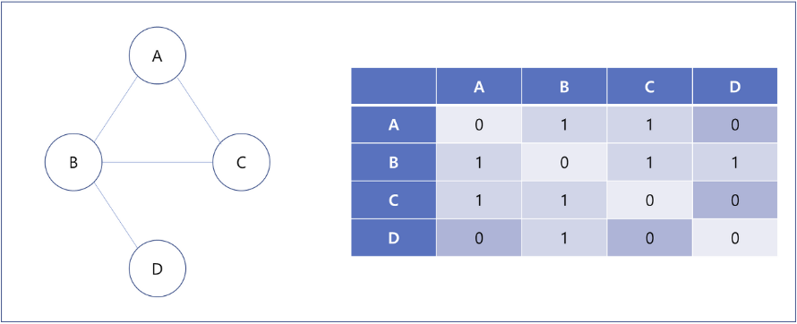
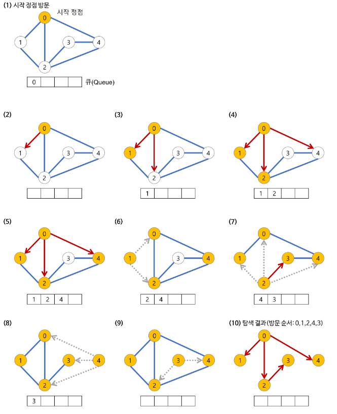

# 그래프 (Graph)

### 용어
- 인접 행렬(Adjacency matrix): 그래프의 노드를 2차원 배열로 만든 것이다.
  - NxN 불린 행렬(Boolean Matrix)로써 matrix[i][j]가 true라면 i에서 j로의 간선이 있다는 뜻이다.
  - 0과 1을 이용한 정수 행렬(Integer Matrix)도 사용 가능하다. 직접 연결 되어 있으면 1, 아니면 0이다.

## 그래프 표현
- 그래프를 구현하는 방법에는 두 가지 방식이 있다.
  - 인접행렬
  - 인접리스트

## 인접 행렬(Adjacency matrix)


### 특징
- 무방향 그래프를 인접 행렬로 표현하면, 이 행렬은 대칭 행렬(Symmetric Matrix)이 된다.

### 장점
- 두 정점에 대한 연결 정보를 조회할 때, 시간 복잡도는 O(1)이면 가능하다.
  - 2차원 배열 안에 모든 정점들의 간선 정보가 담겨있기 때문이다.
- 정점의 차수는 O(N) 안에 알 수 있다.
- 인접리스트에 비해 구현이 쉽다.

### 단점
- 모든 정점에 대한 간선 정보를 대입해야 하므로 O(N^2)의 시간복잡도를 가진다.
- 무조건 2차원 배열이 필요하기 때문에 필요 이상의 공간이 낭비된다.
- 어떤 정점에 인접한 정점을 찾기 위해서는 모든 노드를 전부 순회해야 한다.

### 예제


### 코드
```python
graph = [
  [0, 1, 1, 0],
  [1, 0, 1, 1],
  [1, 1, 0, 0],
  [0, 1, 0, 0]
]
```
---

## 그래프 순회 (Graph traversal)
- 모든 정점을 방문하는 알고리즘
- 동일한 정점이 처리되지 않도록 방문(visited) 표시 사용
- 대표적인 두 가지 방법 존재
	- 깊이 우선 탐색 (DFS)
 	- 너비 우선 탐색 (BFS)

## 깊이 우선 탐색(DFS)

### 정의

- 그래프에서 **깊이**를 우선적으로 탐색하는 알고리즘
- 다음 분기로 넘어가기 전에 해당 분기를 완벽하게 탐색하는 방식

### 특징

- 자기 자신을 호출하는 순환 알고리즘 형태
- 스택 자료구조 사용
- 전위 순회 등 모든 트리 순회 방법은 DFS의 한 종류
- 어떤 노드를 방문했었는 지에 대한 여부 반드시 검증 필요
    - 무한 루프 가능성 방지
    

### 원리

1. 탐색 시작 노드를 스택에 삽입하고 방문 처리를 한다.
    - 방문처리는 visited(리스트) 등을 통해 구현한다.
2. 스택의 최상단 노드에 방문하지 않은 인접 노드가 있으면 그 인접 노드를 스택에 넣고 방문처리를 한다.
    
    방문하지 않은 인접 노드가 없으면 스택에서 최상단 노드를 꺼낸다.
    
3. 2번의 과정을 수행할 수 없을 때까지 반복한다.


- 방문 처리된 노드 : 주황색
- 현재 처리하는 스택의 최상단 노드 : 파란색
- 먼저, 시작 노드인 1을 스택에 삽입하고 방문처리를 한다.
    - 스택 : [1]
- 스택 최상단 노드인 1에 방문하지 않은 인접노드는 2,3,8 번 노드이다. 그 중에서 **가장 작은** 2번 노드를 스택에 넣고 방문처리를 한다.
    - 스택 : [1,2]


- 스택의 최상단 노드인 2번 노드에 방문하지 않은 7번 노드를 스택에 넣고 방문처리를 한다.
    - 스택 : [1,2,7]
- 스택의 최상단 노드인 7번 노드에 방문하지 않은 인접 노드인 6번을 스택에 넣는다. (작은 값을 먼저 넣음)
    - 스택 : [1,2,7,6]


- 스택의 최상단 노드인 6번 노드에 방문하지 않은 인접노드가 없으므로 **스택에서 6번 노드를 꺼낸다.**
    - 스택 : [ 1,2,7 ]
- 최상단 노드인 7번 노드에 방문하지 않은 인접노드인 8번 노드를 스택에 넣고 방문처리를 한다.
    - 스택 : [1,2,7,8]

이 과정을 반복하면 BFS 결과값은 1→2→7→6→8→3→4→5 이다.

### DFS vs BFS

**DFS**

- 루트노드에서 시작해 다음 분기로 넘어가기 전 모든 분기 탐색 (깊이 우선)
- 스택 자료구조 이용
- 재귀함수 사용
- BFS 보다는 간단하나 속도만 보면 느림
- 검색 대상의 **규모가 클 때**, 경로의 **특징을 저장**해야 할 때
    - 각각 경로의 특징을 저장 가능

**BFS**

- 루트노드에서 인접한 노드부터 탐색(너비 우선)
- 큐 자료구조 이용
- 검색 대상의 **규모가 크지 않고** **최단 거리**를 구해야 할 때 이용
    - 검색 시작 지점으로부터 검색 대상이 멀지 않을 때
    - 각각 경로의 특징 저장 불가능

### 코드(Stack)

```python
def dfs_iteration(graph, root):
    # visited = 방문한 노드 기록 리스트
    visited = []
    # stack 자료구조 이용
    stack = [root]
    
    while(stack): #스택에 남은것이 없을 때까지 반복
        node = stack.pop() # node : 현재 방문하고 있는 노드
        
        #현재 node가 방문한 적 없다 -> visited에 추가한다.
        #그리고 해당 node의 자식 node들을 stack에 추가한다.
        if(node not in visited):
            visited.append(node)
            stack.extend(graph[node])
    return visited
```

### 코드(Recursive)

```python
def dfs(graph, v, visited):     # v: 시작 노드를 매개변수로 입력 받는다. visited : 방문 처리 리스트

    visited[v] = True # 방문처리
    print(v, end = ' ')

    for i in graph[v]:
        if not visited[i]:
            dfs(graph,i,visited) # 재귀호출을 이용하여 현재 노드와 연결된 다른 노드를 재귀적으로 방문
```

- 방문하지 않은 노드가 있다면 재귀적으로 가장 깊숙한 곳까지 방문했다가 다시 돌아와서
    
    다른 방향으로 깊이 방문하게 되는 방법
    

### 활용

- 순열과 조합 구현 시

## 너비 우선 탐색(BFS)

### 정의
- 시작 정점을 방문한 후 시작 정점에 인접한 모든 정점들을 우선 방문하는 알고리즘

### 특징
- **재귀적으로 동작하지 않는다**.
- 그래프 탐색의 경우 어떤 노드를 방문했는지 여부를 반드시 검사해야 한다.
  - 검사하지 않을 경우, 무한루프에 빠질 위험이 있다.
- BFS는 방문한 노드들을 차례로 저장한 후 꺼낼 수 있는 자료 구조인 큐(Queue)를 사용한다.
  - **선입선출(FIFO)** 원칙으로 탐색

### 원리
1. 루트에서 시작한다.
2. 루트 정점과 인접하고 방문된 적 없으며, 큐에 저장되지 않은 정점을 Queue에 넣는다.
3. 그러한 Queue에서 dequeue하여  가장 먼저 큐에 저장한 정점을 방문한다.



- **(1)~(5)**
  - 시작 정점을 방문한다.
  - 방문한 정점 체크를 위해 Queue에 방문된 정점을 삽입(enqueue)한다.
  - 초기 상태의 Queue에는 시작 정점만이 저장되므로 시작 정점의 이웃 노드를 모두 방문한다.
- **(6)**
  - Queue에서 꺼낸 정점과 인접한 정점들을 모두 차례로 방문한다.
  - 만약 인접한 정점이 없다면 한 번 더 dequeue한다.
  - Queue에 방문한 정점을 삽입(enqueue)한다.
- **(7)~(10)**
  - Queue가 소진될 때까지 계속한다.

### 코드
```python
# deque 라이브러리 불러오기
from collections import deque

# BFS 메서드 정의
def bfs (graph, vertex, visited):
    # 큐 구현을 위한 deque 라이브러리 활용
    queue = deque([vertex])
    # 현재 노드를 방문 처리
    visited[vertex] = True
    
    # 큐가 완전히 빌 때까지 반복
    while queue:
        # 큐에 삽입된 순서대로 노드 하나 꺼내기
        value = queue.popleft()
        print(value, end = ' ')
        
        # 현재 처리 중인 노드에서 방문하지 않은 인접 노드를 모두 큐에 삽입
        for i in graph[value]:
            if not (visited[i]):
                queue.append(i)
                visited[i] = True
```

### 활용
- 최단 경로 탐색

---
## 위상 정렬(Topological sort)

- 그래프 관련 알고리즘
- 정렬 알고리즘의 일종
- 순서가 정해져 있는 일련의 작업을 차례대로 수행할 때 사용할 수 있는 알고리즘
    - 커리큘럼(선후관계)
    

### 원리

1. 진입차수(indegree)가 0인 노드를 큐에 넣는다.
2. 큐가 빌 때 까지 아래 과정을 반복한다.
    1. 큐에서 원소를 꺼내 해당 노드에서 출발하는 간선을 그래프에서 제거한다.
    2. 새롭게 진입차수가 0이된 노드를 큐에 넣는다.
    
    


| 노드 | 1  | 2 | 3 | 4 | 5 | 6 | 7 |
| --- | --- | --- | --- | --- | --- | --- | --- |
| 진입차수 | 0 | 1 | 1 | 2 | 1 | 2 | 1 |

큐 : 1번 노드

- 진입차수가 0인 1번 노드를 처음으로 큐에 넣는다. (1번 과정)


| 노드 | 1  | 2 | 3 | 4 | 5 | 6 | 7 |
| --- | --- | --- | --- | --- | --- | --- | --- |
| 진입차수 | 0 | 0 | 1 | 2 | 0 | 2 | 1 |

큐 : 노드 2 , 노드 5

- 큐에서 1번 노드를 꺼내고, 1번 노드에서 출발하는 간선을 그래프에서 제거한다.
- 새롭게 진입차수가 0이 된 노드를 큐에 넣는다. (2번 과정)
- 이 과정을 반복한다.
- **큐에서 빠져나간 노드**를 순서대로 출력한 것이 위상 정렬을 수행한 결과이다.
- 단, 위 처럼 한 단계에서 큐에 들어가는 원소가 2개 이상인 경우 위상 정렬의 답이 여러개 일 수 있다.
  - ex) 1→2→5 ..
  - ex) 1→5→2 ..

### 시간복잡도

- O(V+E)
    - 차례대로 모든 노드를 확인하면서, 해당 노드에서 출발하는 간선을 차례대로 제거


---

# 최소 신장 트리

최소 신장 트리 구현 방법 

1. 크루스칼 알고리즘
2. 프림 알고리즘


### Union Find Algorithm (서로소 알고리즘)

- 크루스칼 알고리즘에 사용되는 알고리즘, 핵심 자료구조
- 서로소 집합 : 공통원소가 없는 두 집합
- union / find 연산으로 이루어진 알고리즘

  
<br/>   

### 1. **초기 상태**
- 각각의 노드들은 연결된 것이 없으므로 각각의 부모 노드는 자기 자신이다.
- 아래는 노드 3개의 부모테이블이다. 

| 1 | 2 | 3 |
| --- | --- | --- |
| 1 | 2 | 3 |

### 2. **노드를 연결하는 경우 (union) - 1번 노드 와 2번 노드**
- 1번 노드와 2번 노드를 연결한다. 그러면 부모테이블은 아래와 같아진다.

| 1 | 2 | 3 |
| --- | --- | --- |
| 1 | 1 | 3 |
- 보통 이처럼 부모노드는 수가 작은 쪽의 노드를 수가 큰 쪽의 부모노드에 넣는다.

### 3. **노드를 연결하는 경우 - 2번 노드와 3번 노드**

2번 노드와 3번 노드를 연결하면 아래처럼 될 것 같지만,
| 1 | 2 | 3 |
| --- | --- | --- |
| 1 | 1 | 2 |

틀린 부모테이블이다.

이 경우 노드의 트리 구조는 다음과 같다.  


하지만, **2번 노드의 루트 노드는 1번 노드**이므로 3번의 부모 노드도 1번 노드이어야 한다.

서로소 알고리즘에서 **재귀 호출**을 사용하는 이유가 여기서 나타난다.

즉, 3번은 부모노드인 2번을 호출

2번은 부모노드인 1번을 호출

1번은 부모노드인 1번을 호출하여 return 하게 된다. 즉 3번의 부모 노드도 1번으로 바뀐다.

따라서 올바른 부모 테이블과 트리 구조는 다음과 같다.

| 1 | 2 | 3 |
| --- | --- | --- |
| 1 | 2 | 1 |


<br/>    


### 서로소 알고리즘 코드

```python

# 특정 원소가 속한 집합을 찾는 Find
def findParent(parent,x):
	
	# 루트 노드가 아니면, 루트 노드를 찾아야 한다. (재귀호출 사용)
	if parent[x] != x:
			parent[x] = findParent(parent,parent[x]
	return parent[x]

# 두 원소가 속한 집합을 합치는 Union
def unionParent(parent,a,b):
	a = findParent(parent,a)
	b = findParent(parent,b)
	
	if a<b: # 값이 작은 노드를 큰 값의 부모 노드로 설정
		parent[b] = a

	else:
		parent[a] = b

```
  
<br/>   


## Kruskal Algorithm(크루스칼 알고리즘)

- 크루스칼 알고리즘은 최소 신장 트리를 구하는 방법이다.
- **가장 적은 비용으로 모든 노드를 연결하는 것**이 핵심 목표 이다.
- 그리디 알고리즘의 한 종류이다.

### 원리

1. 간선 값을 오름차순으로 정렬한다.
2. 간선을 하나씩 확인하며 사이클을 발생시키는 지 확인한다.
    1. **사이클이 발생하지 않는 경우**엔 최소 신장 트리에 포함시킨다.
    2. **사이클이 발생하는 경우** 포함시키지 않는다.
3. 모든 간선에 대하여 2번 과정을 반복한다.

이 과정을 위해 앞서 언급한 서로소 알고리즘이 사용된다.

**find 함수** : 사이클이 발생하는 지 판단 

- 두 노드의 루트 노드가 같다면 사이클을 발생시키므로 집합에 포함시키지 않아야 한다.

**union 함수** : 두 노드가 속한 집합을 합치는 연산 수행


### 시간 복잡도

- 간선의 개수가 E개 일 때 O(ElogE) 의 시간복잡도를 가진다.
    - 간선을 정렬하는 작업 때문이다.
    - E개의 데이터를 정렬할 때의 시간 복잡도 : O(ElogE)


<br/>

## 프림 알고리즘(Prim)

### 정의

- 크루스칼과 마찬가지로 최소 비용 신장 트리를 구하는 알고리즘
- 임의의 시작 정점을 기준으로 가장 작은 간선과 연결된 정점을 선택하며 확장시키는 알고리즘

### 크루스칼 vs 프림

**크루스칼**

- 간선 위주의 알고리즘
- 간선을 오름차순으로 정렬해두고 시작
- 간선을 차례로 대입하면서 트리를 구성하므로, 사이클이 이루어지는 지 항상 확인 필요
    - 서로소 알고리즘을 통해 수시로 사이클 체크

**프림**

- 정점 위주의 알고리즘
- 임의이 시작점에서 가까운 정점을 선택하면서 트리를 구성하므로 사이클을 이루지 않음

간선 수가 적은 희소 그래프 : 크루스칼 알고리즘이 적합

간선이 많은 밀집 그래프 : 프림 알고리즘이 적합

### 원리

1. 임의의 시작 노드를 선택한다. 이 노드를 visited 리스트에 담는다.(방문표시)
2. 방문한 노드(visited 리스트에 있는) 와 방문하지 않은 노드 사이의 간선 중 최소인 간선을 찾는다.
3. 그 간선이 연결하는 두 노드 중, visited 리스트에 없는 노드를 visited에 넣는다.
4. 모든 노드가 visited에  포함될 때 까지 2,3 과정을 반복한다.

참고 : visited는 보통 boolean 배열로 구현

즉, 방문한 노드 중에서 방문하지 않은 노드로 잇는 최소의 간선을 찾고 잇는다.

때문에 사이클을 별도로 체크할 필요가 없어진다.


- 임의로 1번 노드를 시작노드로 가정했을 때, 1번으로 부터 최소 간선인 2번 노드로 가는 간선을 선택
    - visited = [1] → [1,2] 으로 업데이트
- visited에 있는 노드를 잇는 간선 중 최소 간선인 2-6 간선을 선택
    - visited = [1,2] → [1,2,6] 으로 업데이트
    - 


- 다음 간선은 6-4(23) 선택
    - visited = [1,2,6] → [1,2,4,6] 으로 업데이트
- 다음 간선은 4-3(7) 선택
    - visited = [1,2,4,6] → [1,2,3,4,6] 으로 업데이트


- 다음 간선은 4-7(13)을 선택
    - visited = [1,2,3,4,6] → [1,2,3,4,6,7] 으로 업데이트
- 그 다음 간선은 6-7[(25)를 선택하려 했으나 **모두 visited에 있는 노드(방문한 노드)**
    
    따라서, **선택할 수 없다**. (2-3도 마찬가지)
    
    - 크루스칼 처럼 사이클을 계산할 필요 없음
- 따라서, **6-5(53) 간선을 선택**해야 함
    - visited = [1,2,3,4,6] → [1,2,3,4,5,6,7]


- 모든 노드가 visited에 들어갔으므로 과정 종료
- 크루스칼 알고리즘 결과와 동일함

### 구현 관점

- 구현 관점에선 다음과 같다.(우선순위 큐 사용)


- graph : 정점과 간선의 정보를 담은 리스트
    - 크루스칼은 간선 수만큼만 저장했지만 프림에선 모든 정점에 대해서 각각 저장
- priority queue : 우선순위 큐를 사용하여 cost , w 를 저장
- visited : 방문 판단 리스트로 여기서는 0으로 false, 1로 true를 나타냄

### 코드

```python
def prim(graph, start_node):
    visited[start_node] = 1 # 방문한 노드는 1로 방문 표시
    candidate = graph[start_node] # 인접 간선을 추출
    heapq.heapify(candidate) # 우선순위 큐 생성
    mst = [] # mst(결과)
    total_cost = 0 # 전체 가중치

    while candidate: # 인접 간선에 대해 반복
        cost, u, v = heapq.heappop(candidate) # 가중치가 가장 적은 간선 추출
        if visited[v] == 0: # 방문하지 않았다면
            visited[v] = 1 # 방문 갱신
            mst.append((u,v)) # mst 삽입
            total_cost += cost # 전체 가중치 갱신

            for edge in graph[v]: # 다음 인접 간선 탐색
                if visited[edge[2]] == 0: # 방문한 노드가 아니라면, (사이클 방지)
                    heapq.heappush(candidate, edge) # 우선순위 큐에 edge 삽입

    return total_cost
```

### 시간복잡도

- O(n2)


---
## 벨만-포드 알고리즘(Bellman-Ford)

### 정의

- 한 노드에서 다른 노드까지의 최단 거리를 구하는 알고리즘
- 간선의 가중치가 **음수**일 때도 최단 거리를 구할 수 있음
- 음수 간선이 포함된 상황이라면 다익스트라가 아닌 벨만-포드를 사용해야 한다.

### 다익스트라 vs 벨만-포드


**음수 간선의 순환**

- 다익스트라 , 벨만-포드 차이점을 알기 위해 필요한 개념
- 음수 간선이 포함되었을 때 두 가지 경우가 있다.
    - 음수 간선은 있지만 음수 간선 순환은 존재하지 않는 경우
    - **음수 간선 순환**도 존재하는 경우
- 위 그림에서 파란색으로 표시된 2,3,5번 노드에서 음의 간선을 포함한 **사이클**이 발생(**음수 간선 순환 발생**)
    - 이 사이클 때문에 1번 노드(시작노드)를 제외한 **모든 노드의 최소 비용이 -∞** 이다.

**다익스트라**

- 매번 **방문하지 않은 노드 중**에서 최단 거리의 노드를 선택, **한 단계씩** 구해나감
- 음수 간선이 존재하는 경우 최단 경로를 구할 수 없음
- 시간복잡도가 빠름 OElogV (우선순위 큐 사용 시)

**벨만-포드**

- **매 단계마다 모든 간선**을 확인하면서 최단 거리를 구해나감
- **음수 간선**이 존재해도 최단 경로를 구할 수 있음
    - 음수 간선 순환도 탐지 가능(음수 간선에 의한 사이클 발생)
- 시간복잡도가 상대적으로 느림 O(VE)

### 원리
- 기본 원리는 다익스트라 알고리즘과 같으나, 모든 간선을 체크한다는 것만 다르다.
1. 출발 노드를 설정한다.
2. 최단 거리 테이블을 초기화한다.
3. 다음 과정을 N-1 번 반복한다.
    1. 전체 간선 E개를 하나씩 확인한다.
    2. 각 간선을 거쳐 다른 노드로 가는 비용을 계산하여 최단 거리 테이블을 갱신한다.

- 3번 과정을 한 번 더 수행하면, 음수 간선 순환 발생 체크도 가능하다.
    - 이때 최단 거리 테이블이 갱신되면 음수 간선 순환이 존재하는 것이다.
    

### 코드

```python
def bf(start):

    dist[start] = 0            

    # 전체 n번의 라운드 반복
    for i in range(n):
        # 매 반복마다 모든 간선 확인
        for j in range(m):
            cur = edges[j][0]
            next_node = edges[j][1]
            cost = edges[j][2]

            # 현재 간선을 거쳐서 다른 노드로 이동하는 거리가 더 짧은 경우
            if dist[cur] != INF and dist[cur] + cost < dist[next_node]
                dist[next_node] = dist[cur] + cost

                # n번째 라운드에서도 값이 갱신된다면 음수 순환 존재
                if i == n-1:
                    return True
    return False

```

- dist : 최단 거리 테이블(리스트)
- INF : 무한
- edges : 모든 간선에 대한 정보를 담은 리스트
    - 2차원 배열로 ((a,b,c)) 형태로 저장됨
    - a번 노드에서 b번 노드로 가는 비용이 c 임을 의미
