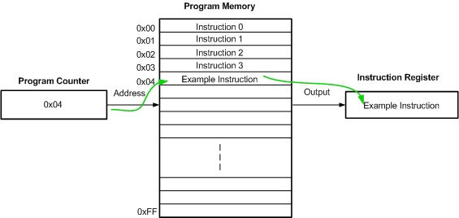

# CPU의 작동 원리

## Content
- ALU와 제어장치
- 레지스터
- 명령어 사이클과 인터럽트

## ALU와 제어장치

### ALU
- ALU는 레지스터를 통해 **피연산자**를 받아들이고, 제어장치로부터 수행할 연산을 알려주는 **제어신호**를 받아들인다
- ALU는 레지스터와 제어장치로부터 받아들인 피연산자와 제어 신호로 산술연산, 논리연산 등 다양한 연산을 수행한다
- CPU가 메모리에 접근하는 속도는 레지스터에 접근하는 속도보다 훨씬 느리다. 따라서 ALU가 연산할 때마다 결과를 메모리에 저장한다면 당연하게도
CPU는 메모리에 자주 접근하게 되고, 이는 프로그램 속도를 늦출 수 있다
- 따라서 ALU의 결괏값을 메모리가 아닌 레지스터에 임시로 저장하는 것이다   
- ALU는 계산 결과와 더불어 **플래그**를 내보낸다.
- 플래그 : 연산 결과에 대한 추가적인 상태 정보
  - 부호 플래그 : 연산한 결과의 부호를 나타냄
  - 제로 플래그 : 연산 결과가 0인지 나타냄
  - 캐리 플래그 : 연산 결과 올림수가 발생했는지 나타냄
  - 오버플로우 플래그 : 오버플로우가 발생했는지 나타냄
  - 인터럽트 플래그 : 인터럽트가 가능한지 나타냄
  - 수퍼바이저 플래그 : 커널 모드로 실행 중인지, 사용자 모드로 실행 중인지 나타냄
- 이처럼 플래그는 CPU가 프로그램을 실행하는 도중 반드시 기억해야 하는 일종의 참고 정보이며, **플래그 레지스터**라는 레지스터에 저장된다

### 제어장치
- **제어장치**는 제어 신호를 내보내고, 명령어를 해석하는 부품이다
- **제어 신호**는 컴퓨터 부품들을 관리하고 작동시키기 위한 일종의 전기신호이다
- 제어장치가 받아들이는 정보
  - 클럭 신호
  - **해석해야 할 명령어** : CPU가 해석해야 할 명령어는 명령어 레지스터라는 특별한 레지스터에 저장된다. 제어장치는 이 명령어 레지스터로부터 해석할 명령어를 받아들이고
  해석한 뒤, 제어 신호를 발생시켜 수행해야 할 내용을 알려준다
  - 플래그 레지스터 속 플래그 값
  - 시스템 버스로 전달된 제어 신호
- 위 정보들을 제어장치가 받아 제어 신호를 발생시킨다

## 레지스터
- 프로그램 속 명령어와 데이터는 실행 전후로 반드시 레지스터에 저장된다

### 반드시 알아야 할 레지스터 
- **프로그램 카운터(PC)** : 메모리에서 가져올 명령어의 주소, 즉 메모리에서 읽어 들일 명령어의 주소를 저장한다. 일반적으로 프로그램 카운터는 꾸준히 증가하여 프로그램을
차례대로 실행시키지만, JUMP, RET, CALL 등의 명령어를 만나면 차례대로 실행되지 않을 수 있다.   
  </img>
- 명령어 레지스터(IR) : 해석할 명령어, 즉 방금 메모리에서 읽어 들인 명령어를 저장하는 레지스터
- 메모리 주소 레지스터 : 메모리의 주소를 저장하는 레지스터
- 메모리 버퍼 레지스터 : 메모리와 주고받을 값(명령어와 데이터)를 저장하는 레지스터
- 플래그 레지스터 : 연산 결과 또는 CPU 상태에 대한 부가적인 정보를 저장하는 레지스터
- 범용 레지스터 : 일반적으로 자유롭게 사용 가능한 레지스터
- 스택 포인터 : 스택의 꼭대기(top)을 가리키는 레지스터
- 베이스 레지스터

### 특정 레지스터를 이용한 주소 지정 방식(1) : 스택 주소 지정 방식
- 스택 주소 지정 방식 : 스택과 스택 포인터를 이용한 주소 지정 방식
- 메모리 안에 스택처럼 사용할 영역이 정해져 있는데, 이를 **스택 영역**이라고 한다

### 특정 레지스터를 이용한 주소 지정 방식(2) : 변위 주소 지정 방식
- 변위 주소 지정 방식 : 오퍼랜드 필드의 값(변위)과 특정 레지스터의 값을 더하여 유효 주소를 얻어내는 주소 지정 방식
  - 상대 주소 지정 방식 : 오퍼랜드와 프로그램 카운터 값을 더해 유효 주소를 얻는 방식
  - 베이스 레지스터 주소 지정 방식 : 오퍼랜드와 베이스 레지스터의 값을 더하여 유효 주소를 얻는 방식
  
## 명령어 사이클과 인터럽트
- CPU가 하나의 명령어를 처리하는 과정에는 어떤 정해진 흐름이 있고, CPU는 그 흐름을 반복하며 명령어들을 처리한다
- 이렇게 하나의 명령어를 처리하는 정형화된 흐름을 **명령어 사이클**이라고 한다
- CPU는 정해진 흐름에 따라 명령어를 처리해 나가지만, 간혹 이 흐름이 끊어지는 상황이 발생하는데, 이를 **인터럽트**라고 한다

### 명령어 사이클
- 인출 사이클 : 메모리에 있는 명령어를 CPU로 가지고 오는 단계
- 실행 사이클 : CPU로 가져온 명령어를 실행하는 단계
- 간접 사이클 : 실행을 위해 메모리 접근이 필요한 경우의 단계
- 인터럽트 사이클 : 인터럽트가 발생한 경우 실행되는 단계

### 인터럽트
- 인터럽트 : CPU의 작업을 방해하는 신호
  - 동기 인터럽트 : CPU에 의해 발생하는 인터럽트. CPU가 명령어들을 수행 하다가 예상치 못한 상황에 마주쳤을 때, 가령 CPU가 실행하는 프로그래밍상의 오류와 같은 예외적인
  상황에 마주쳤을 때 발생하는 인터럽트가 동기 인터럽트이다. **예외**라고도 흔히 부른다.
  - 비동기 인터럽트 : 주로 입출력장치에서 발생하는 인터럽트. 입출력 장치가 완료 알림을 보내거나, 어떠한 입력을 처리하기 위해 CPU에 인터럽트를 보낸다. 
