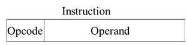
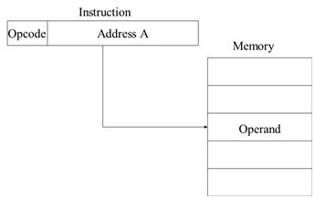
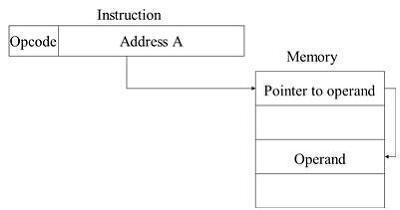
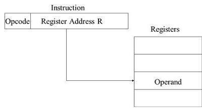
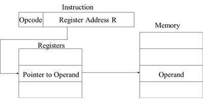

# Instruction

## Contents
- 소스 코드와 명령어
- 명령어의 구조

## 소스 코드와 명령어

### 고급 언어와 저급 언어
- 고급 언어 : 사람을 위한 언어 (C, Java, Python)
- 저급 언어 : 컴퓨터가 직접 이해하고 실행할 수 있는 언어 (기계어, 어셈블리어)
  - 기계어란 0과 1의 명령어 비트로 이루어진 언어이다.
  - 어셈블리어는 0과 1로 표현된 명령어(기계어)를 읽기 편한 형태로 변역한 언어이다.
  
### 컴파일 언어와 인터프리터 언어
- 컴파일 언어 : 컴파일러에 의해 소스 코드 전체가 저급 언어로 변환되어 실행되는 고급 언어
  - 고급 언어로 이루어진 코드가 저급 언어로 변환되는 과정을 컴파일 이라고 한다.
  - 컴파일을 실행해 주는 도구는 컴파일러 이다.
  - 컴파일러를 통해 저급 언어로 변환된 코드를 목적 코드(Object Code)라고 한다.
  - 대표적인 예로 C언어가 있다
  
- 인터프리터 언어 : 인터프리터에 의해 소스 코드가 한 줄씩 실행되는 고급 언어
  - 소스 코드를 한 줄씩 저급 언어로 변환하여 실행해 주는 도구를 인터프리터 라고 한다.
  - 대표적인 예로 Python이 있으나, 현대에 들어서는 Python도 컴파일을 하지 않는것은 아니다.

- 컴파일이 가능한 언어라고 해서 인터프리트가 불가능하거나, 인터프리트가 가능한 언어라고 해서 컴파일이 불가능한 것은 아니다. 따라서 모든 프로그래밍 언어를 컴파일 언어와 인터프리터 언어로 칼로 자르듯 
구분하기보다는 '고급 언어가 저급 언어로 변환되는 대표적인 방법에는 컴파일 방식과 인터프리트 방식이 있다' 정도로만 이해하는 것이 좋다.

### 목적 파일과 실행 파일
- 목적 파일은 최종적으로 링킹(linking)이라는 작업을 거쳐야 비로소 실행파일이 될 수 있다.
- 링킹이란 여러 개의 코드와 데이터를 모아서 연결하여 메모리에 로드될 수 있고 실행될 수 있는 한 개의 파일로 만드는 작업이다.

## 명령어의 구조

### 연산 코드와 오퍼랜드
- 명령어 : 연산 코드(opcode) + 오퍼랜드(operand)
- 연산 코드는 연산자(operator), 오퍼랜드는 피연산자라고도 불린다.

### 오퍼랜드(operand)
- 오퍼랜드는 연산에 사용할 데이터 또는 연산에 사용할 데이터가 저장된 위치를 의미한다.
- 오퍼랜드는 명령어 안에 있을수도 있고, 한개가 있을 수도 있고, 여러개가 있을 수 있다.

### 연산 코드(opcode)
- 연산 코드는 명령어가 수행할 연산을 의미한다.
- 기본적인 연산 코드 유형
  - 데이터 전송
    - MOVE/STORE/LOAD/PUSH/POP
  - 산술/논리 연산
    - ADD/SUB/MUL/DIV/AND/OR/COMP
  - 제어 흐름 변경
    - JUMP, HALT, CALL, RETURN
  - 입출력 제어
    - READ, WRITE
    
 ### 주소 지정 방식
 - 유효 주소(effective address) : 연산 코드에 사용할 데이터가 저장된 위치, 즉 연산의 대상이 되는 데이터가 저장된 위치
 - 오퍼랜드 필드에 데이터가 저장된 위치를 명시할 때 연산에 사용할 데이터 위치를 찾는 방법을 주소 지정 방식(addressing mode)이라고 한다.
 - 즉시 주소 지정 방식(immediate addressing mode)
    - 연산에 사용할 데이터를 오퍼랜드 필드에 직접 명시하는 방식 (건너갈 필요 없음)
    - 표현할 수 있는 데이터의 크기가 작지만, 다른 주소 지정 방식들보다 빠르다.   
    </img>
 - 직접 주소 지정 방식(direct addressing mode)
    - 오퍼랜드 필드에 유효 주소를 직접적으로 명시하는 방식 (한 번 건너가면 접근 가능)   
    </img>
 - 간접 주소 지정 방식(indirect addressing mode)
    - 유효 주소의 주소를 오퍼랜드 필드에 명시 (두 번 건너가야 접근 가능)   
    </img>
 - 레지스터 주소 지정 방식(register addressing mode)
    - 직접 주소 지정 방식과 비슷하게 연산에 사용할 데이터를 저장한 레지스터를 오퍼랜드 필드에 직접 명시하는 방법
    - 메모리에 접근하는 것보다 CPU안에 있는 레지스터에 접근하는 것이 더 빠르므로 직접 주소 지정 방식보다 빠르다.   
    </img>
 - 레지스터 간접 주소 지정 방식(register indirect addressing mode)
    - 연산에 사용할 데이터를 메모리에 저장하고, 그 주소를 저장한 레지스터를 오퍼랜드 필드에 명시하는 방법   
    </img>
 
