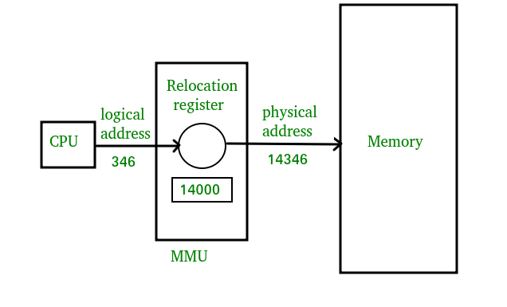
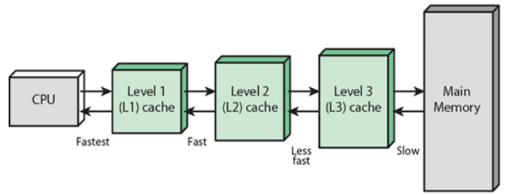

# 메모리와 캐시 메모리

## Content
- RAM의 특징과 종류
- 메모리의 주소 공간
- 캐시 메모리

## RAM의 특징과 종류

### RAM의 특징
- 전원이 꺼지면 저장된 명령어와 데이터가 모두 날아가는 **휘발성 저장 장치**이다
- 하드 디스크, SSD와 같이 전원이 꺼져도 데이터가 날아가지 않는 장치를 **비휘발성 저장 장치**라고 한다. 이들을 **보조기억장치**라고도 한다

### RAM의 용량과 성능
- RAM 용량이 적다면 보조기억장치에서 실행할 프로그램을 가져오는 일이 잦아 실행 시간이 길어진다
- RAM 용량이 충분히 크다면 여러 프로그램을 메모리에 미리 load해 필요할 때마다 보조기억장치에 접근해 프로그램을 가져올 필요가 없다. 따라서 컴퓨터의 속도가 빨라진다
- 다만, 용량이 필요 이상으로 커진다면 속도가 그에 비례해서 증가하지는 않는다

### RAM의 종류
- DRAM(Dynamic RAM)
  - 저당된 데이터가 동적으로 변하는(사라지는) RAM을 의미한다. 
  - 즉, DRAM은 시간이 지나면 저장된 데이터가 점차 사라진다. 따라서 데이터의 소멸을 막기 위해 일정 주기로 데이터를 재활성화(다시 저장)해야 한다.
  - 이런 단점에도 소비 전력이 비교적 낮고, 저렴하고, 집적도가 높기 때문에 대용량으로 설계하기 용이하다
- SRAM(Static RAM)
  - 저장된 데이터가 변하지 않는 RAM
  - 일반적으로 DRAM보다 속도가 빠르다
  - 하지만 DRAM보다 집적도가 낮고, 소비 전력도 크며, 가격이 비싸다. 따라서 대용량으로 만들 필요는 없지만 속도는 빨라야 하는 캐시 메모리에서 사용된다.
- SDRAM(Synchronous Dynamic RAM)
  - 클럭 신호와 동기화된, 발전된 형태의 DRAM
  - 클럭 신호와 동기화 되었다는 말은 클럭 타이밍에 맞춰 CPU와 정보를 주고받을 수 있음을 의미한다
- DDR SDRAM(Double Data Rate SDRAM)
  - 최근 가장 많이 사용하는 RAM으로, 대역폭을 넓혀 속도를 빠르게 만든 SDRAM이다.
  - **대역폭**이란 데이터를 주고받는 길의 너비를 의미한다

## 메모리의 주소 공간
- 물리 주소 : 메모리 하드웨어가 사용하는 실제 주소
- 논리 주소 : CPU와 실행 중인 프로그램이 사용하는 가상의 주소

### 물리 주소와 논리 주소
- 메모리가 사용하는 **물리 주소**는 말 그대로 정보가 실제로 저장된 하드웨어상의 주소를 의미한다
- 반면 CPU와 실행중인 프로그램이 사용하는 **논리 주소**는 실행 중인 프로그램 각각에게 부여된 가상의 주소를 의미한다
- 따라서 논리 주소와 물리 주소간의 변환이 필요한데, 이 변환은 CPU와 주소 버스 사이에 위치한 **메모리 관리(MMU)** 라는 하드웨어에 의해 수행된다
- MMU는 CPU가 발생시킨 논리 주소에 베이스 레지스터 값을 더하여 논리 주소를 물리 주소로 변환한다   
</img>

### 메모리 보호 기법
- 다른 프로그램의 영역을 침범할 수 있는 명령어는 위험하기 때문에 논리 주소 범위를 벗어나는 명령어 실행을 방지하고 실행 중인 프로그램이 다른 프로그램에 영향을 받지 않도록 보호할 방법이
필요하다.
- 이를 **한계 레지스터(limit register)** 라는 레지스터가 담당한다
- 한계 레지스터는 해당 프로그램 논리주소의 최대 크기를 저장해, 이를 벗어나려 하면 인터럽트를 발생시켜 실행을 중단한다

## 캐시 메모리
- CPU는 프로그램을 실행하는 과정에서 메모리에 저장된 데이터를 빈번하게 사용한다
- 하지만 CPU가 메모리에 접근하는 시간은 CPU의 연산 속도보다 느리다
- 이를 극복하기 위한 저장 장치가 바로 **캐시 메모리**이다

### 저장장치 계층 구조
- 저장 장치는 일반적으로 아래와 같은 명제를 따른다
  - CPU와 가까운 저장 장치는 빠르고, 멀리 있는 장치는 느리다
  - 속도가 빠른 저장 장치는 저장 용량이 작고, 가격이 비싸다
- 컴퓨터가 사용하는 저장 장치들은 CPU에 얼마나 가까운가를 기준으로 계층적으로 나타낼 수 있는데, 이를 **저장 장치 계층 구조**라고 한다   

  </img>
  - 위로 올라갈수록 속도는 빠르고, 용량은 작아지며, 가격은 비싸진다
  
### 캐시 메모리(Cache Memory)
- 캐시 메모리는 CPU와 메모리 사이에 위치하고, 레지스터보다 용량이 크고 메모리보다 빠른 SRAM기반의 저장 장치이다
- 캐시 메모리는 CPU연산 속도와 메모리 접근 속도의 차이를 조금이나마 줄이기 위해 탄생했다
- CPU가 매번 메모리에 접근하는 것은 시간이 많이 걸리니, 메모리에서 CPU에서 사용할 일부 데이터를 미리 캐시 메모리로 가지고 와서 활용하는 것이다
- 캐시 메모리에는 여러가지 종류가 있는데, 코어와 가장 가까운 캐시 메모리를 **L1 캐시**, 그 다음 가까운 캐시 메모리를 **L2 캐시**, 그 다음 가까운 캐시 메모리를 **L3 캐시**
라고 한다.   

  </img>

### 참조 지역성 원리
- 캐시 메모리는 메모리보다 용량이 작다
- 당연하게도 캐시 메모리에는 메모리에 있는 모든 내용을 저장할 수는 없다
- 따라서 캐시 메모리는 CPU가 사용할 법한 대상을 예측하여 저장한다
- 이때 자주 사용될 것으로 예측한 데이터가 실제로 들어맞아 캐시 메모리 내 데이터가 CPU에서 활용될 경우를 **캐시 히트(cache hit)** 라고 한다
- 반대로 예측에 실패해 메모리에서 필요한 데이터를 직접 가져와야 하는 경우를 **캐시 미스(cache miss)** 라고 한다
- 캐시가 히트되는 비율을 **캐시 적중률(cahe hit ratio)** 라고 하고 다음과 같이 계산한다   

  ```
  캐시 히트 횟수 / (캐시 히트 횟수 + 캐시 미스 횟수)
  ```
- 캐시 메모리는 한 가지 원칙에 따라 메모리로부터 가져올 데이터를 결정하는데, 이게 바로 **참조 지역성의 원리**이다.
  - 시간 지역성 : CPU는 최근에 접근했던 메모리 공간에 다시 접근하려는 경향이 있다
  - 공간 지역성 : CPU는 최근에 접근했던 메모리 공간 근처를 접근하려는 경향이 있다
