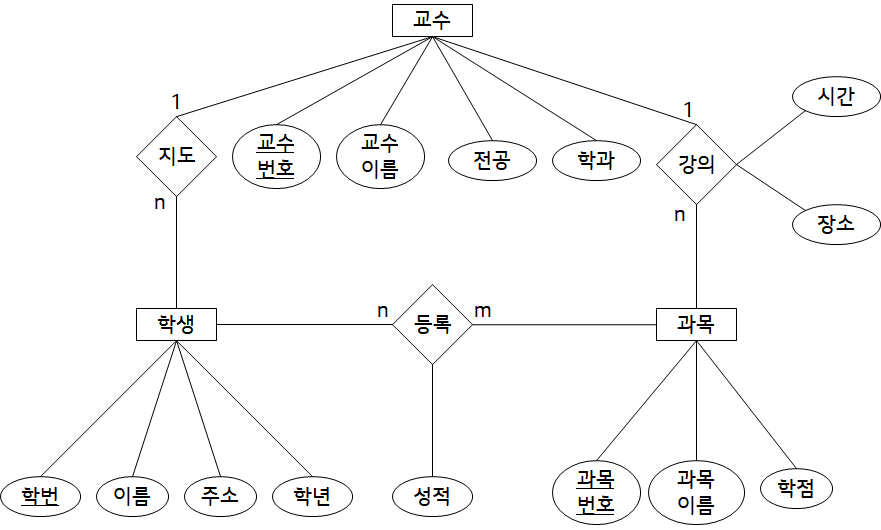

# 데이터 모델링
### 데이터
|현실세계(개체)|개념세계(개념)|컴퓨터세계(데이터)|
|:---:|:---:|:---:|
|개체|개체타입|레코드타입|
|특성|속성|필드|
|값,사실|개념적 구조|논리적 구조|
- 추상화(개념적 모델링): 개체 => 개념
- 변환(데이터 모델링) : 개념 => 데이터
### 데이터 모델링
- 목적 : 현실세계의 개념 => 데이터베이스 설계
1. 개념적 모델링 
    - 현실의 개체를 `개체 타입으로` 표현하는 것 
    - 추상화
2. 데이터 모델링
    - 개념적 구조를 `논리적 개념`으로 표현하는 것 
    - 변환
3. 데이터 구조화
    - 논리적 구조를 `물리적 구조`(하드웨어상의 데이터 저장방식)으로 표현
- 데이터 모델(data model : D)
    - D = <S,O,C>
    - S : 구조
        - 데이터의 정적 성질
        - `개체의 타입`과 각 개체들 간의 `관계` 명시
    - O : 연산
        - 데이터의 동적 성질
        - `개체를 처리`하는 작업에 대한 내용 명세
        - 데이터의 조작 기법
    - C : 제약 조건
        - 데이터의 `논리적 제약`에 대해 명세
            - 구조(s)로부터 파생
            - 의미상 제약
        - 데이터 조직의 한계를 표현
---
### 개체 타입
- 개체 : 현실 세계에서 의미있는 하나의 정보 단위
- 개체 타입 : 개체를 이름과 속성으로 정의한 것
- 속성의 유형
    1. 단순 속성과 복합 속성
        단순 속성 : 더 이상 잘게 `쪼갤수 없는 속성`(ex 나이, 학년)
        - 복합 속성 : `두개 이상의 단순 속성`으로 나눌 수 있는 속성(ex 주소, 이름)
    2. 단일 값 속성과 다중 값 속성
        - 단일 값 속성 : 한 개체가 `하나의 속성`만을 갖는 속성(ex 이름, 나이)
        - 다중 값 속성 : 한 개체가 `여러개의 속성`을 가질 수 있는 속성(ex 취미, 수강 과목)
    3. 유도 속성과 저장 속성
        - 유도 속성 : 속성값이 `다른 속성으로부터 유도` 되어 결정(ex 생일(주민번호로부터), 성별(주민번호))
        - 저장 속성 : 계산으로 구해진 속성이 아닌 `자료구조에 직접 저장`해야하는 속성
    4. 널 속성(NULL)
        - 어떤 개체가 특정 속성에 대한 값을 가지고 있지 않을 때(`해당되지 않음`) 이를 명시적으로 표시하기 위해 사용
### 관계 타입 
- 정의 : 개체 간의 관계 즉 사상(mapping) 을 의미함
- 릴레이션의 종류
    - 카디널리티에 따라 
        - 1:1
            - 한쪽의 기본키를 다른 테이블의 외래키로 사용
        - 1:N
            - 한쪽의 기본키를 다른 테이블들의 외래키로 사용
        - N:M
            - 따로 테이블을 생성, 관계에 참여하는 개체의 기본키를 가져와서 외래키로 사용
    - 참여하는 개체수에 따라
        - 일항, 일차, Unary
        - 이항, 이차, Binary
        - 삼항, 삼차, Ternary
        - N-ary
    - 전체 참여
        - A의 `모든 개체`가 A-B관계에 `참여`
        - ex) 학생-학번 모든 학생은 학번이 있음
    - 부분 참여
        - A의 일부 개체는 A-B관계에 `참여하지 않음`
        - 학생-과목 모든 학생이 과목을 듣는것은 아님
    - 존재종속 
        - 한 개체a가 존재가 다른 개체b의 `존재에 종속`될 때 b를 주 객체, a 를 종속 개체 라고 함
        - ex) 주 개체 : 상품, 종속개체 : 상품 가격(상품이 존재하지 않으면 상품 가격은 존재하지 않음)
---
### E-R모델
- 정의 : 정보들을 개체, 속성, 관계로 기술하는 데이터 모델
    - 개념적 데이터 모델
- 현실 세계를 개념적으로 표현한것
- 그래픽 표현
    ```mermaid
    graph LR
    [개체타입]
    {관계타입}
    ((속성))
    --[링크]--
    ```

- 키 애트리뷰트
    - 키가 되는 속성(유일성과 최소성 만족)
    - E-R 모델에서 밑줄로 표시
- 약한 개체 타입
    - 자기 자신의 속성만으로는 키를 명세할 수 없는 개체타입
    - 종속 개체
- 구별자 
    - 강한 개체와 연관된 약학 개체 집합에서 서로 구별할 수 있는 속성
    - 부분키
- 식별 관계 타입
    - 약한 개체를 강한개체와 연관시켜 개체를 식별할 수 있게 해주는 것
