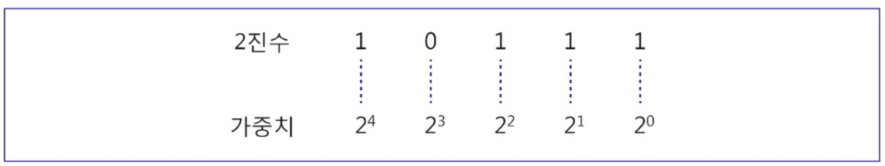
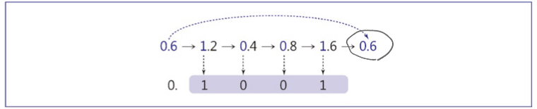
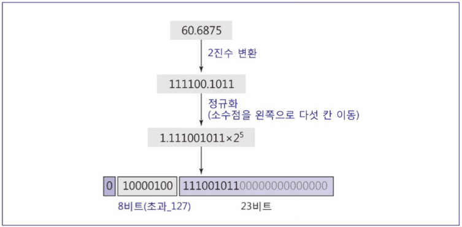

# 컴퓨터 및 데이터

# 컴퓨터 및 컴퓨터 과학

## 컴퓨터란?

> 프로그램이 가능한 데이터 처리기, 즉 프로그램의 지시에 따라 데이터를 입력받아 처리하고 결과를 출력하는 기계
> 
- 시간 단위
    
    
    | 단위 | 표시 |
    | --- | --- |
    | 밀리초(10⁻³초) | ms |
    | 마이크로초(10⁻⁶초) | 𝜇s |
    | 나노초(10⁻⁹초) | ns |
    | 피코초(10⁻¹²초) | ps |

## 컴퓨터 과학(Computer Science)이란?

> 데이터의 표현, 저장, 조작, 검색과 관련이 있으며, 컴퓨터 및 데이터 프로그램, 알고리즘 분야의 연구를 통해 효율적으로 데이터를 처리하기 위한 기술과 방법을 제공하는 분야
> 
- `프로그래밍 언어(Programming Language)`
    - C, Java 등이 존재
    - 특정 문제를 해결하기 위해서 해당 언어를 통해 명령어를 나열함
- `알고리즘(Algorithm)`
    - 특정 문제를 어떤 절차와 방식으로 풀어나갈지 기술한 명령어들의 집합
    - 문제 풀이 방식에 대해 설계하는 것

# 컴퓨터 시스템

## 시스템이란?

> 하드웨어, 소프트웨어, 데이터, 사용자라는 요소가 서로 상호작용하고 유기적으로 연결되어 있는 구성 요소의 모임을 시스템이라고 함
> 

### 하드웨어

- 폰 노이만 모델
    
    
    
    > 컴퓨터 내부 구조와 처리 과정을 정의한 모델로 오늘날 모든 컴퓨터에서 사용되고 있음
    > 
    - 컴퓨터의 서브 시스템
        - 기억장치
            - 정의
                - 데이터와 프로그램이 저장되는 장소
            - 종류
                - 주기억장치
                    - 현재 처리되는 데이터 및 프로그램을 기억
                - 보조 기억 장치
                    - 주기억장치의 외의 데이터 및 프로그램 기억
                - CPU
                    - 산술논리장치와 제어장치의 합
                    - 산술논리연산장치
                        - 산술 연산, 논리 연산을 통해 데이터 처리가 이루어짐
                    - 제어장치
                        - 기억장치, 산술논리연산장치, 입출력장치를 제어함
    - 내장 프로그램 방식
        - 실행될 프로그램은 메모리에 저장되어 있음
        - 프로그램과 데이터는 비트 패턴 형식으로 메모리에 표현됨
            - 비트 패턴 형식
                - 0과 1의 표현
    - 유한개의 명령어 존재
        - 기존에 정의된 기본 명령어 집합을 통해 원하는 프로그램을 구성할 수 있음
    - 흐름
        
        
        
        - 프로그램이 메모리에 저장
        - 제어장치가 명령어를 가져와서 해석
        - 산술논리연산장치가 명령어 실행
    
    ### 소프트웨어
    
    > 하드웨어를 통해 데이터를 처리하기 위한 명령어들의 나열인 프로그램의 총칭을 소프트웨어라고 함
    > 
    - 소프트웨어의 종류
        - 시스템 소프트웨어
            - 컴퓨터 자체의 작업 관리와 특정 기능 수행을 통해 컴퓨터의 전체적인 운영을 담당
                - 운영체제, 컴파일러, 각종 유틸리티 등이 여기에 해당됨
        - 응용 소프트웨어
            - 사용자가 요구하는 작업을 직접적으로 수행하는 프로그램
                - 워드 프로세서, 그래픽 프로그램 등
    
    ### 데이터(Data)
    
    - 이진 상태를 나타내는 0과 1이 나열된 비트 패턴으로 표현함
    - 사용자 데이터를 컴퓨터가 처리하기 위해서는 비트 패턴으로 표현해야 하며, 컴퓨터 내부에서의 처리 결과는 사용자가 알아볼 수 있도록 변환해야 함
    
    ### 사용자(User)
    
    - 컴퓨터의 설계 및 효율적인 이용 및 데이터 처리의 전반적인 과정에 개입함

# 데이터 표현

## 데이터(Data)

> 현실 세계로부터 관찰이나 측정을 통해 단순히 얻어지는 값이나 사실
> 
- 비트 패턴
    - 상태를 저장할 수 있는 비트를 나열하여 데이터를 표현하는 방법
    - 비트가 8개로 나열된 경우 `Byte`라고 함
    - 단위
        
        
        | 이름 | 단위 |
        | --- | --- |
        | 킬로바이트(2¹⁰≈10³) | KB |
        | 메가바이트(2²⁰≈10⁶) | MB |
        | 기가바이트(2³⁰≈10⁹) | GB |
        | 테라바이트(2⁴⁰≈10¹²) | TB |
        | 페타바이트(2⁵⁰≈10¹⁵) | PB |

## 진법

- 진법 변환
    - 2진수 → 10진수
        - ∑(각 자리의 비트 값 * 위치에 대한 가중치)
            
            
            
        - 소수점 이하 자리값은 2⁻¹부터 차례대로 작아진다
    - 10진수 → r진수
        - 정수부
            
            
            
        - 소수부
            - 소수부가 0이되는 경우
                
                
                
            - 소수부가 순환되는 경우
                
                
                

## 정수 표현

- 부호 있는 정수
    - 부호 표시 비트가 존재하지 않음
    - n 비트의 정수 범위
        - $2^n-1$
            - 8비트는 0부터 255까지
        - 오버플로우
            - 주어진 수를 이진수로 표현하여 비트에 저장할 때, 비트의 범위를 넘어가는 경우에 발생
- 부호 없는 정수
    - 부호화-크기 방식
        - 양의 정수에 부호 비트를 추가하는 방법
            - 124
                - 01111100
            - -124
                - 11111100
        - 수의 범위
            - $-(2^{n-1}-1)$ ~ $(2^{n-1}-1)$
            - 8비트 부호화-크기 방식에서 0은 +0(00000000), -0(10000000)이 존재하기 때문에 이를 검사해야 하는 문제 발생
    - 1의 보수 방식
        - 양의 정수 표현에서 모든 비트를 toggle함
            - -124
                - 01111100(124) → 10000011(-124)
        - 1의 보수 방식 또한 +0(00000000), -0(11111111)의 두가지 표현이 존재함
    - 2의 보수 방식
        - 1의 보수에서 1을 더하는 방법
            - -124
                - 10000011 + 00000001 = 10000100
        - 수의 범위
            - $-(2^{n-1})$ ~ $(2^{n-1}-1)$
                - -0이 제외되었기 때문
- 계산
    - 양수 비트와 보수를 취한 비트와 더하기
        
        
        

## 실수 표현

- 부동소수점 표현 방식
    - $(-1)^s*M*B^E$
        - s는 부호, M은 가수, B는 기저, E는 지수
            - $1.234*10^{12}$
                - s = 0, M = 1.234, B = 10, E = 12
    - 매직 넘버
        - 지수 값 표현에 m비트가 할당되는 경우 $`2^{m-1}$과 $2^{m-1}$-1`가 매직 넘버
            - m=8인 경우, 128($2^{8-1}$)과 127($2^{8-1}-1$)이 매직 넘버
            - 각각 초과_128, 초과_127
    - 예시
        
        
        
        1. 실수를 2진수로 변환
        2. 소수점 앞에 1이 1개만 존재할 수 있도록 정규화
        3. 지수부에 매직 넘버를 더해준 후 지수 비트에 담음
        4. 가수부에 존재하는 소수점 이하의 자리만 가수 비트에 담음 
- IEEE의 부동소수점 방식의 표준 형식
    - 단정도 형식 과 배정도 형식
    
    
    

## 문자 표현

- ASCII
    - ANSI에서 개발한 코드
    - 로마자 알파벳 위주로 부호화
    - 7비트를 사용하여 $2^7$개의 서로 다른 문자 표현 가능
- 확장된 ASCII
    - 1바이트를 맞추기 위해 1비트를 추가한 형태
    - 최상위 비트는 0을 채우거나 오류 검출을 위한 패리티 비트로 사용되기도 함
- 유니코드
    - 전세계 모든 문자를 표현하기 위한 16비트 코드 체계
    - 인코딩 방식
        - UTF-8
            - 8비트 단위
            - ASCII와 동일한 값을 가짐
        - UTF-16
            - 16비트 단위
            - 2개의 16비트로 1개의 문자를 인코딩(가변길이 인코딩)
        - UTF-32
            - 32비트 단위
            - 모든 유니코드 문자를 32비트로 표현(고정길이 인코딩)
- BCD코드
    - 4비트로 구성된 10개 코드로 10진수 표현
    - 8421 코드라고 불리기도 함
        - 예시
            - $194_{10}$ ⇒ 0001 1001 0100