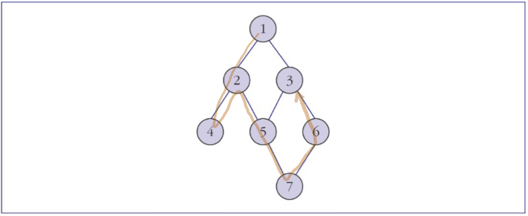

# 자료구조

# 자료구조란?

> 자료(Data)의 집합의 의미하며, 자료에 대한 처리를 효율적으로 수행할 수 있도록 자료를 구분하여 표현한 것
> 

# 종류

## 선형 자료구조

1.  `배열`
    
    ### 배열이란?
    
    
    
    > 동일한 자료형을 갖는 여러 데이터를 동일한 변수에 일렬로 저장하는 자료의 집합체를 의미함. 배열은 하나의 변수명을 가지며, 각 원소의 원소(데이터) 혹은 값에 접근하기 위해 인덱스(index) 즉, 첨자를 이용함
    > 
    
    ## 1차원 배열
    
    
    
    - 한 개의 첨자를 이용하여 원소에 접근
    - 자료형의 크기가 k, A[0]의 시작주소: a
        - A[i]의 주소: $a+i*k$
    
    ## 2차원 배열
    
    
    
    - 개념
        - 하나의 원소는 첨자 i와 j로 구성됨
        - i는 행(row), j는 열(column)
        - 2차원 배열 또한 1차열 배열과 마찬가지로 메모리에 순서대로 저장됨
    - 저장하는 순서에 따른 종류
        - 열우선 순서 행렬
            
            
            
            - 열의 원소 순서대로 데이터에 저장하는 방법
            - C언어가 여기에 해당
        - 행우선 순서 행렬
            
            
            
            - 행의 원소 순서대로 데이터 저장
    
    ## 희소 행렬(Sparse Matrix)
    
    
    
    - 정의
        - 원소 값이 0인 원소가 그렇지 않은 원소보다 많은 행렬
    - 데이터 저장 방식
        
        
        
        - 첫 행: 주어진 행렬의 행 크기, 주어진 행렬의 열 크기, 0이 아닌 값의 개수
        - 이후의 행: 주어진 행렬의 행 첨자, 열 첨자, 해당 값
    1. `리스트`
        
        ### 리스트란?
        
        - 한개 이상의 원소들이 순서를 가지고 구성됨
        
        ### 리스트 구현
        
        1. 1차원 배열을 이용한 리스트 표현
            
            
            
            - 원소 삽입 시 원소들의 순서를 고려해야 함
            - 삽입, 삭제 과정에서 자리 이동이 발생하므로, 해당 작업이 반복적으로 진행되는 경우 컴퓨터 성능 저하 야기
        2. 연결 리스트
            
            
            
            - 설명
                - 모든 노드는 데이터 필드와 링크 필드를 가지며, 마지막 노드를 제외한 모든 노드는 다음 노드를 가르키는 포인터를 가짐
            - 구성 요소
                - 데이터 필드
                    - 원소 값을 저장하기 위한 부분
                - 링크 필드
                    - 다음 원소가 저장되어 있는 노드 주소 저장
                - head
                    - 연결 리스트의 시작 노드를 가리킴
            - 메모리 표현
                
                
                
                - 배열과 같이 메모리에 물리적인 순서를 가지고 저장되는 것이 아닌 논리적인 순서를 가짐
            - 종류
                
                
                
                - 단일 연결 리스트
                    - 각 노드의 링크 필드가 다음 노드를 가르키는 형태로, 특정 노드의 선행 노드에 접근하고자 하는 경우 head부터 다시 접근해야 함
                - 이중 연결 리스트
                    - 각 노드의 링크 필드가 두 개의 링크 필드를 가지며 하나는 선행 노드, 하나는 후행 노드를 가르키기 때문에 선행 노드의 접근이 수월해짐
                
    2. `스택`
        
        ### 스택(Stack)이란?
        
        
        
        - 설명
            - 데이터의 삽입과 삭제가 top에서 이루어지는 자료구조
        - 특징
            - 데이터 처리
                - 삽입(push): top이 가르키는 위치의 위에 저장됨
                - 삭제(pop): top이 가르키는 위치의 데이터가 삭제됨
            - 후입선출(LIFO: Last-In-First-Out) 구조
        - 동작 과정
            
            
            
        1. `큐`
        
        ### 큐란?
        
        
        
        - 설명
            - 삽입 및 삭제가 한 방향에서만 이루어지는 자료구조
            - 운영체제에서 프로세스(작업) 관리 시 사용되는 자료구조
            - 먼저 도착한 프로세스에 CPU 할당할 때 사용
            - FIFO(First-In, First-Out) 방식
        - 구성 요소
            - front
                - 데이터 삭제가 일어나는 큐의 맨 앞, 빈 큐가 되는 경우 front와 rear의 위치를 같게 하기 위해 해당 데이터보다 한 칸 앞을 가르킴
            - rear
                - 데이터 삽입이 일어나는 위치
        - 동작 과정
            
            
            
            - 데이터 삭제 후 front 앞 부분의 원소가 지워져 저장 공간의 여유가 발생함
            - 하지만 이러한 경우에도 해당 위치에 데이터 삽입은 불가능함
        - 저장공간에 따른 현상
            - 오버플로(overflow)
                - 할당된 저장 공간을 초과해 더이상 데이터 삽입을 할 수 없는 현상
            - 언더플로(underflow)
                - 큐에 데이터가 존재하지 않는 경우 데이터 삭제를 시도했을 때 발생하는 현상

## 비선형 자료구조

1. `트리`
    
    ### 트리(Tree)란?
    
    
    
    - 설명
        - 데이터 간의 관계를 나타내는 비선형 자료구조
        - 노드와 가지를 통칭하여 트리라고 부름
    - 구성 요소
        - 노드(node)
            - 데이터가 저장되어 있는 장소
        - 가지(branch, edge)
            - 노드를 연결하는 역할
    - 용어
        - 레벨(level)
            - 루트 노드로부터 특정 노드까지의 거리(가지의 개수)
            - 트리의 깊이(depth), 높이(height)
                - 루트노드로부터 가장 긴 경로를 가지는 노드의 레벨에 1을 더한 값
        - 루트 노드(root node)
            - 빈 트리가 아닌 경우 최상위에 존재하는 노드
            - 위의 트리에서는 A에 해당
        - 단말 노드(terminal node), 잎 노드(leaf node)
            - 특정 노드의 자식이 없는 노드
        - 부모 노드(parent node)
            - 특정 자식과 상단 가지 연결되어 있는 노드
        - 자식 노드(child node)
            - 특정 부모의 하단 가지와 연결되어 있는 노드
        - 형제 노드(sibling node)
            - 부모 노드의 하단 가지로 연결된 모든 노드
        - 조상 노드(ancestor node)
            - 루트 노드에서 특정 노드의 경로상에 존재하는 모든 노드
        - 자손 노드(descendant node)
            - 특정 노드에서 단말 노드까지의 경로 상에 존재하는 모든 노드
        - 차수(degree)
            - 노드의 차수
                - 각 노드의 자식 노드로 향하는 가지 수
                - A의 차수는 3, B의 차수는 2
            - 트리의 차수
                - 모든 노드 중 가장 높은 차수
                - 위의 트리에서는 차수가 3
        - 서브트리(subtree)
            - 특정 노드를 루트 노트로 지정하여 만들어지는 트리 구조
    
    ### 이진트리(Binary Tree)
    
    - 설명
        - 모든 노드의 차수가 2를 넘지 않는 트리
        - 왼쪽 노드와 오른쪽 노드에 순서를 부여함
    - 최대  높이
        - N개의 노드가 왼쪽 혹은 오른쪽으로 치우친 이진트리 형성하는 경우(최대 높이는 $N$)
    - 최소 높이
        - 각 노드가 2개의 자식 노드를 갖는 경우 (최소 높이는 $log_2N$)
    - 연산
        - 삽입
        - 삭제
        - 순회
            
            
            
            - 일정 순서에 따라 각 노드를 한번씩 방문하는 것
            - 데이터
                - D: 루트노드
                - L: 왼쪽 서브트리
                - R: 오른쪽 서브트리
            - 방문 순서
                
                
                
                - 전위 순회: DLR 또는 DRL
                - 중위 순회: LDR 또는 RDL
                - 후위 순회: LRD 또는 RLD
    
    ### 경사 이진트리(Skewed Binary Tree)
    
    
    
    - 노드가 한 방향으로만 뻗어있는 이진트리
    
    ### 포화 이진트리(Full Bianry Tree)
    
    
    
    - 각 레벨에서 빈자리 없이 모든 노드를 가지고 있음
    - 단말 노드를 제외한 모든 노드는 자식 노드를 2개씩 가짐
    - 깊이가 K인 노드의 개수
        - 노드의 최대 개수: $2^k-1$
        - 단말 노드의 개수: $2^{k-1}$
    
    ### 완전 이진트리(Complete Binary Tree)
    
    - 단말 노드를 제외한 모든 노드가 이진트리를 구성
    - 단말 노드에 해당하는 레벨에서는 왼쪽에서 오른쪽으로 순차적으로 채워져있는 트리
    - 총 노드의 개수
        - $2^{k+1}-1$을 초과하지 않음
        
2. `그래프`
    
    
    
    ### 그래프(Graph) 개념 및 용어
    
    - $G = (V, E)$로 표현
        - G는 정점, V는 유한집합, E는 두개의 정점을 연결하는 간선들의 유한집합
        - 무방향 그래프(undirected graph)의 경우 간선은 (), 방향 그래프(directed graph, digraph)의 경우에는 <>로 표현
        - $V(G_1)$ = {1, 2, 3, 4}
        - $E(G_1)$ = {(1, 2), (1, 3), (1, 4), (2, 3), (2, 4), (3, 4)}
        - $V(G_2)$ = {1, 2, 3, 4}
        - $E(G_2)$ = {<1, 2>, <3, 1>, <3, 2>, <3, 4>, <4, 1>, <4, 2>}
    - 용어
        - 두 정점이 직접 연결되어 있는 경우
            - 인접(adjacent) - 정점간의 관계
            - 부수(incedent) - 정점과 간선간의 관계
        - 경로(path)의 길이
            - 두 정점 사이의 경로에 포함된 간선의 개수
        - 사이클(cycle)
            - 3개 이상의 정점을 가진 경로 중 시작 정점과 끝 정점이 같은 경우
        - 두 정점의 연결
            - 두 정점 사이의 경로가 존재하는 경우
        - 그래프의 연결
            - 서로 다른 모든 정점들 사이에 경로가 존재하는 경우
        - 무방향 그래프에서의 차수(degree)
            - 정점에 부수된 간선의 개수
        - 방향 그래프에서의 차수(degree)
            - 진입차수(indegree)
                - 특정 정점으로 향하는 간선의 개수
            - 진출차수(outdegree)
                - 특정 정점을 벗어나는 간선의 개수
    
    ### 그래프 표현
    
    
    > 그래프를 프로그래밍 언어로 구현하기 위해 인접행렬 혹은 인접 리스트 사용
    > 
    
    
    
    - 인접행렬(adjacency matrix)
        - A[i][j]: 정점 i와 j 사이의 간선 존재 여부
            - 1인 경우 간선이 존재
            - 0인 경우 간선이 존재하지 않음
    - 인접 리스트(adjacency list)
        
        
        
        - 첫번째 노드는 그래프를 구성하는 각 정점
        - 각 노드는 정점번호와 포인터 2개의 필드로 구성됨
    
    ### 그래프 탐색
    
    
    - DFS(Depth First Search)
        
        
        <!--  -->
        
    - BFS(Breadth First Search)
        
        