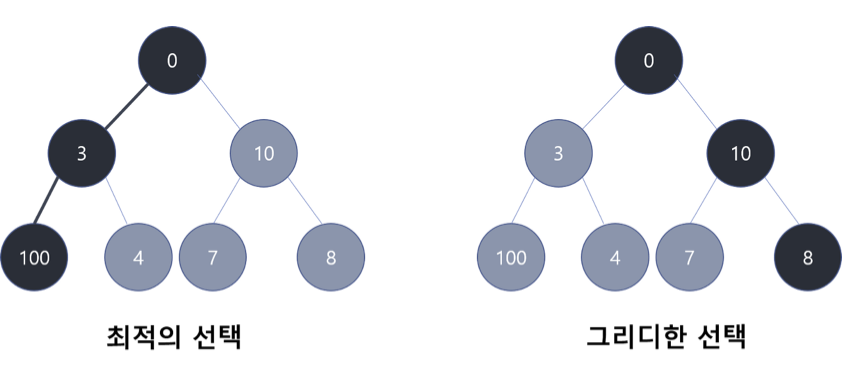
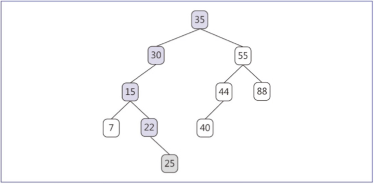

# 알고리즘

# 알고리즘이란?

> 주어진 문제에 대해서 하나 이상의 결과를 생성하기 위해 모호함이 없는 간단하고 컴퓨터가 수행 가능한 유한개의 명령을 순서에 따라 구성한 것, 즉 작업이 어떻게 수행되는지를 정의하는 단계들의 집합
> 
- 조건
    - 입출력
        - 0개 이상의 입력과 1개 이상의 출력이 존재해야 함
    - 명확성
        - 명령은 모호하지 않고 명확해야 함
    - 유한성
        - 한정된 단계를 거치고 나서는 반드시 종료해야 함
    - 유효성
        - 모든 명령은 실행 가능해야 함

# 점근 성능

> n의 크기가 커짐에 따라 결정되는 알고리즘의 성능의 어림값, 수행 시간 f(n)에 대해 계수 없이 최고차항만을 이용해 표기함
> 
- 표기 방법
    
    
    
    ## 1) Big-oh(점근적 상한)
    
    > $어떤\ 양의\ 실수\ c와\ n_0이\ 존재하여\ 모든\ n>=n_0에\ 대하여\ f(n)>= c*g(n)이면\ f(n)=O(g(n))$
    > 
    - 즉, 상한보다 더 커질 수 없음
    
    ## 2) Big-omega(점근적 하한)
    
    > $어떤\ 양의\ 실수\ c와\ n_0이\ 존재하여\ 모든\ n>=n_0에\ 대하여\ f(n)>= c*g(n)이면\ f(n)=Ω(g(n))$
    > 
    
    ## 3) Big-theta(점근적 상하한)
    
    > $어떤\ 양의\ 실수\ c와\ n_0이\ 존재하여\ 모든\ n>=n_0에\ 대하여\ c_1·g(n)<=f(n)<= c_2·g(n)이면\ f(n)=θ(g(n))$
    > 
    
- 연산 시간 증가 순서
    - $O(1)<O(logn)<O(n)<O(nlogn)<O(n^2)<O(n^3)<O(2^n)$

# 알고리즘 설계 기법

## 1. 분할정복(Divide and Conquer)

### 분할정복이란?

- 순환적으로 문제를 해결하는 방식
- 문제를 더이상 나눌 수 없을 때 까지 작은 문제로 분할
- 가장 작은 문제를 해결하고 이들의 해를 결합하여 최종 문제를 해결
- 작업 방식
    - 분할(divide)
        - 주어진 문제를 여러 작은 문제로 나눔
    - 정복(conquer)
        - 작은 문제를 순환적으로 분할하고, 나뉜 문제가 더이상 분할이 되지 않는 경우 문제의 해를 구함
    - 결합(combine)
        - 작은 문제의 해를 모두 합쳐 주어진 문제의 해를 구함

### 적용 예시

- 탐색 알고리즘
    
    1) `이진 탐색`
    
    
    
    ### 이진 탐색이란?
    
    - 키 값이 이미 정렬되어 있는 경우, 적용 가능한 방법
    - 전체 배열 및 부분 배열의 중앙값을 탐색키와 비교하는 방법
    - 탐색키의 값이 배열 값보다 작은 경우 왼쪽 중앙, 큰 경우 오른쪽 중앙으로 이동하여 탐색
    
    ### 탐색 시간
    
    - 정렬된 배열의 단순 탐색
        - $O(logn)$
- 정렬 알고리즘
    
    1) `퀵 정렬`
    
    
    
    ### 퀵 정렬(Quick Sort)이란?
    
    - 맨 왼쪽의 피벗 데이터를 기준으로 배열을 두 부분으로 분할하고 해당
        - 왼쪽 데이터는 피벗보다 작은 값, 오른쪽 데이터는 피벗보다 큰 값
    
    ### 수행시간
    
    - 최선의 수행시간
        - $O(nlogn)$
    - 평균 수행 시간
        - $O(nlogn)$
    - 최악의 수행시간
        - $O(n^2)$
    
    2) `합병 정렬`
    
    
    
    ### 합병 정렬(Merge Sort)이란?
    
    - 왼쪽 부분배열과 오른쪽 부분배열의 크기를 같게 분할
    - 두 부분배열을 더이상 분할할 수 없을 때까지 지속적으로 분할
    - 분할이 모두 진행된 경우, 해당하는 두 부분배열을 정렬하여 합병
    
    ### 수행 시간
    
    - 최선, 평균, 최악의 수행시간
        - $O(nlog(n))$

## 2. 동적 프로그래밍 방법

### 동적프로그래밍 방법이란?

- 특정 문제에 대한 소문제의 해를 테이블에 저장해서 사용
    - 어떠한 문제의 해를 찾기 위해 이전에 구했던 문제를 다시 계산하지 않아도 됨
- 적용 예시
    
    `플로이드 알고리즘`
    
    
    
    ### 플로이드 알고리즘이란?
    
    - 모든 정점 간의 최단 경로를 구하는 동적 프로그래밍 알고리즘
    - 모든 정점간 최단 경로는 방향 그래프의 노드간 경로 중 간선의 가중치 합이 가장 작은 경로
    - 그래프에서 구한 최단 경로는 인접행렬로 표현

## 3. 탐욕 알고리즘

### 탐욕 알고리즘(Greedy)이란?

<!--  -->

- 특정 문제에서 전후 관계와는 상관없이 가장 최선인 최적해를 선택하는 방식
- 간단하고 효율적으로 문제에 대한 최적해를 구할 수 있음
- 전체적인 최적해를 보장하지는 않음

# 알고리즘 분석

- 정확성 분석
    - 유효한 입력에 대해 유한 시간 내에 정확한 결과를 생성하는지 증명
- 효율성 분석
    - 시간 복잡도
        
        
        
        - 알고리즘을 실행하고 완료될 때까지 걸리는 시간
        - 알고리즘을 수행하는 단위 연산을 모두 더한 값
        - 최악의 수행 시간을 알고리즘을 기준으로 시간 복잡도를 평가함
    - 공간 복잡도
        - 알고리즘 실행 후 완료까지 필요한 총 메모리 양
        - 컴파일 과정에 고정된 정적 공간과, 동적 할당 혹은 함수 호출 시 생성되는 동적 공간의 합

# 정렬 알고리즘

1. `선택 정렬`

### 선택 정렬(Selection Sort)이란?

- 데이터 중 가장 작은 값을 선택하여 나열하는 방법
- 모든 키 값 중 가장 작은 원소를 순서대로 왼쪽에 정렬
- 데이터가 적을 경우 효율적

### 수행 시간

- 비교 횟수
    - $(n-1)+(n-2)+ ··· +2+1 = \frac {n(n-1)}2$
- 시간 복잡도
    - 데이터 상태와 관계 없이 $O(n^2)$
    

2. `버블 정렬`

### 버블 정렬(Bubble Sort)이란?

- 배열의 왼쪽부터 오른쪽 끝까지 순서대로 인접한 값을 비교하여 정렬하는 방식
- 한 단계를 거치는 경우 가장 큰 값의 경우 맨 오른쪽에정렬됨
- 해당 단계를 모든 값이 정렬될 때까지 반복
- 자리 변경이 발생하지 않은 경우, 모든 값이 정렬되어 있다는 것을 의미하므로 이후 단계 생략 가능

### 수행 시간

- 최선의 수행 시간
    - 오름차순으로 정렬된 상태
    - $O(n)$의 시간 복잡도
- 최악의 수행 시간
    - 내림차순으로 정렬된 상태
    - $O(n^2)$의 시간 복잡도

1. `삽입 정렬`

### 삽입 정렬(Insertion Sort)이란?

- 정렬된 부분과 정렬되지 않은 부분을 구분
- 정렬되지 않은 부분의 첫번째 값을 기준으로 정렬된 부분에 값을 순서에 맞게 끼워넣는 방식

### 수행 시간

- 최선의 수행시간
    - 데이터가 모두 정렬된 경우
    - n-1번의 비교 수행
    - $O(n)$의 시간 복잡도
- 최악의 수행시간
    - 데이터가 내림차순인 경우
    - $1+2+···+(n-2)+(n-1)=\frac {n(n-1)}2$의 비교 수행
    - $O(n^2)$의 시간 복잡도

# 탐색 알고리즘

1. `순차탐색`

### 순차탐색(Sequential Search)이란?

- 처음 데이터부터 차례대로 탐색키와 비교하는 방법
- 가장 단순함 탐색 방법
- 입력이 리스트(배열, 연결 리스트)인 경우 항상 사용 가능
- 데이터 양이 많은 경우 비효율적
- 데이터가 정렬되어 있지 않은 경우 적합

### 탐색 시간

- 최악의 시간 복잡도
    - $O(n)$

1. `이진 탐색 트리`

### 이진 탐색 트리(Binary Search Tree)란?

- 이진 탐색의 삽입, 삭제 연산을 용이하게 할 수 있도록 이진 트리 형태로 유지
- 특정 노드의 왼쪽 서브트리 키 값은 해당 노드 값보다 항상 작고, 오른쪽 서브트리의 키 값은 해당 노드 값보다 항상 큼

### 연산 방식

- 탐색
    
    
    
    - 찾고자 하는 키 값이 루트 노드보다 큰 경우 오른쪽, 작은 경우 왼쪽으로 이동
- 삽입
    
    
    
    - 기본적으로 탐색 수행
    - 탐색 수행 후 비교할 노드가 없는 경우 해당 노드의 자식노드로 삽입
    - 트리의 형태는 이진 트리를 유지
- 삭제
    
    
    
    - 리프 노드인 경우
        - 해당 값을 가지는 노드를 삭제
    - 하나의 자식노드를 갖는 경우
        - 해당 값의 노드를 삭제한 후 아래의 서브 트리를 위로 이동
    - 2개의 자식 노드를 갖는 경우
        - 해당 값의 노드를 삭제하고 해당 노드의 다음 값을 삭제된 자리에 삽입
        - 해당 삽입 연산을 모든 노드가 이진 트리가 될 때까지 반복
    
    ### 수행 시간
    
    
    
    - 최선 및 평균 탐색 시간
        - $O(logn)$
    - 최악의 탐색 시간
        - 경사 이진트리를 형성하는 경우
        - $O(n)$