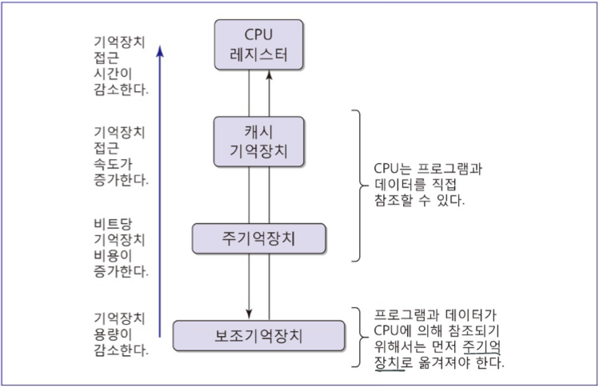
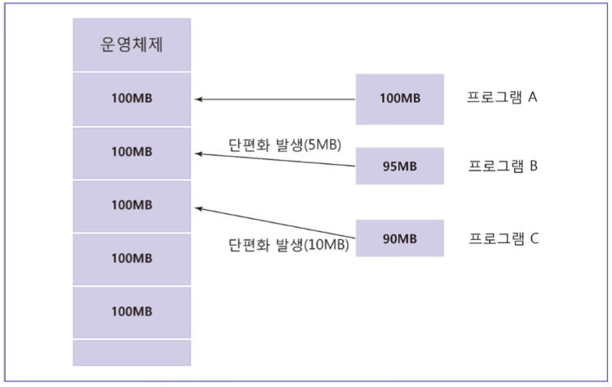
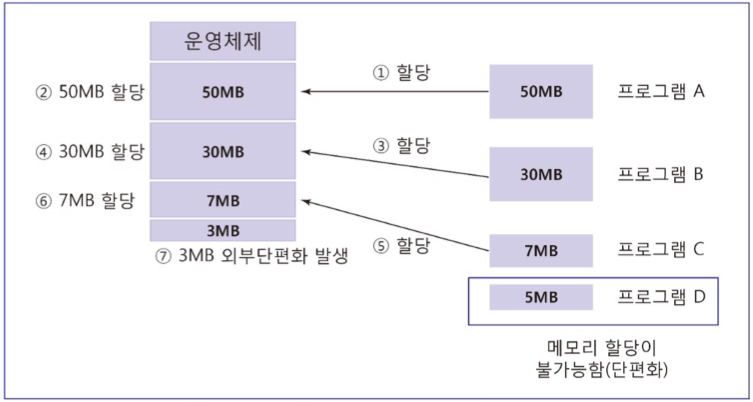
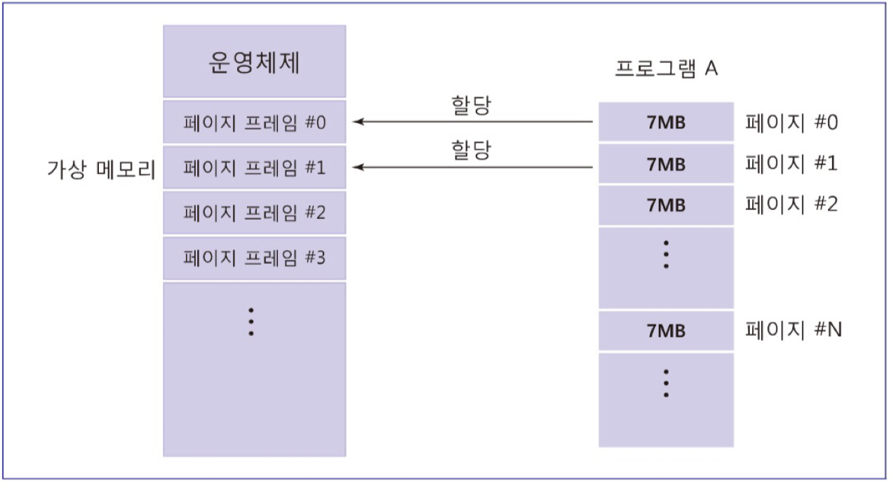
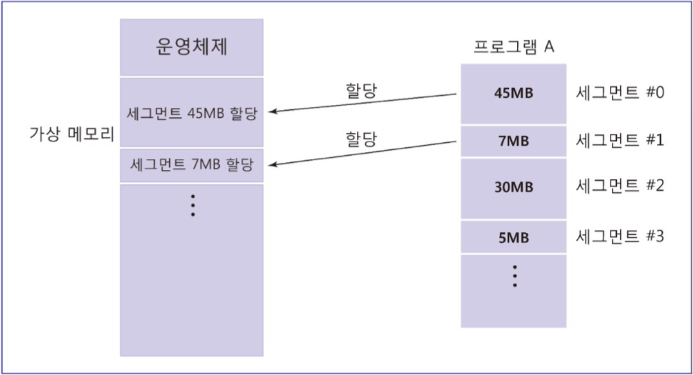

# 운영체제

# 운영체제란?

---

> 컴퓨터 하드웨어와 응용 프로그램 또는 사용자 프로그램 사이의 인터페이스 제공하는 시스템 소프트웨어로 하드웨어 사용의 편리성 및 컴퓨터 자원 효율성을 제공
> 
- 운영체제의 주요 기능
    - 프로세서 관리자, 주기억장치 관리자, 장치 관리자, 파일 관리자

# 작업처리 방식

---

- 일괄처리 시스템(batch processing system)
    - 처리해야 할 작업이 일정량에 도달할 때까지 기다렸다가 여러 작업을 한번에 처리하는 방식
    - 프로그램과 그에 관한 데이터가 일단 작업 큐에 들어가고 나면 고칠 수 없음
- 다중 프로그래밍 시스템(multi-programming system)
    - 여러 프로그램이 존재할 때, 특정 프로그램이 컴퓨터 자원을 사용하지 않는 경우 해당 자원을 다른 프로그램에 양보하며 사용하는 방식
- 시분할처리 시스템(time-sharing processing system)
    - CPU 시간을 작은 시간으로 쪼개 각 사용자에게 시간 간격이 주어지고, 해당 기간동안 컴퓨터와 대화식으로 작업을 수행하는 방식

# 기억장치 계층구조

---

# 주기억장치 할당 방법

---

- 단일 사용자 연속 기억장치 할당
    - 하나의 사용자 프로그램만 전체 주기억장치에 할당
- 고정 분할 다중 프로그래밍 기법
    
    
    
    - 다중 프로그래밍 시스템에서 주기억장치를 여러 개의 고정된 크기의 영역으로 분할하고 실행 중인 여러 개의 프로세스에 각각 할당
    - 단편화(fragmentation): 사용자 프로그램이 분할 영영에 정확하게 맞지 않아 메모리가 낭비되는 현상
- 동적 분할 프로그래밍 기법
    
    
    
    - 프로그램이 주기억장치에 적재될 때마다 작업이 필요로 하는  크기만큼 연속된 공간을 할당해주는 방식

# 가상기억장치 관리 기법

---

- 페이징(paging) 기법
    
    
    
    - 보조기억장치로부터 프로그램 코드나 데이터를 페이지라는 동일한 크기의 블록으로 쪼개 주기억장치에 적재하여 접근
    - 주기억장치 또한 페이지와 같은 크기로 분할됨
- 세그먼테이션(sagmentation) 기법
    
    
    
- 프로그램 코드나 데이터를 서로 다른 크기로 분할한 뒤 주기억장치에 적재하여 접근

# 프로세스란?

---

> 실행 상태에 있는 프로그램
> 
- 프로세스의 상태
    - 생성, 준비, 실행, 대기, 종료

# 중앙처리장치 스케줄링 기법

---

1. 선점 방식(preemptive)
2. 비선점 방식(nonpreemptive)
- 우선순위 스케줄링 기법
    - 우선순위가 높은 프로세스부터 먼저 처리함
- FCFS(First-Come First-Served) 스케줄링 기법
    - 준비 큐에 도착한 순서대로 중앙처리장치를 할당받음
- SJF(Short Job Fisrt)
    - 준비 큐에 존재하는 프로세스 중에서 수행시간이 가장 짧은 것으로 예상되는 프로세스를 먼저 처리함
- RR(Round Robin) 스케줄링 기법
    - 프로세스가 도착한 순서대로 CPU가 할당되지만 추가적으로 CPU의 시간할당량 또는 시간 간격이 주어지고, 해당 시간을 넘기는 경우 가장 나중에 처리됨

## 교착상태

---

- 교착상태(deadlock)란?
    
    > 2개 이상의 프로세스가 자원을 가지고 있고 특정 프로세스가 다른 프로세스가 가지는 자원을 갖기 위해 무한한 시간동안 경쟁하는 현상
    > 
- 교착상태의 필수 조건
    - 상호배제 조건
        - 한 프로세스가 컴퓨터 자원을 사용 중인 경우 해당 자원을 사용하지 못하고 해제시에만 사용 가능
    - 대기 조건
        - 프로세스가 자원을 점유하는 경우 해당 자원을 요청하고 기다려야 함
    - 비선점 조건
        - 프로세스가 점유중인 자원은 자발적으로만 해제 가능
    - 원형 대기 조건
        - 프로세스의 원형 사슬이 존재하며, 특정 프로세스가 요구하는 자원을 다른 프로세스가 가지고 있어 지원을 해제할 때까지 기다림
- 교착상태 처리
    - 교착상태 방지
        - 교착 상태의 필수 요건 4가지 중 어느 한가지라도 만족하지 못하도록 하는 방식
        - 컴퓨터 자원 할당요구를 미리 제한하여 컴퓨터 자원의 이용률과 시스템 성능 저하 문제 발생
    - 교착상태 회피
        - 원형 대기상태가 되지 않도록 자원이 할당 상태를 항상 조사
    - 교착상태 탐지
        - 교착상태에 빠진 프로세스 검사
        - 교착상태 탐지 알고리즘을 수행하면서 시스템 성능에 부담을 줄 가능성 존재
    - 교착상태 복구
        - 시스템 관리자에게 교착상태 발생을 알려 수작업으로 교착상태를 제거
        - 몇개의 프로세스를 중지시키거나 하나 이상의 프로세스들에게 자원을 반납하도록 함

# 파일 관리 시스템

---

- 파일이란?
    - 디스크등의 보조기억장치에 저장되어 있는 서로 연관성 있는 데이터의 집합, 즉 레코드의 집합
- 파일관리 시스템(file management system)이란?
    - 파일에 의해 사용되는 자원의 관리를 비롯하여 파일의 생성, 삭제, 수정, 접근 등을 제어하는 소프트웨어
- 파일관리 시스템의 주요 기능
    - 파일에 저장되어 있는 데이터 접근 관리
    - 파일의 저장, 참조, 공유 및 파일 보호 기법을 제공하는 파일 관리
    - 보조기억장치에 파일 저장을 위한 공간 할당과 관련된 보조기억장치 관리
    - 파일 정보가 소시되지 않도록 파일 무결서 유지 관리
- 파일 구조
    - 순차 파일
        - 레코드들의 저장이 연속적인 물리적 위치에 따라 저장되어 있는 파일 형태
        - 키값에 따라 일정한 순서를 유지하며 저장됨
    - 직접 파일
        - 물리적 주소에 의해 직접 접근 가능한 구조의 파일 형태
    - 인덱스 순차 파일
        - 순차 파일과 직접 파일을 결합한 형태

# 디스크 공간 할당 기법

---

- 연속 할당(contiguous allocation) 기법
    - 파일이 보조기억장치에 저장될 때 연속적 물리적 공간을 할당받는 기법
    - 보조기억장치에 파일 크기보다 큰 연속된 공간이 없는 경우 파일 생성 불가
- 불연속 할당(noncontiguous allocation) 기법
    - 파일을 작은 단위로 나누고, 보조기억장치의 불연속적인 공간을 나누어 할당받는 기법
    - 보조기억장치의 불연속적 공간 단위
        1. 섹터 단위 할당
            - 디스크상에 있는 하나의 파일을 여러 개의 섹터 단위로 저장
            - 동일한 파일에 속한 섹터들은 포인터를 통해 연결된 하나의 리스트를 이루도록 저장
        2. 블록 단위 불연속 할당
            - 연속 할당과 불연속 할당 기법의 절충 방안
            - 개별적이 섹터를 할당하는 대신 연속된 섹터로 구성된 블록을 이용
            - 현재 파일이 저장되어 있는 블록에서 가장 가까운 거리에 있는 블록을 선택하여 할당함