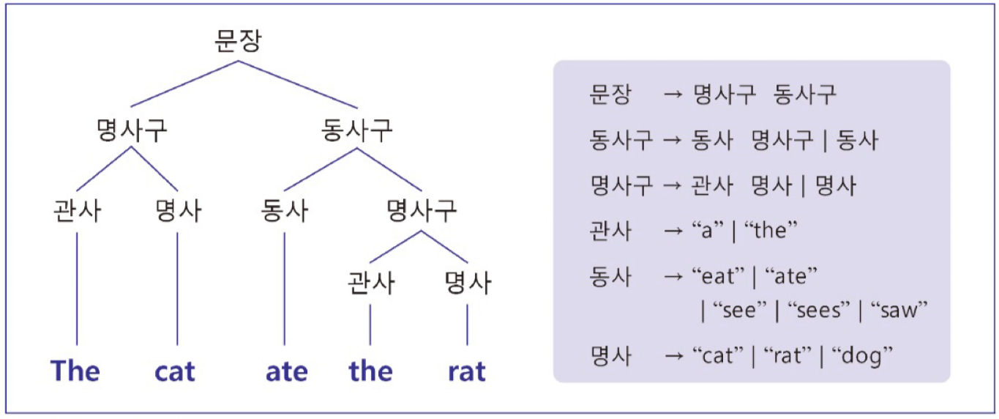
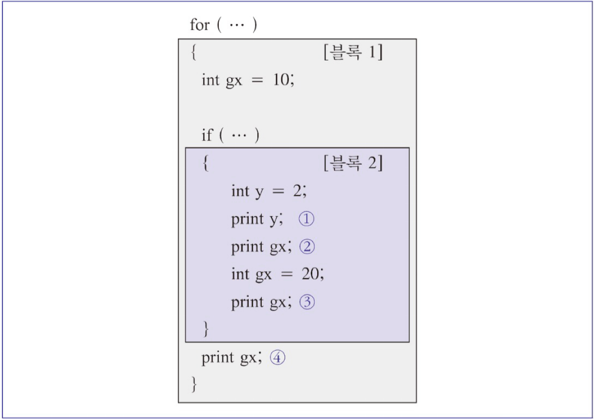
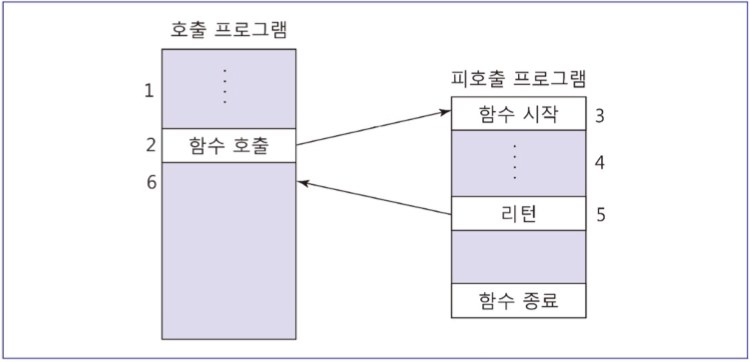
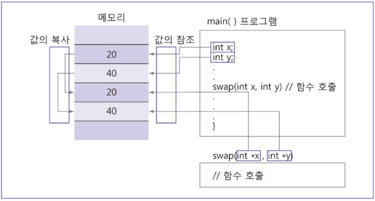
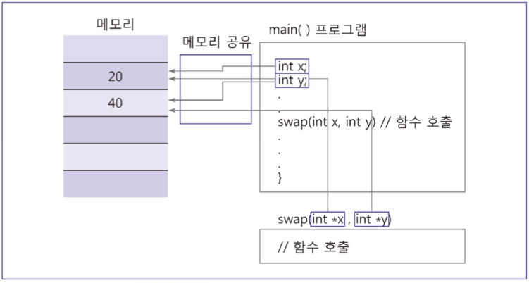

# 프로그래밍 언어

# 프로그래밍 언어란?

---

- 컴퓨터가 특정 작업을 수행할 수 있도록 하기 위해 만들어진 특수 언어
- 단어(예약어, 명령어)와 단어들의 나열규칙을 정의하는 형식문법을 사용해서 기술됨

# 프로그래밍 언어 유형

---

- 기계어
    - 0과 1의 이진수로 구성되어 있음
    - 하드웨어를 직접적으로 제어할 수 있음
    - 사람이 의미를 이해하기 어렵고, 프로그램 작성이 매우 어려움
- 어셈블리어
    - 0과 1로 이루어진 명령어를 사람의 언어와 유사한 알파벳 기호로 바꾼 언어
    - 예시
        
        ```
        mov a1, 061h
        ```
        
- 함수형 프로그래밍 언어(funtional programming language)
    - 수식의 연속으로 이루어져 있으며, 함수들을 사용함
    - 함수의 결과를 다른 함수의 입력값으로 사용하는 프로그래밍 언어
    - 예시
        
        ```
        (+ 3 2);
        (length `(a, b, c));
        (+ 1 (if t 2 3));
        ```
        
- 구조적 프로그래밍 언어(structured programming language)
    - 조건문과 반복문을 사용하여 실행흐름을 제어함
    - 블록 구조, 함수 호출 등 주요 개념을 가져온 프로그래밍 언어
    - 예시
        
        ```
        if (a >= b) {
        	d = a - b;
        	printf("%d", d);
        }
        else 
        	printf("%d", a);
        ```
        
- 논리형 프로그래밍 언어(logical programming language)
    - 질의를 통해 결과를 얻을 수 있는 선언형 언어
- 객체지향 프로그래밍 언어(object-oriented programming language)
    - 객체 개념을 정의하고 객체에 대한 연산과 성질을 정의하여 프로그램을 작성하는 프로그래밍 언어
    - 예시
        
        ```
        public class HelloWorld {
        	public static void main(String[] args) {
        		System.out.println("Hello World");
        	}
        }
        ```
        
- 스크립트 언어(scripting language)
    - 유닉스와 같은 운영체제의 관리와 자동화를 위해 만들어져 사용되기 시작한 프로그래밍 언어
    - 셀 스크립트, 패턴처리 스크립트 언어, 웹 기반 스크립트 언어 등
    - 예시
        
        ```
        >>> print('Hello World')
        ```
        

# 파스트리

---



### 파스트리란?

> 문장의 구조를 빠르게 이해하고 문법의 모호성을 파악하기 쉽게 트리로 만든 형태
> 
- 파스트리의 루트노드는 시작 비단말 기호, 단말 노드는 단말 기호
- 파스트리의 단말노드를 왼쪽에서 오른쪽으로 차례대로 나열하면 문장이 됨
- 형식문법의 요소
    - 단말 기호
        - 문장을 이루는 단어들
    - 비단말 기호
        - 단말 기호가 아니면서 복합적으로 나열된 단말 기호와 비단말 기호의 조합
    - 생성 규칙
        - 하나의 비단말 기호가 어떻게 다른 단말 기호나 비단말 기호를 대체할 수 있는지 정의하는 규칙
        - 예시(영어)
            - 문장은 명사구와 동사구의 합으로 이루어짐
            - 명사구는 관사와 명사의 합으로 이루어짐
    - 시작 기호
        - 가장 상위 계층의 비단말 기호
        - 보통 문장이 시작 기호이며, 파스 트리의 루트 노드에 해당됨

# 컴파일 과정

---

1. 어휘 분석
    - 프로그램을 구성하는 문자들의 나열에서 단어[token(단말 기호)]를 추출하는 과정
    - 빈 칸을 기준으로 단어를 구분하고, 구분한 안의 각 단어를 이름, 숫자, 수식기호 등으로 분류하는 과정
2. 구문 분석
    - 어휘 분석에 결과로 나온 토큰들의 나열이 프로그래밍 언어의 문법에 맞는지 확인하는 과정
    - 이 과정에서 파스 트리 생성
3. 코드 생성
    - 구문 분석의 결과로 변수, 상수, 제어 흐름이 결정됐을 때, 해당 명령어들을 어셈블리어로 풀어쓰거나 이진 코드를 생성함

# 프로그래밍 언어의 공통 개념

---

- 할당문(대입문)
    - 변수나 기억장치 주소에 값을 저장
    - 일반적인 형태
        
        ```
        <수식 1> = <수식 2>
        ```
        
    - 왼쪽 값을 l-value, 오른쪽 값을 r-value
- 변수형 검사
    - 변수형이 호환되지 않는 연산을 찾아내는 것
    - 방식
        - 정적 형 검사
            - 컴파일 과정에서 이루어짐
        - 동적 형 검사
            - 프로그램 실행 중에 이루어짐

# 블록과 변수의 유효범위

---



- 전역변수
    - 프로그램의 코드 모든 영역에서 해당 변수를 사용할 수 있음
- 지역변수
    - 해당 변수가 정의된 블록 내에서만 변수를 사용할 수 있음

# 부프로그램

---

- 부프로그램이란?

> 자주 반복되는 코드를 하나로 묶어 고유 이름을 지정하고, 해당 이름을 고유 명령어처럼 사용할 수 있도록 만들어둔 것
> 
- 부프로그램의 종류
    - 함수
        - return 값 존재
    - 프로시저
        - return 값 존재하지 않음
- 함수의 요구조건
    
    
    
    - 함수의 제어는 단일 진입점을 가짐
    - 함수를 호출한 프로그램은 일시 중단되며 실행 흐름이 호출된 함수로 이전됨
    - 함수가 종료되는 경우 제어 흐름은 함수를 호출한 부프로그램이나 프로그램으로 이전됨

# 함수의 매개변수

---

```c
// x는 형식매개변수
int f(int x) {
	return x+2;
}

int val;
int func_val;
val = 10;
// val은 실매개변수
func_val = f(val)
```

- 함수의 매개변수란?
    
    > 호출하는 프로그램과 호출되는 함수 사이에 주고받는 데이터
    > 
- 방식
    - 값 전달(pass-by-value)
        
        
        
        - 함수 안에서 선언된 변수에 대한 연산이 형식 매개변수에 이루어지고, 프로그램 안에서의 실매개변수 값에는 어떠한 영향도 미치지 않음
    - 참조 전달(pass-by-reference)
        
        
        
        - 실매개변수 자체가 형식매개변수 자리를 취해 함수 안에서 형식매개변수에 행해진 모든 조작이 실매개변수에도 이루어짐
        - 포인터 연산

# 변수의 수명

---

- 기억장소 할당과 함께 시작하여 그 변수 이름에 할당된 기억장소가 더 이상 그 변수값을 의미하지 않을 때까지의 시간

# 객체지향 프로그래밍

---

- 추상화
    - 한 구성요소의 외부적인 특성을 그 구성요소의 내부적 세부사항과 구분하는 것
    - 공통의 유사성을 표현하고 차이점을 삭제함으로써 동일한 부류의 객체들을 하나로 묶어서 표현하는 방법
- 캡슐화
    - 프로그래머에게 추상화된 객체의 이름을 통해 객체를 호출하여 사용하도록 하는 윈도(window)를 제공