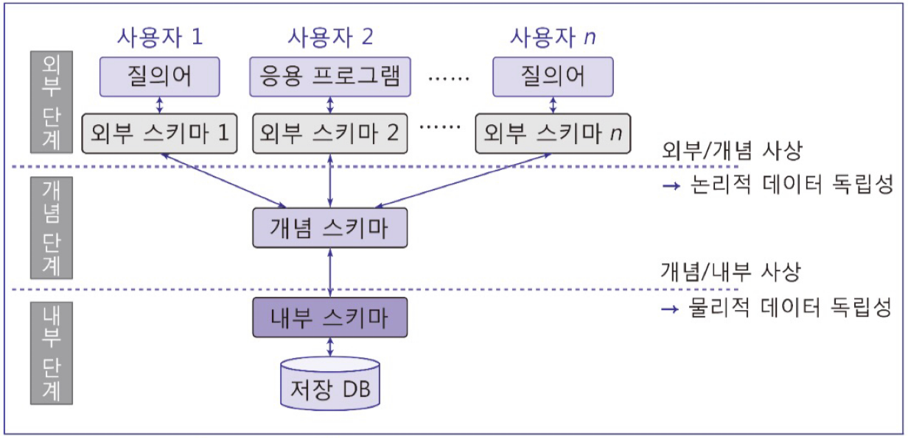
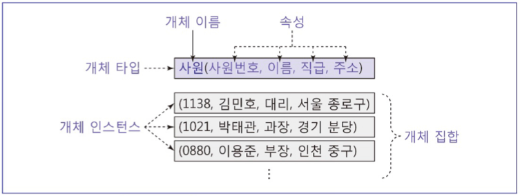
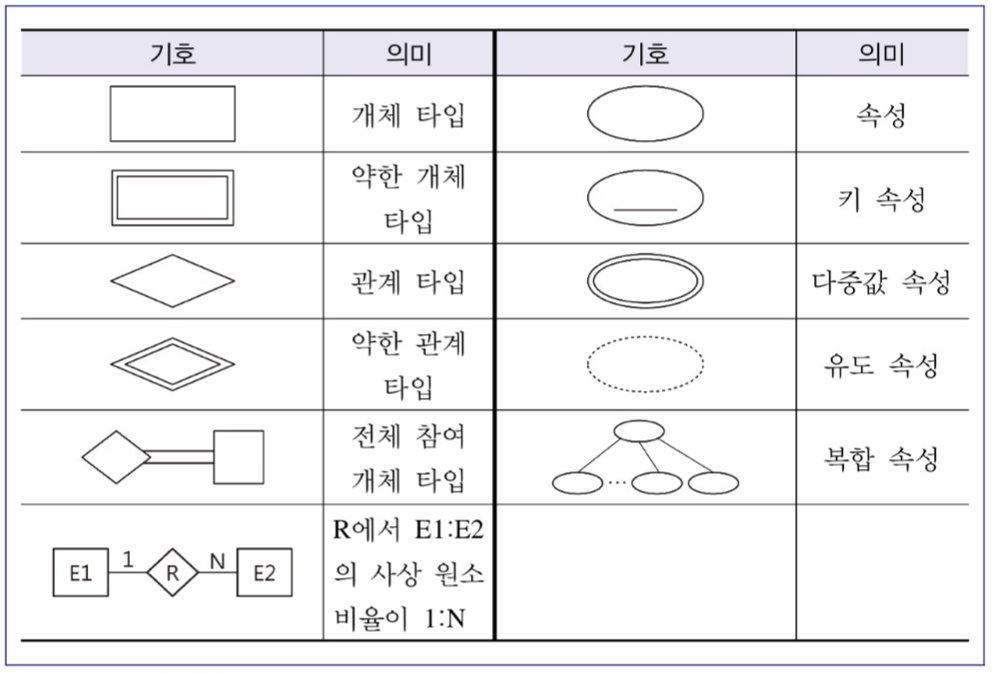
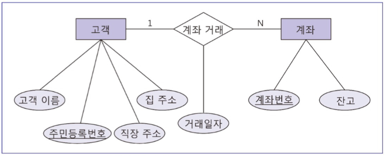

# 7. 데이터베이스

## 데이터베이스

- 한 조직의 여러 사람들이 공유, 통합, 저장, 운영하기 위해 사용되는 데이터의 집합

## 데이터베이스 특징

- 실시간 접근성
    - 데이터베이스에 접근하는 사용자의 요구를 즉시 처리하여 응답 제공

- 지속적인 변화
    - 데이터베이스의 저장된 데이터는 삽입, 삭제, 갱신을 통해 지속적으로 변화

- 동시 공유
    - 여러 사용자가 동시에 원하는 데이터에 접근 가능

- 내용에 의한 참조
    - 데이터는 저장된 위치나 주소가 아닌 값에 따라 참조됨

- 데이터베이스 시스템의 자기 기술성
    - 데이터베이스 시스템이 데이터베이스뿐만 아니라 데이터베이스에 대한 정의나 설명도 가지고 있음
    - 데이터베이스의 정의
        - 데이터베이스에 속하는 각 파일의 구조
        - 각 항목의 타입과 저장 형식
        - 데이터의 제약조건

- 프로그램-데이터 독립성
    - 데이터 파일 구조가 프로그램으로부터 분리되어 시스템 카탈로그에 저장됨
    - 시스템 카탈로그로부터 필요한 데이터베이스의 정의를 가져올 수 있음

- 데이터 추상화
    - 데이터의 세부 정보가 아닌 개념적인 표현을 제공
    - 사용자로 하여금 쉬운 데이터 접근이 가능하게 함

- 다중 뷰 제공
    - 데이터베이스 사용자들이 필요한 부분만 추출해서 볼 수 있음

- 데이터 공유 및 다수 사용자 트랜젝션 처리
    - 여러 사용자가 동시에 데이터베이스에 접근 가능
    - 동시성 제어 기능 제공
        - 다수 사용자가 동시에 데이터를 수정해도 데이터의 일관성을 보장

## 데이터베이스 시스템

> 데이터를 데이터베이스에 저장하고 관리하여 필요한 정보를 생성하는 컴퓨터 중심의 시스템

## 데이터베이스 시스템의 구성요소

- 데이터베이스
- 데이터베이스 관리 시스템
- 데이터 언어
- 데이터베이스 사용자
- 데이터베이스 관리자
- 데이터베이스 기계

## 스키마

> 데이터베이스의 논리적 정의, 즉 자료구조와 제약조건에 대한 명세를 기술한 것
즉, 개체의 특성을 나타내는 **속성 (Attribute)**, 속성들의 집합으로 이루어진 **개체 (Entity)**, 개체 사이에 존재하는 **관계 (Relation)** 에 대한 정의와 이 것들이 유지해야 할 제약조건을 기술

- 데이터베이스를 바라보는 관점
    
    - 외부 스키마
    - 개념 스키마
    - 내부 스키마

## 3단계 데이터베이스 구조 (3-level Database Architecture, ANSI/SPARC)

- 외부 단계 (external)
    - 추상화의 최상위 단계(뷰 단계)
    - 사용자가 필요로 하는 데이터베이스의 일부분만 보여주고 나머지는 은폐함

- 개념 단계 (conceptual)
    - 물리적 저장구조의 세부 사항을 은폐
    - 데이터 간의 존재하는 관계를 기술하는 단계
    - 논리적 단계라고도 불림

- 내부 단계 (internal)
    - 추상화의 최하위 단계
    - 데이터가 실제로 어떻게 저장되어 있는지를 기술함

- 사상
    1. 외부/개념 사상
        - 외부 스키마와 개념 스키마 사이의 대응 관계를 정의
    2. 개념/내부 사상
        - 개념 스키마와 내부 스키마의 대응 관계를 정의

## 데이터베이스 관리 시스템 (DBMS)

> 데이터베이스의 구성, 접근 방법, 관리 유지 등에 대한 모든 책임과 권한을 갖고 응용 프로그램과 데이터의 중재자 역할을 하는 소프트웨어 시스템

- 데이터베이스의 구성, 접근 방법, 관리 유지 등에 대한 모든 책임과 권한을 가지고 있음

## 데이터 언어

> DBMS와 통신할 수 있는 수단으로 데이터 정의어, 데이터 조작어, 데이터 제어어로 구분함

- 데이터 정의어 (DDL: Data Definition Language)
    - 데이터베이스 스키마를 정의하기 위해 사용됨

- 데이터 조작어 (DML: Data Multipulation Language)
    - 데이터베이스에 대한 검색, 수정, 삭제 삽입등의 조작을 위해 사용됨

    - 절차적 (procedural) 데이터 조작어
        - 어떤 데이터가 필요한지, 필요한 데이터를 어떻게 구하는 지 구체적으로 명시해야 함
        - 저수준 데이터 조작어

    - 비절차적 데이터 조작어 (non-procedural)
        - 어떤 데이터가 필요한지만 명세하면 데이터 접근 방법에 대해서는 명시하지 않아도 됨
        - 고수준 데이터 조작어

- 데이터 제어어 (DCL: Data Control Language)
    - 데이터를 안전하게 사용할 수 있도록 데이터 보안, 무결성, 데이터 회복, 동시성 제어등과 관련된 명령어
    - 데이터 베이스 관리자가 사용함

## 데이터베이스 사용자

> 데이터베이스에 접근하는 사람으로 일반 사용자, 응용 프로그래머, 데이터베이스 관리자로 구분 가능

## 데이터베이스 기계

> 데이터베이스 관리 기능을 효율적으로 수행할 수 있도록 특화되어 설계된 하드웨어 및 소프트웨어

## 데이터 모델링

> 실세계 일부분을 데이터베이스 시스템이 지원하는 데이터 모델의 형태로 데이터베이스를 표현하는것

- 데이터 모델
    - 데이터베이스 구조를 추상화하여 체계적으로 명시하기 위한 개념의 집합
    - 개념적 모델, 논리적 모델, 물리적 모델

### 논리적 모델 (구현 모델)

> 개념 세계의 데이터를 데이터베이스에 저장할 구조로 표현하는 과정에서 사용되는 모델

- 계층형 모델
    
    
    
    - 논리적 구조가 트리 형태로 표현

- 네트워크형 모델
    
    
    
    - 그래프를 이용하여 논리적 구조를 표현
    - 오너-멤버 관계

- 관계형 모델

- 객체지향형 모델
    - 객체 지향 개념을 모아 정의해놓은 집합

- 객체관계형 모델
    - 관계형 모델과 객체지향형 모델의 장점을 결합한 형태

### 개체-관계 모델(E-R 모델)

> 현실 세계에 존재하는 개체(entity)와 개체간의 관계(relationship)를 개념적으로 표현하는 방법

- 개체

    

    - 개체란?
        - 데이터로 표현하고자 하는 유무형의 모든 것
        - 사람이나 사물과 같은 물리적인 것 뿐만 아니라 직급이나 부서와 같은 개념적인 것도 가능함
    - 특징
        - 다른 개체와 구별되는 이름을 가지며, 하나 이상의 속성을 가짐
    - 속성(attribute)이란
        - 데이터의 가장 작은 논리적 단위
        - 개체만이 가지는 고유한 특성이나 상태
    - 속성의 종류
        - 단일값 속성: 속성의 값이 하나
        - 다중값 속성: 속성의 값이 여러개
        - 단순 속성: 속성의 의미 분해 불가
        - 복합 속성: 속성의 의미 분해 가능
        - 유도 속성: 기존의 다른 속성 값에서 유도

- 관계    
    > 개체 타입의 모든 인스턴스, 개체 집합들 사이의 대응성(사상)을 의미, 집합간의 관계를 해석하여 의미있는 정보를 얻을 수 있음

    - 분류 기준: 원소의 수 (mapping cardinality)
        
        
        
- E-R 다이어그램

- E-R 모델을 그래프 방식으로 표현한 것으로 개체 타입을 사각형, 관계를 마름모, 속성은 타원으로 표현, 이들을 연결하는 링크로 구성됨

    

- 예시
    
    

### 관계형 모델

> 데이터를 행과 열로 구성된 테이블(릴레이션) 형식으로 나타내 구현한 것

- 주요 용어의 의미
    - 릴레이션
        - 테이블
    - 튜플
        - 행, 레코드
    - 속성
        - 열, 필드
    - 차수
        - 속성의 개수
    - 영역(도메인)
        - 속성이 가질 수 있는 값의 집합
    - 카디널리티
        - 튜플의 개수

### 키 (Key)

> 릴레이션의 튜플을 유일하게 구별할 수 있는 속성 혹은 속성의 집합
 
- 기본 성질
    - 유일성
        - 키값으로 하나의 투플을 유일하게 식별함
    - 최소성
        - 키는 모든 튜플을 유일하게 식별 가능한 최소의 속성들로 구성됨

- 종류
    - 슈퍼키
        - 유일성을 만족하는 속성 혹은 속성의 집합
    - 후보키
        - 슈퍼키 중 최소성을 만족하는 것, 즉 유일성과 최소성을 만족하는 것
    - 기본키
        - 후보키 중 DB 설계자나 관리자가 기본적으로 사용할 키로 선택한 것
    - 대체키
        - 후보키 중 기본키로 선택되지 못한 것
    - 외래키
        - 다른 릴레이션(테이블)의 기본기를 그대로 참조하는 속성 또는 속성의 집합

### 관계 (Relation)

- 구성 요소
    - 릴레이션 스키마(relation schema)
    - 릴레이션 인스턴스(relation instance)

- 특징
    - 튜플의 유일성
        - 하나의 릴레이션에는 중복되는 튜플이 존재하지 않음
        - 하나의 키값으로 하나의 튜플을 유일하게 식별
    - 튜플의 무순서성
        - 한 릴레이션에 포함된 튜플은 순서를 가지지 않음
    - 속성의 무순서성
        - 한 릴레이션을 구성하는 속성들 사이에는 순서가 존재하지 않음
        - 이름과 값의 쌍으로 구성됨
    - 속성값의 원자성
        - 모든 속성 값은 분해 불가능한 하나의 값(원자값)을 갖는다
        - 널값도 원자값으로 취급함

- 제약조건
    - 영역 제한 조건
        - 각 속성의 값은 반드시 해당 속성의 영역에 포함되며, 원자값이어야 함
    - 키 제약 조건
        - 적어도 하나의 키가 모든 튜플을 유일하게 식별 가능해야 함
    - 개체 무결성 제약 조건
        - 어떠한 기본키값도 널값이 될 수 없음
        - 널값인 경우 튜플을 식별할 수 없기 때문
    - 참조 무결성 제약 조건
        - 한 릴레이션에 있는 튜플이 다른 릴레이션에 있는 참조하기 위해서는 반드시 참조되는 튜플이 해당 릴레이션 내에 존재해야 함

## 데이터베이스 설계

- 사용자의 요구조건으로부터 데이터베이스 구조를 도출해 내는 과정

- 데이터베이스 내용과 구조 설계에 관한 활동과 데이터 처리와 응용 소프트웨어 설계에 관련된 활동이 병행적으로 수행

- 데이터베이스 내용과 구조 설계 과정
    - 사용자 요구 사항 분석
        - 데이터베이스 사용자의 요구 사항을 수집하고 분석하여 데이터베이스 용도를 파악

    - 개념적 설계
        - 추상화를 통해 속성으로 기술된 개체 타입과 개체 타입간의 관계를 나타내기 위해 데이터베이스에 대한 개념적 구조를 생성
        - 개념적 데이터 모델로 E-R 모델을 가장 많이 사용

    - 논리적 설계
        - E-R 다이얼로그를 관계형 데이터 모델로 변환시켜 스키마로 표현

            

        - 고수준의 개념적 구조를 목표 DBMS의 논리적 모델로 변환하는 논리적 데이터 모델링이 이루어짐
        - 응용 프로그램에 대한 인터페이스 설계가 이루어짐

    - 물리적 설계
        - 물리적 데이터베이스 구조를 설계
        - 여러 파일 타입에 대한 저장 레코드 양식, 순서, 접근 경로, 저장공간등의 할당 등을 표현

    - 구현 단계
        - DBMS의 데이터 정의어로 기술된 명령문을 컴파일하고 실행

## SQL(Structured Query Language)이란?

> 관계 데이터베이스를 위한 구조화된 질의어로, 데이터의 정의, 조작, 제어 기능 제공함

- SQL 데이터 정의어
    - 스키마, 도메인 테이블, 뷰 등을 정의하거나 변경 혹은 제거하는 문장
    - CREATE, ALTER, DROP 명령문

- SQL 데이터 조작어
    - 데이터에 대한 검색, 갱신, 삭제, 삽입을 수행
    - SELECT, UPDATE, DELETE, INSERT문

### 뷰

> 하나 이상의 테이블로부터 유도되어 만들어지는 가상테이블, 뷰의 내용은 실제 만들어지는 것이 아니라 기본테이블에 데이터를 이용하여 만들어짐
