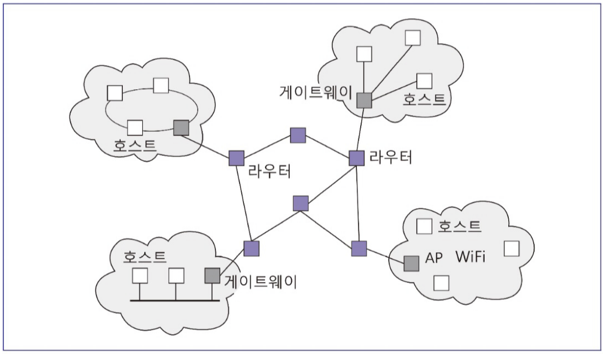
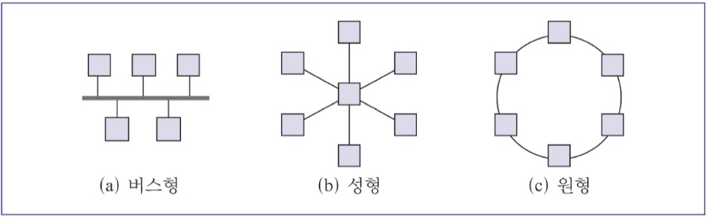
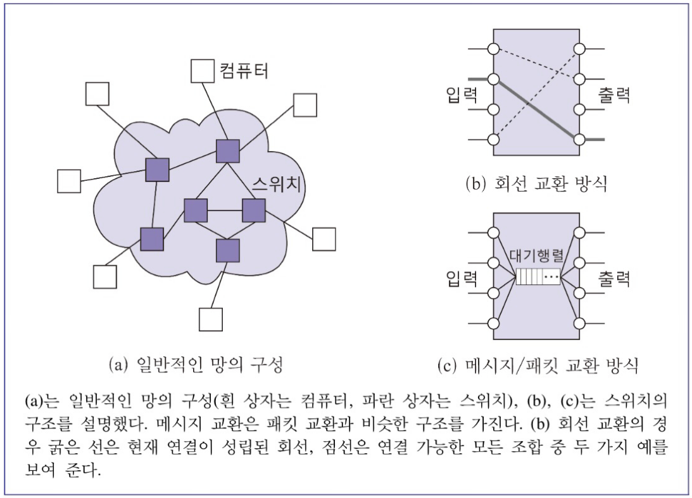
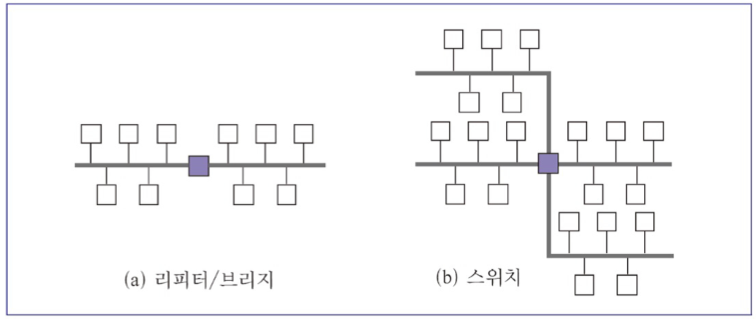
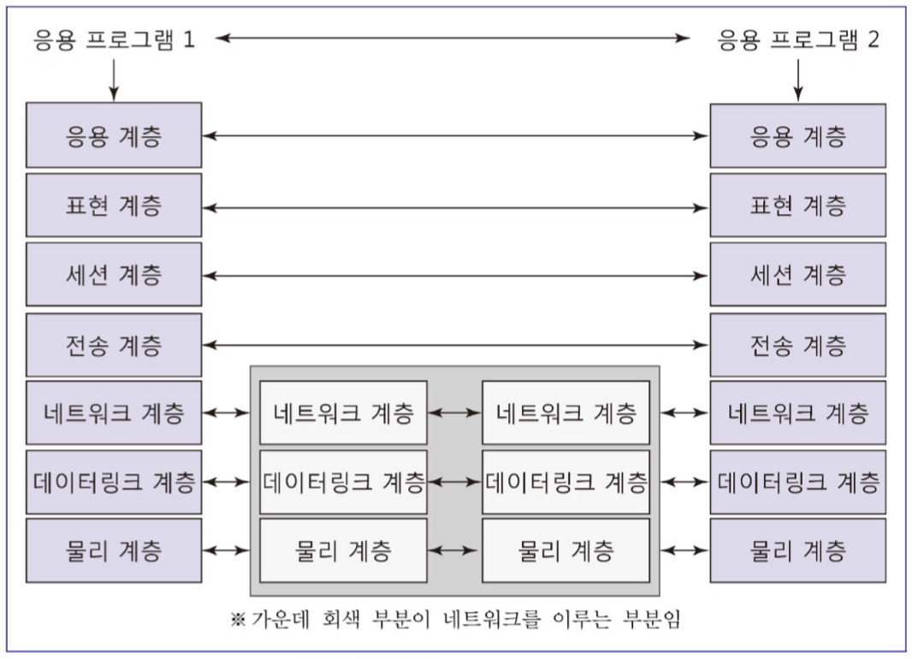
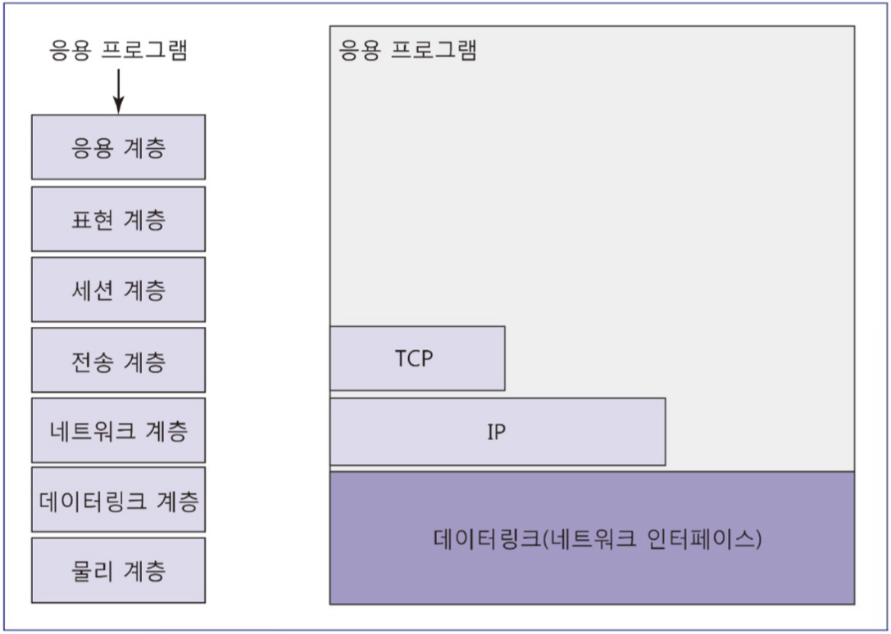

# 컴퓨터 네트워크

# 컴퓨터 네트워크란?

---

> 데이터 통신을 위한 것으로 사람, 컴퓨터, 기타 장비들간의 정보를 교류할 수 있도록 함
> 

# 네트워크 구성요소

---

- 채널
    - 통신 신호가 실제로 전달되는 통로
    - 전선, 전화선, 광케이블 무선 링크 등의 통신 매체
- 주파수
    - 통신 채널을 통해 전달되는 통신 신호가 초당 몇 번을 진동하는 지를 계산한 것
    - 주파수의 단위
        - 헤르츠(Hz)
- 대역폭
    - 통신 채널의 최대 주파수에서 최소 주파수 사이의 주파수 대역
    - 최대 주파수가 높을수록 같은 시간에 많은 정보 전달 가능
- 노드
    - 네트워크에 연결된 컴퓨터나 관련 장비
    - 일반 범용 컴퓨터나 라우터(router)와 같은 전용 네트워크 장비
- 네트워크 인터페이스
    - 컴퓨터와 네트워크를 연결해주는 장치
    - 이더넷 카드나 USB 와이파이 등
- 프로토콜
    - 해당 파트에서는 통신 프로토콜을 의미하며, 통신하는 노드 간의 합의된 통신 규약

# 컴퓨터 네트워크의 크기

---

- LAN(Local Area Network)
    - 근거리 통신 네트워크
    - 방, 빌딩, 캠퍼스
- MAN(Metropolitan Area Network)
    - 도시권 통신 네트워크
    - 도시
- WAN(Wide Area Network)
    - 광역 통신 네트워크
    - 국가, 대륙

# 컴퓨터 네트워크 연결 형태ㅍ

---

- 버스(bus)형 컴퓨터 네트워크
    - 컴퓨터들이 하나의 버스를 공유하면서 데이터 송신을 위해 연결된 모든 컴퓨터에 메시지를 보내는 형태
    - 데이터 수신자가 주소를 보고 선택적으로 수신
    - 예시
        - 이더넷
- 성(star)형 컴퓨터 네트워크
    - 중앙에 있는 컴퓨터가 모든 데이터의 중계자 역할을 함
    - 모든 데이터가 중앙의 컴퓨터로 보내지고 데이터를 수신받은 중앙의 컴퓨터가 다양한 목적지의 컴퓨터에게 데이터를 송신
    - 예시
        - 와이파이 엑세스 포인트[WiFi AP(Access Point] 컴퓨터 네트워크
- 원(ring)형 컴퓨터 네트워크
    - 데이터가 원형으로 돌면서 특정 컴퓨터의 다음 컴퓨터로 지속적으로 전달하여 최종 수신 컴퓨터에게 데이터를 전달하는 방법
    - 예시
        - 토큰링 네트워크

# 데이터 교환(Switching) 방식

---

- 회선 교환 방식
    - 물리적으로 연결된 회선 중 통신을 위해 임시로 전용 회선을 선택하여 데이터를 주고받는 방식
- 데이터 교환 방식
    - 송신하고자 하는 데이터 전체를 한 단계씩 목적지 방향의 스위치를 거쳐서 전송
    - 스위치 안에 대기행렬(queue)을 통해 수신한 데이터를 순서대로 전달함
- 패킷 교환 방식
    - 데이터를 패킷(packet)이라는 작은 단위로 나누워 패킷별로 보내는 방식
    - 중간 단계의 스위치들은 수신한 패킷을 목적지 방향의 스위치로 전달
    - 대기행렬 사용

# 네트워크 연결 요소

---

- 리피터(repeater)
    - 2개의 버스가 동시에 연결된 장비
    - 어떤 버스에서 수신 받았는지에 관계없이 양쪽 버스에 수신된 정보를 브로드캐스트함
- 브릿지(bridge)
    - 리피터와 동일한 장비
    - 데이터를 목적지에 해당하는 버스 방향으로만 브로드캐스트함
- 스위치(switch)
    - 2개 이상의 버스와 연결되어 있음
    - 소프트웨어 기반으로 구현
    - 목적지 방향의 버스 쪽으로만 데이터를 브로드캐스팅

# OSI 참조 모델(7 계층)

---

- 물리 계층(physical layer)
    - 물리적으로 연결된 채널을 통해 비트 단위로 전송
    - 예시
        - 이더넷의 연결 잭
- 데이터링크 계층(datalink layer)
    - 직접 연결된 두 컴퓨터나 장비 간에 프레임 단위로 전송하는 계층
        - 프레임(frame): 블록 단위의 정보
    - 예시
        - 이더넷, 와이파이
- 네트워크 계층(network layer)
    - 패킷 단위의 전송이 이루어지는 계층
    - 패킷 경로를 결정하는 라우팅 발생
    - 패킷이 몰리는 경우 혼잡제어 (congestion control)수행
- 전송 계층(transport layer)
    - 세트먼트 혹은 데이터그램 단위의 데이터가 송신 컴퓨터에서 수신 컴퓨터까지 신뢰성을 보장하며 전달하는 계층
    - 데이터를 패킷 단위로 잘라 네트워크 계층을 통해서 전송
    - 패킷의 일부가 중간에 사라지거나 순서가 바뀐 경우 오류 없이 다시 궁해서 전송
    - 예시
        - TCP(Transport Control Protocol)
- 세션 계층(session layer)
    - 통신 컴퓨터 간 접속 및 차단 관리와 데이터 통신 방식을 결정하는 계층
- 표현 계층(presentation layer)
    - 송수신되는 데이터의 표현 방식에 대한 표준화된 구문 형식 제공
    - 응용 계층에서 데이터 사용 방식과 무관하게 잘 작동할 수 있도록 하는 계층
- 응용 계층(application layer)
    - 웹에서 사용하는 HTTP(HyperText Transfer Protocol), 파일 전송을 위한 FTP, 이메일 전송을 위한 SMTP 등과 같은 응용 프로토콜의 기능을 지원하는 계층

# 인터넷

---

- 인터넷
    - TCP/IP 프로토콜 기반으로 구현
    - 효율성을 위해 OSI 참조 모델의 일부만을 구현

- TCP/IP 구현에 필요한 요구 조건
    - 네트워크 하드웨어/컴퓨터 기술 독립성
        - 다양한 컴퓨터 구조, 운영체제를 갖는 모든 컴퓨터와 장비 사이에 안정적인 데이터 교환을 위해 필요
    - 연결성
        - 전체 네트워크가 항상 가동되어 임의의 두 컴퓨터가 연결 가능한 상태로 유지되어야 함
    - 출발지-목적지 간 수신 확인
        - 송신 컴퓨터의 데이터가 수신 컴퓨터에 제대로 도착했는지 확인 가능해야 함
        
    - 응용 계층 프로토콜의 표준화
        - 미리 정의된 통신 프로토콜을 사용해야 정보통신 서비스와 컴퓨터 자원의 공유가 가능
- 데이터 링크 계층 프로토콜
    - 이더넷
        - 하나의 선로를 여러 대의 컴퓨터(노드)가 공유하며 정보를 교환
        - 다중 접근(multiple accesss) 방식
    - 와이파이
        - 송신과 동시에 수신 범위에 있는 모든 노드에 정보가 도착함
        - 이더넷과 달리 무선으로 연결되어 있음
        - 와이파이 연결 노드인 AP(Access Point)가 여러 개로 구성되어 있음
        - AP는 이더넷과 같은 유선 네트워크에 연결되어 있음

# IP

---

## IP란?

> 패킷의 출발지-목적지(end-to-end) 간 전송을 위한 프로토콜
> 
- 종류
    - IPv4(IP 버전 4)
        - IP에서는 해당 표준을 주로 사용
        - 사용가능한 호스트(인터넷 상의 노드) 주소가 $"2^{32}"$(대략 42억개)로 한정되어 있음
    - IPv6(IP 버전 6)
        - 호스트 주소 부족 문제를 해결하고 추가 기능 지원
- 방식
    - 패킷 송신, 패킷 수신 호스트 컴퓨터의 주소 지정을 위해 컴퓨터별로 IP주소가 부여됨
    - IP를 사용해 패킷(packet)을 보냄
    - 패킷은 데이터그램이라고도 불림
- 패킷
    - 헤더(header) 부분과 데이터 부분으로 구성
    - 헤더
        - 주소 등 각종 제어정보나 버전정보, 패킷의 길이, 송수신 IP 주소 등의 정보를 가짐
- IP 라우팅 방법
    - 복잡한 네트워크에서 IP 패킷을 목적지로 보내는 방법
    - 라우터는 라우팅 테이블을 이용해 라우터에 도착한 데이터그램의 수신 주소 방향으로 패킷을 전달(forwarding)하는 역할

# TCP

---

## TCP란?

> 송신 노드로부터 수신 노드까지 신뢰성 있게 순서대로 나열된 데이터를 보낼 수 있도록 하는 방식
> 
- 기능
    - 신뢰성 있는 연결 지향형(connection-oriented) 메시지 전송 지원
        - 송신자가 수신자에게 메시지 보내고, 수신자는 송신자에게 수신 확인 메시지를 발송
    - 데이터가 중간에 누락되는 경우 세그먼트를 복원하는 작업 진행
    - 중복 세그먼트 삭제

# 응용 계층 프로토콜

---

- ICMP(Internet Control Message Protocol)
    - 전송 오류에 관한 메시지를 주고받는 데 사용
- FTP(File Transfer Protocol)
    - 파일 전송에 사용
- HTTPS(HyperText Transfer Protocol over Secure skcket layer)
    - 웹 서버와 웹 브라우저 간 멀티미디어 통신에 사용
    - Http에 보안이 강화된 방식
- SMTP(Simple Mail Transfer Protocol)
    - 인터넷 이메일 전송을 위해 사용됨
    - 메일 서버 사이의 메일 송수신 혹은 사용자가 메일 서버에 메일을 보내는 경우에 사용
    - 메일 서버에서 사용자에게 메일이 전달되는 경우 POP3, IMAP4 프로토콜 사용
- DHCP
    - 인터넷 IP를 동적으로 할당받는 데에 사용
    - 와이파이 사용시 자동으로 스마트폰 IP 주소를 부여해주는 데에 사용
- 도메인 네임 시스템(DNS: Domain Name System)
    - 숫자로 이루어진 IP 주소와 문자로 이루어진 IP 주소를 연결시켜 주는 역할