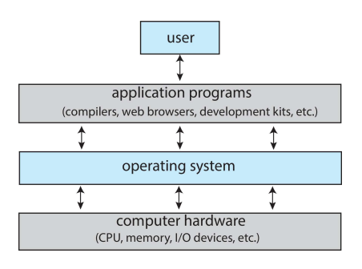
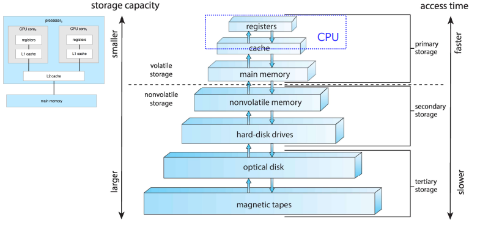

# 서론

## 운영체제가 할 일

- `운영체제`란?

    - 컴퓨터 하드웨어를 관리

    - 응용프로그램의 토대를 제공

    - 사용자와 하드웨어 중간 매개체 역할

- 컴퓨터의 시스템은 네 가지 구성요소로 구성

    - 하드웨어

        - 중앙 처리 장치, 메모리 및 입출력 장치로 구성되어 기본 계산용 자원 제공

    - 운영체제

        - 다양한 사용자를 위해 다양한 응용 프로그램 간의 하드웨어 사용을 제어, 조정

        - 컴퓨터 시스템이 동작할 때 이등 자원을 적절하게 사용할 수 있는 방법 제공

    - 응용 프로그램

        - 사용자의 컴퓨팅 문제를 해결하는 데 사용되는 방법을 정의

    - 사용자

        - 인간, 기계, 다른 컴퓨터

    

- 운영체제의 사용자 관점

    - 편리함, 사용의 용이함, 좋은 수행력 등의 `사용의 용이성`

    - 하지만 `자원의 이용`에는 전혀 신경을 쓰지 않음

- 운영체제의 시스템 관점

    - 하드웨어와 밀접하게 연관된 프로그램

        - 자원 할당자, 자원 관리자

    - 컴퓨터 시스템을 효율적이고 공정하게 운영할 수 있도록 어느 자원을 할당할지를 결정해야 함

- 운영체제의 정의

    - 컴퓨터에서 항상 실행되는 프로그램(커널)

    - 요즘날 모바일 운영체제에는 핵심 커널 뿐만 아니라 `미들웨어(middleware`도 포함되기도 함

---

## 컴퓨터 시스템의 구성

- 하나 이상의 APU와 구성요소와 공유 메모리 사이에 액세스를 제공하는 공통 버스를 통해 연결된 여러 장치 컨트롤러로 구성

    - 각 장치 컨트롤러마다 장치 드라이버 존재

- 인터럽트

    - 컨트롤러가 장치 드라이버에세 작업을 완료했다는 사실을 CPU에게 알리는 것

    - CPU가 인터럽트 되면 하던 일을 중단하고 즉시 고정된 위치로 실행을 옮김

        - 고정된 위치는 `인터럽트 서비스 루틴(ISR)`이 위치한 시작 주소를 가지고 있음

    - 과정

        1. 인터럽트 요청

        2. 프로그램 실행 중단

        3. 현재 진행중인 프로그램 상태 보관

        4. 인터럽트 원인 판별

        5. 인터럽트 서비스 루틴(ISR) 처리

            - 실질적인 인터럽트 처리 작업

        6. 상태 복구

            - PC(프로그램 카운터)를 복원하여 이전 실행 위치로 복원

        7. 중단된 프로그램 실행 재개

- 부트스트랩 프로그램(bootstrap program)

    - 컴퓨터 전원을 켤 때 가장 먼저 실행되는 프로그램

- 저장장치

    - 비트, 바이트, 워드

        - 워드 : 컴퓨터 구조의 본연의 데이터 단위

            - 보통 64비트 레지스터와 64비트 메모리 주소지정을 가지는 컴퓨터가 64비트 워드를 가짐

    - 메인 메모리

        - 메인 메모리는 모든 필요한 프로그램과 데이터를 영구히 저장하기에는 너무 작은

        - 전원이 공급되지 않으면 내용을 잃어버리는 `휘발성` 저장장치

        - 따라서 대부분의 컴퓨터는 보조저장장치를 제공

            - HDD, NVM 등

    - 저장장치 시스템은 저장용량, 액세스 시간에 따라 계층 구조로 구성됨

        

        - 크기와 속도는 상충하는 측면

            - 메모리가 작고 빠를수록 CPU에 더 가깝고, 용량은 더 작아짐

        - 캐싱

            - 정보를 저장공간에서 더 빠르게 접근하기 위한 기법

        

---

## 컴퓨터 시스템 구조

---

## 운영체제의 작동

---

## 자원 관리

---

## 보안과 보호

---

## 가상화

---

## 분산 시스템

---

## 커널 자료구조

---

## 계산 환경