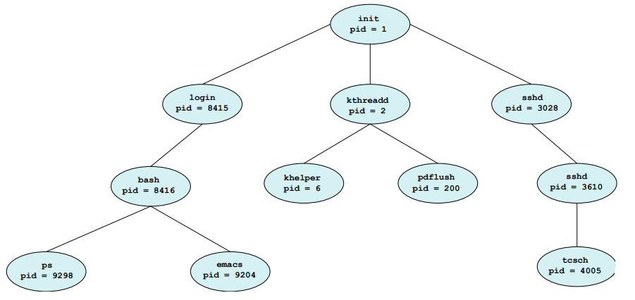

# 프로세스


## 프로세스 개념

- 프로세스

    - 실행중인 프로그램

    - 순차적으로 실행됨

- 프로그램 카운터

    - 프로세스의 현재 활동의 상태를 나타냄

- 프로세스의 메모리 배치는 일반적으로 여러 섹션으로 구분됨

    

    1. 텍스트 섹션

        - 실행 코드

    2. 데이터 섹션

        - 전역 변수

    3. 힙 섹션

        - 프로그램 실행 중에 동적으로 할당되는 메모리

    4. 스택 섹션

        - 함수를 호출할 때 임시 데이터 저장장소

            - 함수 매개변수, 복귀 주소 및 지역변수

    - 스택, 힙 섹션은 서로의 방향으로 커지므로 운영체제는 서로 겹치지 않게 해야함

        

- 프로세스 상태 (중요)

    - `new`

        - 프로세스가 생성 중

    - `running`

        - 명령어들이 실행되는 중

    - `waiting`

        - 프로세스가 어떤 이벤트가 일어나기를 기다리는 중

    - `terminated`

        - 프로세스의 실행이 종료됨

        

- 프로세스 제어 블록(Process Control Block, PCB)

    - 특정 프로세스와 연관된 여러 정보를 수록하고 있음

    1. 프로세스 상태

        - new, ready, running, waining, halted

    2. 프로그램 카운터

        - 이 프로세스가 다음에 실행할 명령어의 주소를 가리킴

    3. CPU 레지스터들

        - 누산기, 인덱스 레지스터, 스택 레지스터, 범용 레지스터, 상태 코드 정보가 포함

    4. 메모리 관리 정보

    5. 회계 정보

    6. 입출력 상태 정보

---

## 프로세스 스케줄링

- 다중 프로그래밍의 목적

    - CPU 이용을 최대화하기 위하여 항상 어떤 프로세스가 실행되도록 함

- 프로세스 스케줄러

    - 코어에서 실행 가능한 여러 프로세스 중에서 하나의 프로세스를 선택함

- 스케줄링 큐

    - 준비 큐(ready queue)

        - 프로세스가 시스템에 들어가면 준비 큐에 들어감

    - 대기 큐(wait queue)

        - I/O 완료와 같은 특정 이벤트가 발생하기를 기다리는 프로세스는 대기 큐에 들어감

        

- 문맥 교환(context switch)

    - 인터럽트가 발생한 시스템은 인터럽트 처리가 끝난 후에 문맥을 복구할 수 있도록 현재 실행중인 프로세스의 현재 문맥을 저장해야 함

        - 이는 프로세스를 중단했다가 재개하는 작업

    - 문맥 교환이 진행되는 동안 아무런 일을 하지 못하기에 `오버헤드`가 됨
    
---

## 프로세스에 대한 연산

### 프로세스 생성

- 실행되는 동안 프로세스는 여러 개의 새로운 프로세스를 생성할 수 있음

    - 생성하는 프로세스는 `부모 프로세스`, 새로운 프로세스는 `자식 프로세스`

    - 트리가 형성됨

- 프로세스 각각은 정수 식별자인 `프로세스 식별자(pid)`를 사용하여 구분됨

리눅스의 전형적인 프로세스 트리


- 자원 공유 옵션

    1. 부모와 자식이 모든 자원을 공유

    2. 자식이 부모로부터 일부의 자원을 공유

    3. 아무런 공유를 하지 않음

- 두 프로세스를 실행시키는 옵션

    1. 부모는 자식과 병행하게 실행을 계속함

    2. 부모는 일부 또는 모든 자식이 실행을 종료할 때까지 기다림

- 주소 공간 측면에서 볼 때의 옵션

    1. 자식 프로세스는 부모 프로세스의 복사본(같은 프로그램과 데이터를 가짐)

    2. 자식 프로세스가 자신에게 적재될 새로운 프로그램을 가지고 있음


- fork() : 새로운 프로세스 생성

- exec() : 자신의 메모리 공간은 새로울 프로그램으로 교체

- wait() : 자식이 실행하는 동안 할 일이 없으면 자식이 종료될 때까지 준비 큐에서 자신을 제거하기 위해 기다림

- exit() : 종료

### 프로세스 종료

- 프로세스가 마지막 문장의 실행을 끝내고 exit 시스템 콜을 사용하여 운영체제에 자신의 삭제를 요청하면 종료

    - 부모 프로세스에 (wait()을 통해) 상태값을 반환할 수 있음

- 프로세스의 모든 자원이 할당 해제도디고 운영체제로 반납됨

- 부모가 자식 프로세스를 종료(terminate)하는 경우

    1. 자식이 자신에게 할당된 자원을 초과하여 사용할때

    2. 자식에게 할당된 태스크가 더이상 필요 없을때

    3. 부모가 exit 하는데 운영체제는 부모가 exit한 후에 자식이 실행을 계속하는 것을 허용하지 않는 경우

- 몇몇 시스템에서 부모가 종료한 이후에 자식이 존재할 수 없으므로 `연쇄식 종료`가 필요함

    - 프로세스가 종료하면 그로부터 비롯된 모든 자식들도 종료되어야 함을 의미

- 좀비(zombie) 프로세스

    - 종료되었지만 부모 프로세스가 아직 wait() 호출을 하지 않은 프로세스

- 고아(orphan) 프로세스

    - 부모 프로세스가 wait()을 호출하는 대신 종료를 함

- 안드로이드 프로세스 계층 (참고)

    - 전경 프로세스(foreground process)

    - 가시적 프로세스(visible process)

    - 서비스 프로세스(service process)

    - 백그라운드 프로세스(background process)

    - 빈 프로세스(empty process)

---

## 프로세스 간 통신(IPC)

- 프로세스간에 데이터를 공유하지 않는 독립적 프로세스도 있지만, 프로세스간에 영향을 주거나 받는다면 `협력적`인 프로세스

- 프로세스 협력 이유

    - 정보 공유

    - 계산 가속화

    - 모듈성

- 프로세스 간 통신(Interprocess Communication, IPC)

    - 공유 메모리(shared memory), 메시지 전달(message passing) 기법이 존재

        

    - 공유 메모리(shared memory)

        - 

    - 메시지 전달(message passing)

        - 적은 양의 데이터를 교환하는데 유용

        - 분산 시스템에서 공유 메모리보다 구현이 쉬움

---

## 공유 메모리 시스템에서의 프로세스 간 통신

- 프로세스 간에 메모리 영역이 공유됨

- OS가 아닌 사용자의 제어 하에 있음

    - 동기화 기법이 필요함

### 생산자- 소비자 문제(Producer-Consumer Problem)

- 생산자는 정보는 생산, 소비자는 정보를 소비

- 해결책은 공유 메모리를 사용하는것

- 무한 버퍼(unbounded buffer)

    - 버퍼의 크기에 한계가 없음

- 유한 버퍼(bounded buffer)

    - 버퍼의 크기가 고정되어 있음

    - 버퍼가 비면 소비자는 대기해야 하고, 버퍼가 전부 채워져 있으면 생산자가 대기해야 함

- 유한 버퍼에서의 공유 메모리

    - 논리 포인터 `in`과 `out`을 갖는 원형 배열로 구현됨

    - in == out 일때 버퍼는 비어 있음

    - ((in+1)% BUFFER_SIZE) == out 이면 버퍼는 가득 참

    

---

## 메시지 전달 시스템에서의 프로세스 간 통신

- 동일한 주소공간을 공유하지 않고도 프로세스들이 통신을 하고, 그들의 동작을 동기화할 수 있도록 허용하는 기법 제공

    - 분산 환경에서 매우 유용

- 서로 메시지를 주고받기 위해 통신 연결이 설정되어야 함

- send(), receive()를 통해 통신함

- 직접 통신

    - 통신하기 위해 상대방의 신원(identity)만 알면 됨

    - 정확히 두 프로세스 사이에만 연결됨(하나의 연결)

    ```
    send(P, message)  -  프로세스 P에 메시지를 전송
    receive(Q, message)  -  프로세스 Q로부터 메시지를 수신
    ```

- 간접 통신

    - 메시지들은 메일박스(mailbox) 또는 포트(port)로 송,수신됨

    - 각 메일박스는 고유의 id를 가짐

    - 한 쌍의 프로세스가 같은 공유 메일박스를 가져야함

    - 연결은 두개 이상(다수)의 프로세스가 연관될 수 있음

    ```
    send(A, message)  -  메시지를 메일박스 A로 송신
    receive(A, message)  -  메시지를 메일박스 A로부터 수신
    ``` 

### 동기화

- Blocking send

    - 송신하는 프로세스는 메시지가 수신될 때까지 봉쇄

- Blocking receive

    - 수신 프로세스는 메시지가 이용 가능할 때까지 봉쇄

- Non-blocking send

    - 송신 프로세스가 메시지를 보내고 계속함

- Non-blocking receive

    - 수신 프로세스가 유효한 메시지 또는 NULL을 받음

- 랑데부(rendezvous)

    - send(), receive()가 모두 봉쇄형일 때 랑데부 하게됨

### 버퍼링

- 무용량(zero capacity)

    - 큐의 최대 길이가 0

        - 링크는 자체 안에 대기하는 메시지들을 가질 수 없음

    - 송신자는 수신자가 메시지를 수신할 때까지 기다려야 함

- 유한 용량(bounded capacity)

    - 큐는 유한한 n의 길이

    - 링크가 가득 차있는 동안 봉쇄됨

- 무한 용량(unbounded capacity)

    - 큐는 무한한 길이

    - 메시지들이 얼마든지 큐 안에서 대기할 수 있음

    - 송신자는 절대 봉쇄되지 않음

---

## IPC 시스템의 사례

### POSIX shared memory

### 파이프(Pipes)

- 파이프는 두 프로세스가 통신할 수 있게 하는 전달자로서 동작

- 초기 UNIX 시스템에서 제공하는 IPC 기법중 하나였음

- 고려사항

    1. 단방향 통신 또는 양방향 통신을 허용하는가

    2. 양방향 통신이 허용되면 반이중 방식인가 전이중 방식인가

        - 반이중 : 한순간에 한 방향 전송만 가능

        - 전이중 : 동시에 양방향 데이터 전송 가능

    3. 통신하는 두 프로세스 간에 부모-자식과 같은 특정 관계가 존재해야 하는가

    4. 네트워크를 통해 통신이 가능한가, 동일한 기계 안에 존재하는 두 프로세스끼리만 가능한가

- 일반 파이프

    - 생산자-소비자 형태로 두 프로세스 간의 통신을 허용

    - 생산자는 파이프의 한 종단(쓰기 종단)에 쓰고, 소비자는 다른 종단(읽기 종단)에서 읽음

        - 결과적으로 단방향 통신만이 가능

        

- 지명 파이프(Named pipes)

    - 양방향 통신 가능

    - 부모-자식 관계 필요로 하지 않음

    - 여러 프로세스들이 통신할 수 있음

---

## 클라이언트 서버 환경에서의 통신

### 소켓

- 통신의 극점을 뜻함

- 두 프로세스가 네트워크상에서 양 프로세스마다 하나씩 소켓이 필요

- 각 소켓은 IP주소와 포트번호 두가지를 접합하여 구별

- 클라이언트-서버 구조 사용

    

### 원격 프로시저 호출(Remote Procedure Calls, RPC)

