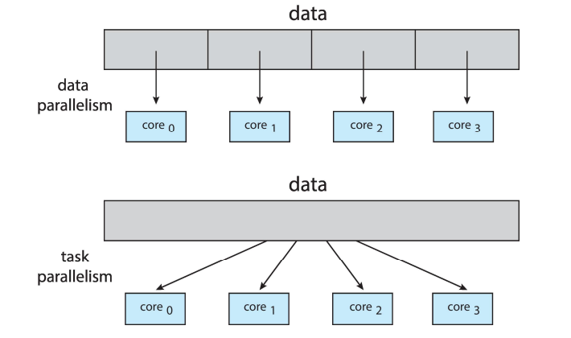
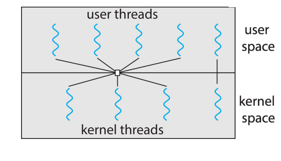

# 스레드와 병행성

## 개요

- 스레드(thread)

    - CPU 이용의 기본 단위

    - 전통적인 프로세스는 하나의 제어 스레드 -> `단일 스레드(single thread)`

    - 프로세스가 다수의 제어 스레드를 가진다면 -> `다중 스레드(multiple thread)`

        - 다중 코어 시스템에서 처리 능력을 향상시킴

            - 다중 계산 코어를 사용하여 다수의 CPU 집중 작업을 병렬로 처리 가능

            

        - 운영체제 커널 또한 다중 스레드

            - 사용자는 메인스레드(Main thread)에게 작업을 요청하면, 메인스레드는 worker스레드에게 서비스를 요청하고 추가적인 사용자 요청을 listen한다.

            

        - 장점

            1. `응답성(responsiveness)`

                - 하나가 block되어도 다른 스레드는 작업을 계속함

            2. `자원 공유(resource sharing)`

                - IPC보다 쉽게 자원을 공유

            3. 경제성(economy)

                - 스레드 생성은 프로세스 생성보다 쉽고 저렴함

                - 문맥교환보다 스레드 switching의 오버헤드가 더 적음

            4. 규모 적응성(Scalability)

                - 병렬 처리의 장점

---

## 다중 코어 프로그래밍

- 다중 코어(multicore)

    - 하나의 컴퓨텅 칩에 여러 컴퓨팅 코어를 배치

    - Challenges

        1. 분배 수행(dividing activities)

            - 서로 독립적이고 분리되어 개별 코어에서 병렬 실행될 수 있어야 함

        2. 균형(balance)

            - 균등한 기여도를 가지도록 task를 분배

        3. 데이터 분리(data spliting)

            - task가 접근, 조작하는 데이터가 개별 코어에서 사용할 수 있도록 분리

        4. 데이터 종속성(data dependency)

            - 접근하는 데이터는 둘 이상의 task 사이에 종속성이 없는지 검토해야 함

            - 동기화

        5. 시험 및 디버깅(testing and debugging)

            - 다중 코어에서 병렬로 실행될 때 다양한 실행 경로가 존재할 수 있으므로

- Comcurrency(동시성)

    - 단일코어(single core)

    - 동시에 번갈아가며 일을 처리(병렬적 = X)

- Parallelism(병렬성)

    - 다중코어(multicore)

    - 병렬적으로 실행

    

- 병렬 실행 유형

    - 데이터 병렬 실행(data parallelism)

        - 동일한 데이터의 부분집합을 다수의 계산 코어에 분배한 뒤 각 코어에서 동일한 연산 실행

    - 태스크 병렬 실행(task parallelism)

        - 데이터가 아니라 태스크(스레드)를 다수의 코어에 분배

        - 각 스레드는 고유의 연산

        

    - 두 전략은 상호 배타적이지 않아 혼용하여 사용하기도 함

---

## 다중 스레드 모델

- 사용자 스레드
    
    - 사용자 수준에서 관리됨

    - 커널 위에서 지원되며 커널의 지원 없이 관리됨

- 커널 스레드

    - 커널 수준에서 제공됨

    - 운영체제에 의해 직접 지원되고 관리됨

- 스레드 모델들

    - 다대일 모델(Many-to-One)

        - 다중 사용자 스레드가 하나의 커널 스레드로 매핑

        - 한 스레드가 blocking 하면 다른 모든 스레드가 block

        - 병렬로 실행할 수 없음

        

    - 일대일 모델(One-to-One) (가장 흔한 모델)

        - 각 사용자 스레드를 각각 하나의 커널 스레드로 매핑

        - 하나가 block 되어도 다른 스레드들을 실행함 -> 다대일 보다 많은 병렬성 제공

        - 사용자 스레드를 만들려면 커널 스레드도 만들어야 하는 오버헤드 발생 가능

        

    - 다대다 모델(Many-to-Many)

        - 여러 개의 사용자 스레드를 그보다 작거나 같은 수의 커널 스레드로 멀티플렉스 함

        - blocking 문제 발생하지 않음

        - 가장 flexible 하지만 구현하기 어려움

    - Two-level 모델

        - 다대다 + 일대일

        - 다대다 구현하기 어려우므로 탄생

        

---

## 암묵적 스레딩

- 스레딩의 생성과 관리 책임을 개발자로부터 컴파일러와 실행시간 라이브러리에게 넘겨주는 것

- 스레드 풀(thread pool)

    - 프로세스를 시작할 때 아예 일정한 수의 스레드들을 미리 풀로 만들어두는 것

        - 스레드를 만드는데 걸리는 시간을 줄이고, 스레드를 무한정 만들면 생기는 자원 고갈 현상을 막아주기 위해

    - 장점

        1. 새 스레드를 만들기보다 기존 스레드로 서비스해 주는 것이 종종 더 빠름

        2. 임의 시각에 존재할 스레드 개수에 제한을 두어서 많은 수의 스레드를 병렬 처리할 수 없는 시스템에 도움이 됨

        3. 태스크 생성 방법을 태스크로부터 분리하면 태스크 실행을 다르게 할 수 있음
