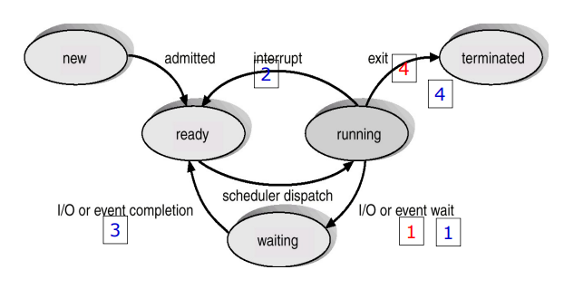
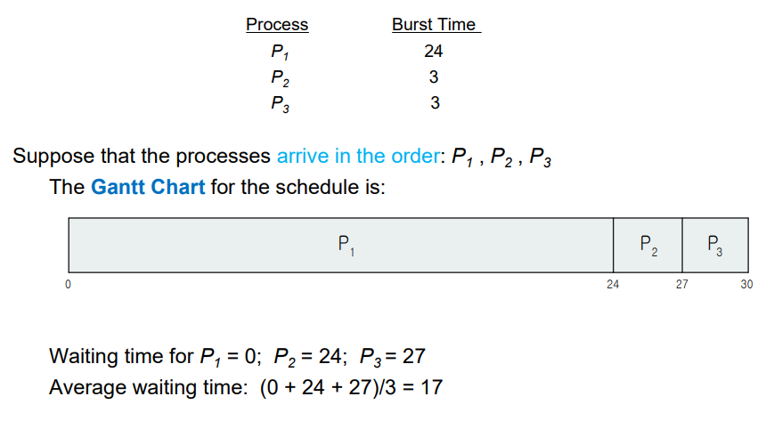
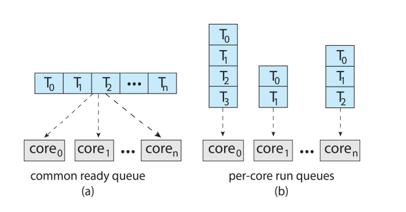

# CPU 스케줄링
- 운영체제가 프로세스를 프로세서에 할당하는 것을 디스패치(Dispatch)라고 한다. (이때 프로세스 상태가 ready에서 running으로 바뀐다.) 그리고 운영체제가 레디 큐(Ready queue)에 있는 프로세스들 중에서 어떤 프로세스를 디스패치할 것인가 정하는 것이 프로세스 스케줄링(Process scheduling)이다.

- 선점(Preemptive) 방식과 비선점(Non-Preemptive) 방식으로 나뉜다. 선점 스케줄링은 운영체제가 강제로 프로세스의 사용권을 통제하는 방식이고, 비선점 스케줄링은 프로세스가 스스로 다음 프로세스에게 자리를 넘겨주는 방식이다. 즉, 선점 스케줄링 방식에서는 CPU에 프로세스가 할당되어 있을 때도 운영체제가 개입해 다른 프로세스에게 CPU를 할당할 수 있다.

## 기본 개념

- 프로세스의 실행은 I/O burst와 CPU burst 두 상태 사이를 교대로 왔다 갔다 함

    

- CPU 스케줄러

    - 준비 큐에 있는 프로세스 중에서 하나를 선택 실행하는데 선택하는 역할을 함

    - 준비 큐는 반드시 FIFO 방식의 큐는 아니어도 됨

- CPU 스케줄링의 결정 상황

    1. 한 프로세스가 실행 상태에서 대기 상태로 전환될 때(ex. I/O요청, wait() 호출할 때) `(running -> waiting)`

    2. 프로세스가 실행 상태에서 준비 완료 상태로 전환될 때(ex. 인터럽트 발생) `(running -> ready)`

    3. 프로세스가 대기 상태에서 준비 완료 상태로 전환될 때(ex. I/O 종료 시) `(waiting -> ready)`

    4. 프로세스가 종료할 때 `(terminate)`

    - 1, 4의 경우 스케줄링 면에서 선택의 여지가 없음 -> `비선점(nonpreemptive)` or 협조적(cooperative)

    - 2, 3의 경우 선택의 여지가 있음 -> `선점(preemptive)`

        

- 디스패처(dispatcher)

    - CPU 코어의 제어를 CPU 스케줄러가 선택한 프로세스에 주는 모듈

    - 하는 일

        - 한 프로세스에서 다른 프로세스로 문맥을 교환

        - 사용자 모드로 전환

        - 프로그램을 다시 시작하기 위해 사용자 프로그램의 적절한 위치로 이동

    - 디스패치 지연(dispatch latency)

        - 디스패처가 하나의 프로세스를 정지하고 다른 프로세스의 수행을 시작하는 데까지 소요되는 시간

---

## 스케줄링 기준

- CPU 스케줄링 알고리즘을 비교하기 위한 기준들

    1. CPU 이용률(CPU utilization)

    2. 처리량(Throughput)

    3. 총처리 시간(Turnaround time)

    4. 대기 시간(Waiting time)

    5. 응답 시간(Response time)

    - 1과 2는 최대화하고, 3, 4, 5는 최소화하는 것

---

## 스케줄링 알고리즘

### 선입 선처리 스케줄링(First-Come, First-Served, FCFS)

- 비선점 방식이므로 대화식 프로세스에는 부적합

- CPU를 먼저 요청하는 프로세스가 CPU를 먼저 할당받음 (FIFO큐 이용하여 쉽게 관리)

    

    순서를 달리 한다면

    

    더욱 짧은 평균 대기시간

- 긴 프로세스가 앞에 있을수록 뒤의 짧은 프로세스들은 긴 대기시간으로 인한 `호위효과(convoy effect)` 발생 가능

### 최단 작업 우선 스케줄링(Shortest-Job-First, SJF)

- CPU 버스트 길이가 작은 순서대로 프로세스에 할당

    - 동일한 길이인 경우는 선입 선처리

- 평균 대기시간이 주어진 프로세스 집합에 대해 최소

    

- 하지만 다음 CPU 버스트의 길이를 알 수 없기에 CPU 스케줄링 수준에서는 구현 불가능

    - 따라서 다음 CPU 버스트는 일반적으로 측정된 이전의 CPU 서스트들의 길이를 `지수 평균` 한것으로 `예측`

- 버스트 시간(실행 시간)이 큰 프로세스는 계속 뒤로 밀려나는 `기아(Starvation)`가 발생한다

### 우선순위 스케줄링(Priority)

- 우선순위가 각 프로세스에 연관되어 있으며, CPU는 가장 높은 우선순위를 가진 프로세스에 할당됨

    - 우선순위가 같으면 선입 선처리

- 새로 도착한 프로세스의 우선순위가 현재 프로세스보다 높다면 CPU를 선점함

    - `무한 봉쇄`, `기아 상태(starvation)` 문제 발생 가능성이 있음

        - 이를 해결하기 위한 해결 방안으로는 `노화(aging)`

            - 오랫동안 시스템에서 대기하는 프로세스일 수록 우선순위를 증가시킴

### 라운드 로빈 스케줄링(Round-Robin, RR)

- 선입 선처리 + 선점(preemptive)이 추가된 개념

- 각 프로세스에 일정시간을 할당하고, 할당된 시간이 지나면 그 프로세스는 잠시 보류한 뒤 다음 프로세스에게 돌아가는 것을 반복

    - 돌아가며 기회를 부여하는 운영방식

    

### 다단계 큐 스케줄링(multilevel queue)

- 우선순위마다 별도의 큐를 갖는 것

- 우선순위 스케줄링이 라운드 로빈과 결합한 경우에도 효과적

    

### 다단계 피드백 큐 스케줄링

- 프로세스가 큐들 사이를 이동하는 것을 허용

    - 어떤 프로세스가 CPU 시간을 많이 사용하면 낮은 우선순위의 큐로 이동시킴

        - 기아(starvation) 상태를 예방

        

---

## 스레드 스케줄링

- 대부분 최신 운영체제에서 스케줄 되는 대상은 프로세스가 아닌 `커널 수준 스레드`

---

## 다중 처리기 스케줄링

- 지금까지의 예시는 단일 처리기 코어를 가진 시스템

- 여러 개의 CPU를 사용하면 여러 스레드가 병렬로 실행되는 `부하 공유(load sharing)`가 가능해짐

- 다중 처리기

    - 여러 개의 물리적 프로세서를 제공하는 시스템

- 대칭 다중 처리(symmentric multiprocessing, SMP)

    - (a) 모든 스레드가 공통 준비 큐(ready queue)에 있을 수 있음

        - 두 개의 다른 프로세서가 동일한 스레드를 스케줄 하지 않도록, 큐에서 스레드가 없어지지 않도록 보장해야 함

    - (b) 각 프로세서는 자신만의 스레드 큐를 가질 수 있음

        
        
---

## 실시간 CPU 스케줄링
