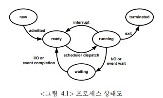

# 프로세스 관리

## 1.1 프로세스 개념
----
### 1.1.1 프로세스
- 프로세스 : 실행 중인 프로그램
- 프로세스의 구성
    - 텍스트 부분(text section): 프로그램 코드
    - 현재 상태: 프로그램 카운터를 포함한 현재 프로세서의 레지스터 값
    - 스택(stack): 일시적인 데이터(파라미터, 복귀주소, 지역 변수 등)를 저장하는 곳
- 프로그램 자체는 프로세스가 아니다. 프로그램은 수동적 개체이지만 프로세스는 능동적 개체이다.
- 여러 프로세스가 같은 프로그램과 관련되어 있더라도 서로 같은 것으로 간주하지 않는다.
----
### 1.1.2 프로세스의 상태

- 가능한 상태: 그림 4.1
    - `생성중(new)`: 프로세스가 생성 중이다.
        - 예) log on, 프로그램의 실행
    - `실행중(running)`: 프로세스가 실행 중이다.
    - `대기중(waiting)`: 프로세스가 어떤 사건을 기다리고 있는 상태
    - `준비완료(ready)`: 프로세스가 프로세서에 할당되기를 기다리고 있는 상태
    - `종료(terminate)`: 프로세스의 실행이 종료된 상태
        - 프로세스의 상태가 준비중, 실행중, 대기중이라는 것은 프로세스가 주기억 장치에 적재되어 있음을 말한다. 주기억장치에 적재되어 있는 프로세스의 수를 줄이기 위해 유닉스에서는 프로세스를 중지(suspend)할 수 있다. 프로세스가 중지되면 주기억장치에서 일시적으로 제거되어 디스크에 보관되며, 재개될 때까지 스케줄링 대상에서 제외된다.
- 단일 프로세스 시스템에서는 현재 실행 상태에 있을 수 있는 프로세스는 오직 하나이다. 하지만 많은 프로세스가 대기 또는 준비완료 상태에 있을 수 있다.
- 대기중인 프로세스는 현재 프로세서가 실행할 프로세스가 없더라도 실행될 수 없다.
----
#### 프로세스 제어 블록


----
### 1.1.3 프로세스 제어 블록
- 운영체제는 프로세스마다 위의 블록과 같은 `프로세스 제어 블록(PCB, Process Control Block)`을 유지한다. 다른 말로 태스크 제어 블록이다.
- 프로세스 제어 블록에 유지되는 정보
    - 프로세스 상태: 생성중, 실행중, 대기중, 준비완료, 종료
    - 프로그램 카운터: 다음에 실행할 명령어의 주소
    - CPU 레지스터: 실행중 상태에서 대기중 또는 준비중으로 변경될 때 현재 레지스터의 값을 여기에 보관한다. 이것은 프로그램 카운터와 함께 다시 실행중 상태로 옮길 때 필요하다.
    - CPU 스케줄링 정보: 우선순위와 같은 스케줄링에 필요한 정보
    - 주기억장치 관리 정보: 기준 레지스터와 한계 레지스터의 값과 같은 주기억장치 관리에 필요한 정보
    - 회계 정보: CPU 사용 시간과 같은 통계 정보
    - 입출력 상태 정보: 프로세스에 할당된 입출력 장치, 프로세스가 연 파일 목록 등
----
### 1.1.4 스레드
- 프로세스 모델에서 프로세스는 단일 실행 흐름을 가짐. 이런 흐름을 스레드(thread)라 한다. 최근에는 하나의 프로세스가 여러 스레드를 가질 수 있도록 하였다. 따라서 프로세스는 한번에 여러 작업 수행 가능.
----
## 1.2 프로세스 스케줄링
- 다중 프로그래밍의 목적은 항상 실행할 프로세스가 있도록 하는 것. 이를 통해 CPU 사용 효율을 높이는 것이다.
----
   
그림 <준비완료 큐>

----
   
그림 <프로세스 스케줄링 표현하는 큐잉 도표>

----
### 1.2.1 스케줄링 큐
- 큐는 일반적으로 연결 리스트(linked list)로 구현됨.
- 큐의 종류
    - `작업 큐(job queue)`: 프로세스가 시스템에 처음 들어와서 대기하는 큐
    - `준비완료 큐(ready queue)`: 주기억장치에 적재되어 실행을 기다리는 프로세스를 유지하는 큐
    - `장치 큐(device queue)`: 장치를 사용하기 위해 기다리는 큐로서, 각 장치는 자신만의 장치 큐를 가지고 있다.
    - `대기 큐(waiting queue)`: 특정한 사건마다 그 사건을 기다리는 프로세스를 유지하는 큐를 사용할 수 있다.
- 프로세스가 실행중 상태일 때 발생할 수 있는 사건의 종류
    - 입출력을 요청하면 해당하는 장치큐로 옮겨진다.
    - 새로운 프로세스를 생성하여 그 프로세스의 종료를 기다릴 수 있다. 이 경우에는 대기 큐에 옮겨진다. 하지만 부모 프로세스도 자식 프로세스와 함께 병행으로 수행될 수 있다. 이 경우에는 준비 큐로 옮겨진다.
    - 인터럽트가 발생하면 현재 수행 중인 프로세스를 중단하고 인터럽트를 처리. 처리가 끝나면 보통 현재 프로세스를 준비완료 큐로 옮긴다.
- 모드 스위치(mode switch)와 프로세스 스위치의 차이점
    - 모드 스위치: 사용자 모드에서 커널 모드로 변경될 때 발생, 완전 문맥 전환이 필요하지 않고, 시스템 스택을 사용한다. 예) 시스템 호출
    - 프로세스 스위치: 현재 실행 중인 프로세스를 중단하고 새 프로세스를 실행할 떄 발생하며, 완전 문맥 전환 필요하다.
----
### 1.2.2 스케줄러
- 각 큐마다 다음 차례의 프로세스를 결정하여 주는 `스케줄러(scheduler)가 있다.`
- 프로세스의 종류
    - `입출력 중심 프로세스(I/O-bound process)`: 계산보다 입출력을 많이 하는 프로세스
    - `계산 중심 프로세스(CPU-bound process)`: 입출력보다는 계산을 많이 하는 프로세스
- `장기 스케줄러(long-term scheduler)`: 한번에 병행으로 수행할 수 있는 작업의 수가 제한되어 있다. 작업풀에서 준비완료 큐로 옮겨질 다음 작업을 결정한다. 다른말로 `작업 스케줄러(job schduler)`라 한다.
    - 장기 스케줄러는 입출력 중심과 계산 중심 스케줄러를 적절한 비율로 선택해야한다.
- `단기 스케줄러(short-term scheduler)`: 이 스케줄러는 준비완료 큐에서 다음에 CPU에 할당하여 실행할 프로세스를 결정한다. 다른말로 `CPU 스케줄러`라 한다.
- `중기 스케줄러(midterm)`: 시분할 시스템에서는 프로세스를 메모리에서 디스크로 옮겨 당분간 실행되지 못하도록 하는 경우가 있다. 이것은 다중 프로그래밍의 정도를 조절하여 프로세스 혼합을 향상시키거나 메모리 요구사항을 충족시키기 위함이다.
- 단기 스케줄러는 장기 스케줄러보다 상대적으로 빈번하게 실행된다.
----
### 1.2.3 문맥 전환
- `문맥 전환(context switch)`: 실행 중인 프로세스의 상태를 보관하고 새로운 프로세스의 상태를 CPU에 적재하는 과정을 말한다.
- 프로세스의 문맥(context)는 프로세스의 PCB에 유지된다.
- 문맥 교환에 소요되는 시간은 순수 오버헤드이다.
- 이것을 극복하기 위한 방안
    - 특수 명령어
    - 레지스터 집합
    - 스레드 사용
----
## 1.3 프로세스에 대한 연산
----
### 1.3.1 생성
- 프로세스는 수행 도중에 새로운 여러 프로세스를 생성할 수 있다. 이 때 프로세스를 생성하는 프로세스를 `부모 프로세스(parent process)`라 하고, 생성된 프로세서를 `자식 프로세스(child process)`라 한다.
- 자식 프로세스는 그것이 필요한 자원을 운영체제로부터 직접 받을 수 있고, 부모 프로세스의 자원에 한정되어 받을 수도 있다.
- 자식 프로세스가 얻을 수 있는 자원을 한정하면 한 프로세스가 수 많은 자식 프로세스를 생성하여 시스템을 마비시크는 것을 방지하는데 도음이 된다.
- 부모와 자식 프로세스의 실행 형태
    - 부모와 자식 프로세스가 병행으로 실행된다.
    - 자식 프로세스가 완료될 떄까지 부모 프로세스는 기다린다.
- 자식 프로세스의 주소 공간 측면에서 두 가지 가능성
    - 부모 프로세스의 주소 공간의 복사본이 할당된다.
    - 자식 프로세스는 자신의 공간에 적재할 프로그램을 가지고 있다.
----
### 1.3.2 종료
- 프로세스는 자신의 마지막 문장을 수행하면 종료된다. 이 떄 프로세스는 exit 시스템 호출을 이용하여 운영체제에 자신의 삭제를 요청한다. 이 때 자식은 부모에게 결과 데이터를 전달할 수 있다. 부모는 wait 시스템 호출을 통해 이 데이터를 받을 수 있다.
- 부모 프로세스는 abort 시스템 호출을 이용하여 자식 프로세스를 강제로 종료시킬 수 있다.
- 강제로 종료해야 하는 경우
    - 할당된 자원을 초과 사용한 경우
    - 자식에게 할당한 작업이 더 이상 필요없는 경우
    - 부모 프로세스가 종료되는 경우: 운영체제는 부모 프로세스가 종료된 자식 프로세스의 수행을 허락하지 않을 수 있다. 이 경우에 부모 프로세스가 종료되면 그것의 모든 자손 프로세스들도 함께 종료되어야 한다. 이런 현상을 폭포형 종료(cascading termination)라 한다.
----
## 1.4 프로세스 간 협력
- 병행 수행되는 프로세스 간의 관계
    - 독립 프로세스(independent process): 다른 프로세스의 실행에 영향을 주지도 받지도 않는 프로세스
    - 협조 프로세스(cooperating process): 다른 프로세스의 실행에 영향을 주는 또는 영향을 받는 프로세스
- 협조 프로세스가 필요한 이유
    - 정보 공유: 같은 정보(예: 공유 파일)가 필요할 수 있다.
    - 계산 가속화: 보다 빠른 결과를 얻기 위해 계산을 나누어 실행할 수 있다. 이것이 가능하기 위해서는 반드시 다중 처리기 요소(예: CPU, 입출력 장치) 가 있어야 한다.
    - 모듈화: 기능의 분리를 위해
    - 편리성: 사용자는 한번에 여러 작업을 동시에 수행할 필요가 종종 있다.
- 프로세스 간에 협조가 이루어지기 위해서는 상호 통신하는 메커니즘과 동기화 메커니즘이 필요하다.
----
### 4.4.1 소비자 생산자 문제
- 유한 버퍼 소비자 생산자 문제
    - 공유 메모리   
    ```
    #define BUFSIZE 10
    typedef struct { ...} item;
    item buf[BUFSIZE];
    int in=0, out=0;
    ```
    - 생산자 코드   
    ```
    while(1) {
        /* nextProduce에 다음 아이템을 생산*/
        while(((in+1) % BUFSIZE) == out);
        buf[in] = nextProduced;
        in = (in+1) % BUFSIZE;
    }
    ```
    - 소비자 코드   
    ```
    while(1) {
        while(in == out);
        nextConsumed = buf[out];
        out = (out + 1) % BUFSIZE;
        /* nextConsumed에 있는 아이템을 소비*/
    }
    ```
----
- 생산자 프로세스는 소비자 프로세스가 필요한 정보를 생산한다.
- 예) 프린터 프로그램(생산자), 프린터 구동기(소비자)
- 생산자와 소비자는 이를 위해 버퍼를 공유해야한다.
- 생산자의 생산 속도와 소비자의 소비 속도를 맞출 수 있어야 한다.
- 버퍼의 특성에 따른 소비자 생산자 문제의 분류
    - 무한 버퍼: 소비자는 기다려야 하는 경우가 있지만 생산자는 기다려야 하는 경우가 없다.
    - 유한 버퍼: 소비자는 버퍼가 비어 있으면 기다려야 하고, 생산자는 버퍼가 채워져 있으면 기다려야 한다.
- 이런 버퍼는 프로세스 간 통신(IPC, InterProcess Communication) 기능을 이용하여 만들 수 있고, 프로그래머가 공유 메모리를 이용하여 직접 구현할 수 있다.
- 유한 버퍼 소비자 생산자 문제의 예: 위의 코드
    - 이 예에서는 최대 BUF-1개의 아이템이 버퍼에 존재할 수 있다.
----
## 1.5 프로세스 간 통신
- IPC는 프로세스가 같은 주소 공간을 공유하지 않아도 프로세스 간에 통신하고 그들의 행동을 동기화해 줄 수 있는 메커니즘을 제공한다.
----
### 1.5.1 메시지 전달 시스템
- 메시지 전달 시스템은 데이터의 공유 없이 프로세스 간에 통신을 할 수 있게 해준다.
- 메시지 전달 방식의 IPC는 기본적으로 다음과 같은 두 가지 연산을 제공한다.
    - `send(msg)`
    - `receive(msg)`
- 메시지의 크기는 가변적일 수 있고 고정되어 있을 수 있다.
    - 메시지의 크기가 가변적이면 프로그래밍은 쉬워지나 구현이 어려워 진다.
- 두 프로세스 간에 통신하기 위해서는 두 프로세스 간에 통신 링크가 필요하다. 이 링크는 다양하게 구현될 수 있지만 여기서는 논리적 구현 측면에서 접근한다.
    - 직접 또는 간접 통신
    - 대칭 또는 비대칭 통신
    - 자동 또는 명시적 버퍼링
    - 복사본 전달 또는 주소 전달
    - 고정 또는 가변 크기
----
### 1.5.2 명명
----
#### 1.5.2.1 직접통신
- 직접 통신에서는 각 프로세스는 수신자 또는 송신자의 이름을 명백하게 제시하여야 한다.
- 직접 통신의 특징
    - 통신을 하고자 하는 프로세스 간에 자동으로 링크가 설정된다. 즉, 상대방의 이름만 알고 있으면 된다.
    - 링크는 정확하게 두 개의 프로세스만 연관된다.
    - 두 프로세스 근에는 오직 하나의 링크만 존재한다.
- 대칭 방식
    - send(P, msg): 프로세스 P에게 msg를 전송한다.
    - receive(Q, msg): 프로세스 Q로부터 msg를 수신한다.
- 비대칭 방식
    - send(P, msg): 프로세스 P에게 msg를 전송한다.
    - receive(id, msg): 임의의 어떤 프로세스로부터 msg를 수신한다. 송신한 프로세스의 이름이 id에 저장된다.
----
#### 1.5.2.2 간접통신
- 간접 통신에서 메시지는 메일박스나 포트로 전달된다.
- 이 방식에서 두 프로세스는 여러 개의 메일박스를 이용하여 통신할 수 있다.
- 간접 통신의 특징
    - 두 프로세스가 메일박스를 공유할 경우에만 이 프로세스 간에 링크가 설정된다.
    - 링크는 여러 개의 프로세스와 연관될 수 있다.
    - 두 프로세스 간에는 여러 개의 링크가 존재 할 수 있다.
- 제공 연산의 형태
    - send(A, msg): 메일박스 A로 msg를 전달한다.
    - receive(A, msg): 메일박스 A로부터 msg를 수신한다.
----
### 1.5.3 동기화
- 메시지 전달을 구현하는 방법
    - `봉쇄형(blocking)`: 다른 말로 `동기식(synchronous)`
        - 동기식 send: 송신 프로세스는 수신자가 메시지를 수신하거나 메일박스가 받아들일 때까지 대기한다.
        - 동기식 receive: 수신할 메시지가 있을때까지 대기한다.
    - `비봉쇄형(nonblocking)`:  다른 말로 `비동기식(asynchronous)`
        - 비동기식 send: 송신 프로세스는 무조건 메시지를 전송하고 다른 작업을 한다.
        - 비동기식 receive: 수신자는 유효한 메시지를 수신하거나 널 메시지를 수신한다.
- 여러 조합으로 사용할 수 있다. 예) 동기식 send, 비동기식 receive
----
### 1.5.4 버퍼링
- 직접, 간접 통신 모두 교환되는 메시지는 임시 큐에 보관된다.
- 임시 큐를 구현하는 방법
    - 무용량(zero capacity): 링크는 대기하는 메시지를 가질 수 없다. 따라서 송신자는 반드시 수신자가 메시지를 수신할 때까지 대기해야 한다.
    - 유한용량: 송신자는 링크가 채워져 있는 경우에만 대기해야 한다.
    - 무한용량: 송신자가 대기하는 경우가 없다.
- 유한용량 또는 무한용량의 버퍼를 사용하는 것을 다른 말로 자동 버퍼링이라 한다.
----
## 1.6 클라이언트-서버 시스템에서 통신
----
### 1.6.1 소켓
- `소켓(socket)`은 통신의 끝을 정의하는 것으로서, 네트워크를 통해 통신하는 두 프로세스는 각자 소켓을 만들어 이것을 이용하여 통신한다.
- 소켓은 IP 주소와 포트 번호에 의해 식별된다.
----
### 1.6.2 원격 프로시저 호출
   
- `원격 프로시저 호출(RPC, Remote Procedure Call)`은 원격에 있는 프로시저를 마치 지역 프로시저를 호출하듯이 호출할 수 있도록 해준다.
- 원격 프로시저 호출은 소켓보다는 상위 레벨의 통신 메커니즘이다.
- 원격에서 프로시저를 호출할 수 있도록 하기 위해서는 그것을 사용할 수 있도록 등록해 놓아야 한다.
- 원격에 있는 클라이언트는 어떤 프로시저를 제공하는지 검색해 볼 수 있다.
- RPC는 stub procedure를 이용하여 복잡한 내부 통신을 사용자로부터 숨겨준다. 클라이언트의 stub 프로시저는 원격에 전달하는 파라미터를 RPC에 맞는 형태로 바꾸어 서버에 전달해주고, 서버에서 받은 응답을 클라이언트가 이해할 수 있는 형태로 복원해준다. 유사한 기능을 하는 stub 프로시저가 서버에도 존재한다.
- 기계간의 표현의 차이도 이 프로시저가 해결해준다.