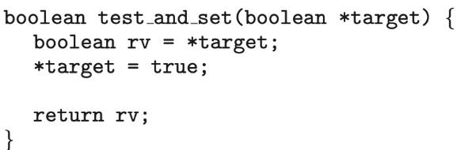
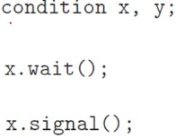

# 동기화 도구들
- 협력적 프로세스는 시스템 내에서 실행 중인 다른 프로세스의 실행에 영향을 주거나 영향을 받는 프로세스이다.

----
## 1. 배경
- 여러 프로세스가 병행으로 수행되어 발생하는 문제를 해결하는 것을 프로세스 동기화라 한다.
- 프로세스가 병행 또는 병렬로 실행될 때 여러 프로세스가 공유하는 `데이터의 무결성`에 어떤 문제를 일으키는지에 관해 설명한다.
- 동시에 여러 개의 프로세스가 동일한 자료를 접근하여 조작하고, 그 실행 결과가 접근이 발생한 특정 순서에 의존하는 상황을 `경쟁 상황(race condition)`이라고 한다.
- 예) 변수의 값이 항상 같아야 하는 두 개의 변수 a와 b를 여러 프로세스가 공유한다고 가정하자. 이 때 다음과 같은 두 개의 프로세스가 있다고 하자.
    - P1
    ```
    a = a + 1;
    b = b + 1;
    ```
    - P2
    ```
    b = b * 2;
    a = a * 2;
    ```
    - 각 프로세스가 독립적으로 수행되면 일관성은 유지된다. 그러나 병행으로 수행되면 다음과 같이 일관성이 깨질 수 있다.
    ```
    a = a + 1;
    b = b * 2;
    b = b + 1;
    a = a * 2;
    ```

- 그렇다면 경쟁 상황으로부터 보호하기 위해서 우리는 한 순간에 하나의 프로세스만이 데이터를 조작하도록 보장해야한다.

- 이러한 보장을 위해서, 어떤 형태로든 프로세스들이 동기화 되도록 할 필요가 있다.

## 2.임계구역 문제
- `임계 구역(critical section)`: 프로세스의 코드의 일부분으로서, 다른 프로세스와 공동으로 사용하는 변수, 테이블, 파일 등을 변경하는 부분이다.
- 임계 구역의 실행은 상호배타적으로 실행되어야 한다. 즉, 한 프로세스가 임계 구역을 실행하고 있으면 다른 프로세스는 임계 구역에 진입할 수 없어야 한다.
- 임계구역 문제는 프로세스들이 데이터를 협렵적으로 공유하기 위하여 자신들의 활동을 동기화할 때 사용할 수 있는 프로토콜(약속)을 설계하는 것이다.
- 따라서 각 프로세스는 임계구역에 진입하기 전에 허가를 받아야 한다. 이 허가를 요청하는 코드를 `진입 구역(entry section) (lock)`이라 한다. 허가를 받아 임계구역을 실행한 다음에는 다른 프로세스들이 진입할 수 있도록 해주어야 한다. 이것을 하는 코드를 `출구 구역(exit section) (unlock)`이라 한다.
- 진입 구역, 임계 구역, 출구 구역에 아닌 코드 부분을 `잔류 구역(remainder section)`이라 한다.
- 이 시스템을 사용하는 프로세스의 일반적인 구조를 나타낸 그림은 아래와 같다.
-    
   

- 임계구역 문제의 해결안은 세가지 요건을 충족해야 한다.
    - `상호 배제(mutual exclusive)`: 한 프로세스가 임계 구역에서 실행하고 있으면 어떤 프로세스도 임계 구역에 진입할 수 없어야 한다.
    - `진행(progress)`: 임계 구역을 실행하고 있는 프로세스가 없을 때, 몇 개의 프로세스가 임계 구역에 진입하고자 하면 이들의 진입 순서는 이들에 의해서만 결정되어야 한다. 또 한 이 선택은 무한정 연기되어서는 안 된다.
    - `한계 대기(bounded waiting)`: 한 프로세스가 자신의 임계 구역에 진입하고자 요청을 한 후부터 이 요청이 허용될 때까지 다른 프로세스가 그들의 임계구역에 진입할 수 있는 회수가 제한되어야 한다.


----

## 3. Peterson의 해결안

- Peterson 해결안은 Critical Section과 Remainder Section을 번갈아 가며 실행하는 두 개의 프로세스로 한정된다.   

- 보통 프로세스는 P0와 P1으로 번호를 매긴다.   

- Peterson의 해결안은 두 프로세스가 두 개의 데이터 항목을 공유하도록 하여 해결한다.

- 두가지 항목은 다음과 같다.   
----
```
int turn; // Critical Section으로 진입할 순번을 나타내는 변수
boolean flag[2]; // 각 프로세스가 Critical Section으로 진입할 준비가 되었다는 것을 표현한 배열
```   
----
- Pi에 대한 Peterson 알고리즘은 다음과 같다.        

-    

- Peterson의 해결안 알고리즘 설명   
    - PI가 임계구역에 진입하기 위해서는 flag[i]를 true로 만든다.   
    그리고 turn에 j를 입력하여 Pj가 임계구역에 진입을 원한다면 즉시 진입할 수 있게 설정해준다.   
    만약 flag[j]가 true이고, turn == j 라면 Pj가 임계구역에 진입했다는 뜻이므로 Pi는 임계구역에 접근 할 수 없다. while문을 돌면서 자신의 차례가 올 때까지 기다린다. 이를 `spin-wait`이라 한다.   
    임계구역이 종료되고, flag[i]를 false로 설정함으로서 Pj가 임계구역에 진입할 수 있도록 해준다.

- 위 알고리즘은 Pi와 Pj가 동시에 임계구역에 들어가려면 flag[i]와 flag[j]가 동시에 true가 되어야 하고 turn값에 i이면서 동시에 j여야 한다. turn값은 반드시 하나의 값을 가지기 때문에 하나의 프로세스만 임계구역에 진입할수 있으므로 상호 배제의 원리가 성립한다.   

- 위 알고리즘의 핵심은 현재 프로세스가 임계구역에 진입하기 전에 다른 프로세스에게 `양보`를 해준다는 것이다. flag를 통해 자신이 임계구역에 입장을 원한다는 표시를 남기고, turn을 상대 프로세스로 바꿔준다. 만약 상대 프로세스도 flag에 임계구역 입장을 원한다는 표시를 했다면 상대 프로세스가 먼저 실행이 된 후에 자신이 실행되게 된다.   

- Peterson의 해결안은 최신 컴퓨터 아키텍처에서 작동한다고 보장되지 않는다. 주된 이유는 시스템 성능을 향상하기 위해 프로세스 또는 컴파일러가 종속성이 없는 읽기 및 쓰기 작업을 재정렬 할 수 있기 때문이다. 예로 들어, Peterson 해결안의 entry section의 첫 두 문장의 순서를 바꾸게 되면 임계구역 문제를 해결할 수 없다.   

- 최신 프로세서 또는 컴파일러에서는 최적화를 위하여 서로 종속성이 없는 변수들은 순서가 뒤죽박죽으로 실행될 수 있게 한다.(정렬을 하지 않고 실행함.)

EX)   
```
boolean flag = false;
int x = 0; 
```   
두 스레드 간에 공유되는 데이터.

```
while (!flag)
    ;
print x;
```   
스레드 1이 위 코드를 수행한다.   


```
x = 100;
flag = true;
```   
스레드 2가 위 코드를 수행한다.   

스레드 1에서는 100을 출력할 것으로 보인다.   
하지만 현대 아키텍쳐에서는 x와 flag 변수에 서로 종속성이 없다고 보고 flag=true 코드를 x=100 보다 먼저 실행시켜서 스레드 1에서 x값으로 0을 출력하게 될 수 있다.

- 따라서 위에서 보았던 Peterson의 해결안의 진입경로의 코드의 순서가 바뀔 수 있다는 것이다.
----
## 4. 동기화를 위한 하드웨어 지원
- Critical Section 문제의 소프트 웨어 기반 해결책은 최신 컴퓨터 아키텍처에서 작동하지 않을 수 있다.

- Critical Section 문제를 해결하기 위한 지원을 제공하는 세 가지 하드웨어 명령을 제시한다.
----

### 4.1 메모리 장벽
- 시스템은 명령어의 순서를 재정렬 할 수 있다는 것과 이러한 정책이 신뢰할 수 없는 데이터 상태로 이어질 수 있다는 것을 보았다.

- 컴퓨터 아키텍처가 응용 프로그램에게 제공하는 메모리 접근 시 보장되는 사항을 결정한 방식을 메모리 모델이라고 한다.

- 일반적으로 메모리 모델을 두 가지 범주 중 하나에 속한다.
    - 1. 강한순서: 한 프로세서의 메모리 변경 결과가 다른 모든 프로세서에 즉시 보임
    - 2. 약한순서: 한 프로세서의 메모리 변경 결과가 다른 프로세서에 즉시 보이지 않음   
          

- 위에서 보았던 문제를 해결하기 위해서 컴퓨터 아키텍처는 메모리 변경 사항을 다른 모든 프로세서에 전파하는 명령어를 제공할 수 있다. 이러한 명령어를 `메모리 장벽` 또는 `메모리 펜스` 라고 한다.

- 위의 스레드 1이 실행하는 코드에 메모리 장벽 연산을 추가하면
```
while (!flag)
    memory_barrier();
print x;
```   
flag 값이 x 보다 먼저 적재되도록 보장한다.   

```
x = 100;
memory_barrier();
flag = ture;
```
마찬가지로 스레드 2의 flag 입력 사이에 메모리 장벽을 넣으면 flag 설정 이전에 x 설정이 먼저 실행되도록 할 수 있다.

----
## 4.2 하드웨어 명령어
- 현대에는 두 워드(word)의 내용을 원자적으로 교환할 수 있는, 즉 인터럽트 되지 않는 하나의 단위로서, 특별한 하드웨어 명령어들을 제공한다.

> -    
> 먼저 가장 간단한 test_and_set 명령어 이다.
> 이 함수는 가장 작은 실행 단위로 간주되어 실행 중간에 인터럽트가 발생하지 않는다.
> target 변수에 저장된 값을 가져와서 true로 설정하고, true로 설정하기 이전의 원래의 값을 반환하는 함수이다.

> - 
> - lock을 얻는 과정을 원자적으로 구현함으로써 상호 배제의 원리를 충족시켰다.
> - 위의 알고리즘은 lock이라는 공유 변수가 한 프로세스에서 false일 경우 lock을 true로 만들고 자신은 Critical Section으로 들어간다. Critical Section에서 빠져나온 프로세스가 lock을 false로 만들면 다른 프로세스가 Critical Section에 들어가고 이러한 과정이 반복되는 알고리즘이다.

> - 
> compare_and_swap 명령어(CAS)는 value의 값이 expected와 같으면 value를 new_value로 변경하고, 기존의 value 값을 반환하는 함수이다.

> - 
> - 
> waiting 배열의 원소는 false로 초기화되고 lock은 0으로 초기화된다.
> 이 알고리즘이 상호 배제 조건을 만족시킨다는 것을 증명하기 위해서는 Pi가 임계구역에 진입하는 경우가 오직 waiting[i] == false 이든지 key == 0이라는 사실을 주의하여야 한다.
> key값은 compare_and_swap() 명령어를 실행했을 경우에만 0이 된다. 그리고 인자로 넘겨진 lock의 값은 1이 될 것이다

----
## 4.3 원자적 변수
- 일반적으로 compare_ans_swap() 명령어는 상호 배제를 제공하기 위해 직접 사용되지 않는다.
- 오히려 임계구역 문제를 해결하는 다른 도구를 구축하기 위한 기본 구성요소로 사용된다. 그러한 도구 중 하나는 원자적 변수(atomic variable)로, 정수 및 부울과 같은 기본 데이터 유형에 대한 원자적 연산을 제공한다.
   
   
- 정수 값을 증가시키거나 감소시키면 경쟁 조건이 발생할 수 있다.
- 원자적 변수는 카운터가 증가할 때아 같이 갱신되는 동안 단일 변수에 대한 데이터 경쟁이 있을 수 있는 상황에서 상호 배제를 보장하는 데 사용될 수 있다.
- 원자적 변수를 지원하는 대부분의 시스템은 원자적 변수에 접근하고 조작하기 위한 기능뿐만 아니라 특별한 원자적 데이터 유형을 제공한다.
- 이러한 함수느 종종 compare_and_swap() 연산을 사용하여 구현된다.   
   
   
EX)   
```
increment(&sequence);
```   
위 코드는 sequence를 증가시킨다.   
   
여기서 increment() 함수는 CAS 명령어를 사용하여 구현된다.   

   

원자적 변수는 모든 상황에서 race condition을 완벽히 해결할 수는 없다.

* race condition이란 두 개 이상의 프로세스가 공통 자원을 병행적으로(concurrently) 읽거나 쓰는 동작을 할 때, 공용 데이터에 대한 접근이 어떤 순서에 따라 이루어졌는지에 따라 그 실행 결과가 같지 않고 달라지는 상황을 말한다. Race의 뜻 그대로, 간단히 말하면 경쟁하는 상태, 즉 두 개의 스레드가 하나의 자원을 놓고 서로 사용하려고 경쟁하는 상황을 말한다.   

만약 A, B 두 개의 스레드가 count > 0을 기다리는 while 루틴을 spin-wait하는 상황이 있다고 가정하자.   

count는 원자적 변수로서 올바르게 증가할 수 있지만, count가 증가하면서 A스레드에서 while문을 탈출하고 동시에 B스레드에서도 while문을 탈출하게 되면서 데이터의 무결성을 해칠 수 있다.   

원자적 변수는 운영체제 병행 응용 프로그램에서 일반적으로 사용되지만 카운터 및 시퀀스 생성기와 같은 공유 데이터 한 개의 갱신에만 제한되는 경우가 많다.

----
## 5. Mutext Locks
- `mutext lock`은 mutual exclusion lock의 축약 형태로서 Critical Section을 해결하기 위한 하드웨어 기반의 해결책보다 상위 수준의 해결책이다.

- Critical Section을 보호하고, Racing Condition을 방지하기 위해 mutex lock을 사용한다.

- 즉, 프로세스는 `Critical Section에 들어가기 전에 반드시 lock을 획득`해야 하고 `Critical Section을 빠져나올 때 lock을 반환`해야 한다.

- mutex lock 을 위한 두가지 함수와 한가지 변수
    - acquire(): 락을 획득하는 함수
        ```
        acquire(){
            while(!available)
                ; /* busy wait */
            available = false;
        }
        ```
    - release(): 락을 반환하는 함수
        ```
        release() {
            available = true;
        }
        ```
    - available: 락의 가용 여부를 표시하는 변수

- 아래의 그림은 mutex lock을 사용한 Critical Section 문제 해결 알고리즘이다.   
   

- 위 방식의 단점은 `busy waiting`을 해야한다는 것이다.

- 다른 프로세스가 임계구역에 있는 동안 임계구역에 들어가기를 원하는 다른 프로세스는 acquire()함수를 호출하는 반복문을 계속 실행해야 한다.
- 이러한 busy waiting은 다른 프로세스가 생산적으로 사용할 수 있는 CPU 주기를 낭비하게 된다.

- 위에 설명한 mutex lock 유형을 스핀락(spin lock)이라고도 한다.

----
## 6. 세마포
- 신호장치, 신호기 라는 뜻.
- `세마포어(semaphore)`S는 정수 변수로서 초기화를 제외하고는 두 가지 연산 `wait`와 `signal`을 통해서만 접근할 수 있다. 이 두 연산은 원자적이다.
- wait() 연산은 원래 “검사하다”를 의미하는 네덜란드어 proberen에서 P, 그리고 signal() 연산은 “증가하다”를 의미하는 verhogen에서 V라고 지어졌다.
- `wait` 연산은 S의 값을 감소시키는 작업이다.
- 초기에 n개의 인스턴스를 가진 자원의 공유를 관리할 때 사용할 수 있다. (counting semaphore)

- 만약 S가 1이라면 mutex lock 처럼 사용할 수 있게 된다. (binary semaphore)
```
wait(S){
    while(S <= 0)
        ; // busy wait
    S--;
}
```
- `signal` 연산은 S의 값을 증가시키는 작업이다.
```
signal(S){
    S++;
}
```
- 즉, 세마포는 S의 값을 초기에 설정해 놓고, S가 0이 되면 더 이상 다른 프로세스의 진입을 못하게 막는 것이다.
----
### 6.1 사용법
- 세마포어를 이용한 n 프로세스 임계 구역 문제에 대한 해결책   
```
do{
    wait(mutex);
    /*critical setcion*/
    signal(mutex)
    /*remainder section*/
}
```   
모든 프로세스는 mutex라는 세마포어를 공유하며, mutex는 1로 초기화된다. 


- `wait` 연산을 제일 먼저 실행하는 프로세스는 mutex 값이 1이므로 이 값을 0으로 바꾸고 임계 구역에 진입할 수 있다. 이 프로세스가 출구 지역에서 mutex 값을 1로 다시 바꾸어주면 다른 프로세스가 진입을 할 수 있다.   
- 한계 대기는 충족하지 못한다.
- 병행으로 수행되는 두 개의 프로세스 P1, P2는 각각 S1, S2 프로그램이 문장을 가지고 있다고 하자. 또한 S1이 실행된 다음에 S2가 실행되어야 한다. 이런 동기화 문제는 세마포어를 이용하여 쉽게 해결할 수 있다. 두 프로세스는 0으로 초기화된 synch라는 세마포어를 공유한다.   
```
S1;
signal(synch);
```
P1에 위와 같은 코드를 삽입한다.   
S1이 실행된 이후에 signal 함수를 통해 synch의 값을 1 증가시킨다.
```
wait(synch);
S2;
```
P2에 위와 같은 코드를 삽입한다.   
P1이후에 wait가 실행되면 synch의 값이 1 증가되었기 때문에 wait을 벗어날 수 있다.   
따라서 S1이후에 S2가 실행됨을 보장할 수 있다.

----
## 6.2 이진 세마포어
- 지금까지 사용한 세마포어는 가질 수 잇는 값의 범위가 정해져 있지 않은 카운팅 세마포어이다.
- 세마포어가 가질 수 있는 값의 범위가 0 또는 1로 제한되어 있으면 이진 세마포어라 한다.
- busy waiting이 없는 이진 wait 연산   
```
void wait(semaphore S){
    if(S.value == 1)
        S.value = 0;
    else{
        add this process to S.L;
        block()
    }
}
```
- busy waiting이 없는 이진 signal 연산
```
void signal(semaphore S){
    if(S.L is empty)
        S.value = 1;
    else {
        remove a process P from S.L;
        wakeup(S.L);
    }
}
```
- 카운팅 세마포어는 두 개의 이진 세마포어 S1과 S2를 이용하여 구현할 수 있다. 이 때 추가로 카운팅 세마포어의 초기값으로 초기화된 정수 변수 C를 사용한다.
- `wait` 연산   
```
void wait(semaphore S){
    wait(S1);
    C--;
    if(C < 0){
        signal(S1);
        wait(S2);
    }
    signal(S1);
}
```
- `signal` 연산
```
void signal(semaphore S){
    wait(S1);
    C++;
    if(C <= 0) signal(S2);
    else signal(S1);
}
```

----
## 7. 모니터

- Mutex Lock과 세마포어는 구현이 간단하다. 하지만 발견하기 어려운 오류가 발생할 수 있다.
- 예를 들어 프로그램의 크기가 커질 수록 signal()과 wait()의 순서가 잘못되는 경우와 같이 충분히 일어날 수 있지만 발견하지 못하면 심각해지는 오류가 발생할 가능성이 높아진다.
- 오류를 간단하게 처리하기 위한 한 가지 전략으로 `모니터(Monitor)`라는 동기화 도구를 사용할 수 있다.

- 모니터 형(monitor type) 이란?
    - ADT(Abstract Data Type, 추상화된 데이터형)는 데이터와 이 데이터를 조작하는 함수들의 집합을 하나의 단위로 묶어서 보호한다. 쉽게 생각해서 Java의 class라고 생각할 수 있다. (OOP)
    - 모니터 내부에서 프로그래머가 정의한 상호 배제가 보장되는, 일련의 연산자 집합을 포함하는 ADT이다.   
    상태를 나타내는 여러 개의 변수를 가지고 있고, 그러한 변수들을 제어하는 연산자(메소드)를 가지고 있는 것이라고 볼 수 있다.

   
위 코드는 모니터에 대한 pseudo 코드이다.   
monitor라는 자료형을 선언하고, 해당 블록 안에서 여러 메소드들을 선언해 주면, 이 함수들은 모니터 내부에서 동기화 된 함수로서 사용할 수 있음을 명시해 준다.   
    

    
한 모니터의 구조를 그림으로 표현하면 위와 같다.   
공유데이터, 공유데이터를 초기화 해주는 코드, 공유데이터에 대해서 동기화 되어야 하는 명령어들을 OOP처럼 하나의 class로 선언해 준 것이다. 따라서 이러한 모니터 자료형을 사용한 스레드들이 entry queue 같은 곳에서 대기할 수 있게 된다.

- 하지만 이러한 구조체/class는 아직까지 동기화를 수행하기에는 충분하지 않다. 따라서 자체적인 동기화를 제공하는 추가적인 condition 변수들이 필요하다.   
   
condition형 변수에 호출될 수 있는 연산은 오직 wait()와 signal()이다.   
x.wait()를 호출한 프로세스는 다른 프로세스가 x.signal()을 호출할 때까지 일시중지 되어야 한다는 것을 의미한다.

- x.signal() 연산이 프로세스 P에 의하여 호출될 때, 조건 x와 연관된 일시중지된 프로세스 Q가 있다고 가정해 보자.

- 만일 일시 중지된 프로세스 Q가 실행을 재개하도록 허용된다면, signal을 보낸 프로세스 P는 반드시 대기해야 한다.

- signal과 wait에 관련된 두 가지 매커니즘
    - 1. Signal and Wait
        - P는 Q가 모니터를 떠날 때까지 기다리거나 또는 다른 조건을 기다린다.
    - 2. Signal and Continue
        - Q는 P가 모니터를 떠날 때까지 기다리거나 또는 다른 조건을 기다린다.


- condition형 변수 x, y가 추가되었으므로 모니터를 사용하는 프로세스는 내부에서 다시 x와 관련된 프로세스가 될 지, y와 관련된 프로세스가 될 지를 선택할 수 있다. 그렇게 x와 y에 관련된 프로세스들은 서로의 영역을 침범하지 않고 동기화 될 수 있다.

   

위는 모니터의 구조를 간단히 나타낸 그림이다. 모니터는 공유 자원 + 공유 자원 접근함수로 이루어져 있고, 2개의 큐를 가지고 있다. 각각 mutual exclusion(상호배타) queue, conditional synchronization(조건동기) queue이다.   

- 상호배타 큐는 말그대로 공유 자원에 하나의 프로세스만 진입하도록 하기 위한 큐이다.
- 조건동기 큐는 이미 공유자원을 사용하고 있는 프로세스가 특정한 호출 명령어인 wait()을 통해 조건동기 큐로 들어갈 수 있다.

조건동기 큐에 들어가 있는 프로세스는 공유자원을 사용하고 있는 다른 프로세스에 의해 깨워줄 수 있다. 이 역시 깨워주는 프로세스에서 특정한 호출 signal()을 해주며, 깨워주더라도 이미 공유자원을 사용하고 있는 프로세스가 해당 구역을 나가야 비로소 큐에 있던 프로세스가 실행된다.

----
## 8. 라이브니스
- 앞서 살펴본 Mutex, Semaphore, Monitor 모두 상호 배제의 규칙만 지킬 뿐 Progress(deadlock)나 bounded-waiting같은 문제를 해결해 주지는 못한다.

- 라이브니스는 프로세스가 실행 수명주기 동안 진행되는 것을 보장하기 위해 시스템이 충족해야 하는 일련의 속성을 말한다.

- Deadlock 또는 Starvation같은 상황이 라이브니스 실패의 예가 된다.