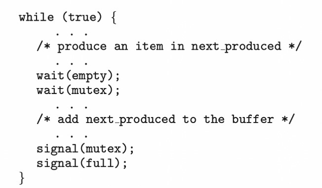
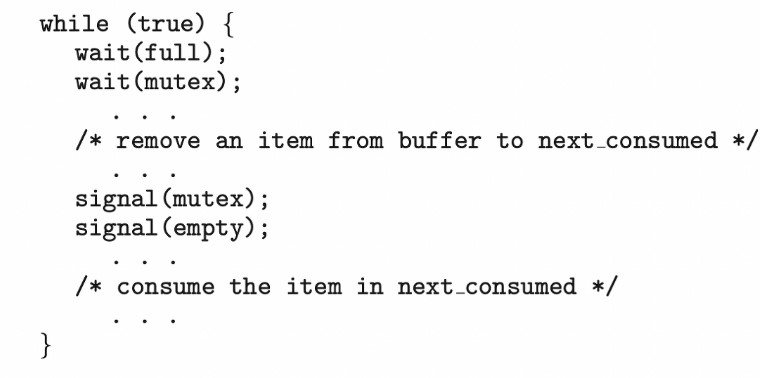
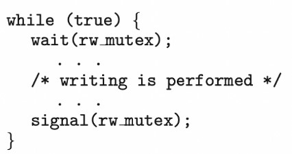
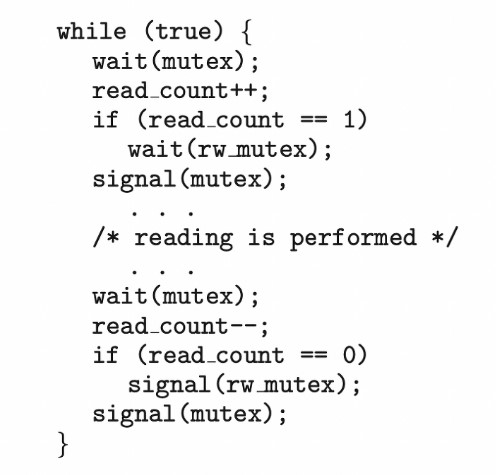

## [동기화 예제](./07_syncExamples/README.md)

- 고전적인 동기화 문제들

- 커널 안에서의 동기화

- POSIX 동기화

- Java에서의 동기화

- 대체 방안들

----
# 동기화 예제
전 장에서 Critical Section, 경쟁 조건에 중점을 두었고 전 장에 제시된 도구를 고전적인 동기화 문제에 적용하는 것에 중점을 둔다.

----
## 1. 고전적인 동기화 문제들
> - `1.1` 유한 버퍼 문제   
소비자와 생산자가 아래 데이터를 공유한다고 가정하자   
```
int n;
semaphore mutex = 1;
semaphore empty = n;
semaphore full = 0
```   
> 길이가 n인 버퍼가 있고, 상호 배제를 제공하는 `이진 세마포`가 있다.   
그리고 현재 버퍼의 빈 공간의 개수와 가득 찬 버퍼의 개수를 기록하는 empty, full 세마포가 있다.   
   
생산자 프로세스의 코드이다.   
`empty 세마포가 0보다 클 때(버퍼에 빈 공간이 있을 떄) + mutex가 존재할 때(lock을 얻을 수 있을 때)` 임계 구역에 진입해서 버퍼에 데이터를 입력할 수 있다.   

----
----
>   
소비자 프로세스의 코드이다.   
`full 세마포가 0보다 클 때(버퍼에 데이터가 있을 때), mutex가 존재할 떄(락을 얻을 수 있을 때)` 임계구역에 진입해서 버퍼를 소비할 수 있다.

----
----
----
- `1.2` Readers - Writers 문제   
- 하나의 DB가 다수의 프로세스들 사이에 공유된다고 가정하자.   
프로세스 `Readers는 데이터베이스의 내용을 읽기만` 한다.   
프로세스 `Writers는 데이터베이스의 내용을 갱신할 수` 있다.   
만약 두 Reader가 동시에 DB에 접근해서 데이터를 읽으려고 하면 별다른 문제가 발생하지 않는다.   
하지만 하나의 Writer와 다른 Reader 또는 Writer가 동시에 DB에 접근하려고 하면 혼란이 생길 수 있다.   
이 문제를 Readers-Writers 문제라고 부른다.   
이러한 문제점이 발생하지 않도록 하기 위해서 Writer의 쓰기 작업 동안에는 공유 데이터베이스에 대해 베타적 접근 권한을 가져야 한다.   

- Readers-Writers 문제에는 다양한 변형이 있는데 모두 우선순위에 관련된 변형이다.   
첫 번쨰로, writer가 공유 객체에 접근할 수 있는 허가를 얻지 못했다면 어떤 reader도 기다리게 해서는 안된다.   
`writer가 기다리고 있다고 해서 reader가 기다려서는 안된다는 말`이다.   
두 번째로, 일단 writer가 준비되면 가능한 빨리 write작업을 끝내도록 요구한다.   
`writer가 객체에 접근하려고 한다면, 새로운 reader들은 읽기를 수행할 수 없다`.   
두가지 경우에 대해서 reader-wirter 문제가 존재한다.   
첫 번쨰 경우는 writer의 기아 문제가 있을 수 있고, 두 번쨰 경우는 reader의 기아 문제가 있을 수 있다.   

- 먼저 첫 번째 문제의 해결안에서, reader 프로세스는 다음과 같은 자료 구조를 공유한다.   
```
semaphore rw_mutex = 1;
semaphore mutex = 1;
int read_count = 0;
```   
`rw_mutex와 mutex는 1로 초기화` 된다. rw_mutex는 reader와 writer 모두 공유하고 mutext는 read_count의 연산 동안에 상호 배제를 보장하기 위해서 사용한다.   
rw_mutex는 writer들의 상호 배제를 위한 세마포이다.   
그리고 임계 구역에 진입하는 첫 번째 reader와 임계구역을 빠져 나오는 마지막 reader에 의해서도 사용된다. 그러나 reader들이 임계구역 안에 있는 동안 임계구역을 드나드는 reader들은 이것을 사용하지 않는다.   
   
rw_mutex를 사용할 수 있을 때만 임계구역에 진입할 수 있다.   
   
writer가 임계구역에 있고 n개의 reader가 기다리고 있으면 한 개의 reader만이 rw_mutex 큐에 삽입되고(mutex 큐에도 삽입된다.), 나머지 n-1개의 reader들은 mutex큐에 삽입된다.

- 진행   
1. Writer가 rw_mutex를 얻고 쓰기 임계 구역에서 작업중이다. (Writer 프로세스)
2. (Reader 프로세스)Reader가 임계구역에 진입하기 위해서 mutex를 얻고, read_count를 증가시킨다.(read_count = 1)
3. read_count가 1이므로 rw_mutex를 기다린다. 이때 다른 reader들이 생기면 그 reader들은 mutex를 기다린다.
4. 처음 reader가 rw_mutex를 얻으면 mutex를 반환한다. 이떄 read_count는 1보다 크게 되므로(다른 reader가 mutex를 얻고 read_count를 증가시키므로) rw_mutex를 기다리지 않는다.
5. 임계구역의 코드를 수행한다.
6. 마지막 reader가 read_count를 0으로 만들고, rw_mutex를 반환한다. (이때 처음 reader와 마지막 reader를 다룰 수 있다.)
7. mutex까지 반납하면서 종료한다.

----
----
----
- `1.3` 식사하는 철학자들 문제
   
테이블에 앉은 철학자는 자신의 양쪽에 놓인 수저를 집어야 식사를 할 수 있다.   
만약 모든 철학자가 동시에 자신의 왼쪽에 놓인 수저를 집는다면?   
f2포크는 p2철학자가 가지고 있고, p2철학자는 f3를 기다리는 상황이다.   
이러한 상황들이 얽히면서 모두가 아무것도 할 수 없는 deadlock상황(교착 상태)이 발생한다.   
- `세마포 해결안   `   
간단한 해결책은 각 젓가락을 하나의 세마포로 표현하는 것이다.   
철학자는 세마포에 wait() 연산을 실행하여 젓가락을 집으려고 시도한다.   
그는 또한 해당 세마포에 signal() 연산을 실행함으로써 자신의 젓가락을 놓는다.   
그러므로 공유 자료구조는 다음과 같다.   
```
semaphore chopstick[5];
```   
- 여기서 chopstick의 원소들은 모두 1로 초기화 된다.   
```
while (ture) {
    wait(chopstick[i]);
    wait(chopstick[(i+1) % 5]);
     . . .
    /* eat for a while */
     . . .
    signal(chopstick[i]);
    signal(choptsick[(i+1)%5]);
     . . .
    /* think for a while */
     . . .
}
```   
- 이 해결안은 인접한 두 철학자가 동시에 식사하지 않는다는 것을 보장하지만, 위에서 말했던 교착 상태를 야기할 가능성이 있기 떄문에 채택될 수 없다.   
- 교착 상태 문제에 대한 다양한 해결안
    - 최대 4명의 철학자만이 테이블에 앉을 수 있도록 한다.
    - 한 철학자가 젓가락 두 개를 모두 집을 수 있을 때만 젓가락을 집도록 허용한다.(임계구역 안에서만 젓가락을 집을 수 있다.)
    - 홀수 번호의 철학자는 왼쪽 젓가락을 먼저 집고 다음에 오른쪽 젓가락을 집는다. 짝수는 반대로 한다. 이를 비대칭 해결안 이라고 한다.

----
----
----
## 2. 