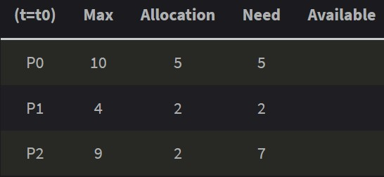

# 교착 상태

## 1. 시스템 모델
시스템은 경쟁하는 프로세스들 사이에 분배되어야 할 유한한 수의 자원들로 구성된다.   
   

자원은 여러 타입들로 나눠지고, 이들 각각은 동등한 다수의 인스턴스들로 구성된다.   
   
CPU 주기, 파일 그리고 입출력 장치 등이 자원 타입들의 예이다.
   
프로세스는 자원을 사용하기 전에 반드시 요청해야하고, 사용후에는 반드시 반납해야한다. 요청된 자원의 수는 시스템에서 사용 가능한 전체 자원의 수를 초과해서는 안된다.
   
정상적인 동작 모드일 떄, 프로세스는 이 순서로만 자원을 요청할 수 있다.
- 1. 요청: 프로세스는 자원을 요청한다. 즉시 허용되지 않으면 자원을 얻을 떄 까지 대기한다.
- 2. 사용: 프로세스는 자원에 대해 작업을 수행할 수 있다.
- 3. 방출: 프로세스가 자원을 반납한다.
----
## 2. 교착 상태
두개 이상의 작업이 서로 상대방의 작업이 끝나기 만을 기다리고 있기 때문에 결과적으로 아무것도 완료되지 못하는 상태를 가리킨다.
   
mutex lock과 세마포와 같은 임계영역의 경쟁조건을 회피하도록 설계되었지만, 이러한 도구들을 사용할 떄 락이 획득하고 방출되는 방식에서 서로의 락 방출만 기다리는 교착 상태가 발생할 수 있다.

----

## 3. 교착 상태의 특성
교착 상태에서는 프로세스들은 결코 실행을 끝낼 수 없으며, 시스템 자원이 묶여 있어 다른 작업을 시작하는 것도 불가능하다.
   
교착 상태가 되려면 4가지 조건이 동시에 성립되어야 한다.   
   
1. 상호 배제(Mutual exclusion): 한 번에 프로세스 하나만 해당 자원을 사용할 수 있다. 사용 중인 자원을 다른 프로세스가 사용하려면 요청한 자원이 해제될 때까지 기다려야 한다.
2. 점유 대기(Hold-and-wait): 자원을 최소한 하나 보유하고, 다른 프로세스에 할당된 자원을 점유하기 위해 대기하는 프로세스가 존재해야 한다.
3. 비선점(No preemption): 자원들을 선점할 수 없어야 한다. 즉, 자원이 다른 프로세스에 의해 강제적으로 방출될 수 없고(뺏을 수 없다.), 점유하고 있는 프로세스가 task를 종료한 후 그 프로세스에 의해 자발적으로만 방출될 수 있다.
4. 순환 대기(Circular wait): 대기 프로세스의 집합이 순환 형태로 자원을 대기하고 있어야 한다.
   

(순환대기)
   
   
   
----

## 4. 교착 상태 처리 방법
시스템이 교착 상태가 되지 않도록 보장
- 교착상태 예방 기법 -> 교착 상태는 자주 발생하지 않으므로 자원 낭비
- 교창상태 회피 기법 -> 쓸데없이 프로세스가 기다리는 시간이 있으므로 자원 낭비
   
시스템이 교착 상태가 될 수 있도록 하되 회복시키는 방법
- 교착 상태 탐지 알고리즘 & 교착 상태로부터의 회복 알고리즘
   
교착 상태 무시
- 시스템 중단 -> 인위적인 재시작

----
## 5. 교착 상태 예방
교착 상태 4가지 조건 중 하나라도 성립하지 않도록 보장해 예방하는 기법
   
- 상호 배제 방지
    - 자원 공유 가능하게 함
   
- 점유 대기 방지
    - 프로세스가 자원을 요청할 떄 마다 다른 자원들을 점유하지 않도록 보장
        - 프로세스가 실행되기 전에 각 프로세스가 요청하는 모든 자원들을 함께 할당
        - 프로세스가 자원을 전혀 갖고 있지 않을 때만 자원을 요청할 수 있도록 허용
            - 자원을 더 요청하려면 할당된 자원을 모두 해제해야 함
    - 자원의 이용도가 낮다 -> 자원이 사용되지 않고 낭비 우려
    - 기아 상태가 존재할 수 있다.
        - 기아상태 (Starvation): 특정 프로세스의 우선순위가 낮아서 원하는 자원을 계속 할당 받지 못하는 상태를 말한다.
   
- 비선점 방지
    - 이미 다른 프로세스에게 할당된 자원이 선점권이 없다고 가정할 때, 높은 우선순위의 프로세스가 해당 자원을 선점할 수 있도록 한다.
   
- 순환대기 부정
    - 자원을 순환 형태로 대기하지 않도록 일정한 한 쪽 방향으로만 자원을 요구할 수 있도록 한다.
----
## 6. 교착상태 회피
시스템의 프로세스들이 요청하는 모든 자원을, 데드락을 발생시키지 않으면서도 차례로 모두에게 할당해 줄 수 있다면 `안정 상태(safe state)`에 있다고 한다.
   
특정한 순서로 프로세스들에게 자원을 할당, 실행 및 종료 등의 작업을 할 때 데드락이 발생하지 않는 순서를 찾을 수 있다면, 그것을 `안전 순서(safe sequence)`라 한다.
   
반면 불안정 상태는 안정 상태가 아닌 상황을 말한다. 즉, 데드락 발생 가능성이 있는 상황이며, 교착 상태는 불안정 상태일 때 발생 할 수 있다. 불안정 상태가 교착 상태(데드락)보다 좀 더 큰 집합이다.
   
회피 알고리즘은 자원을 할당한 후에도 시스템이 항상 Safe state에 있을수 있도록 할당을 허용 하자는 것이 기본 특징이다.
   
교착 상태를 회피하기 위해서는 다음과 같은 가정이 필요하다
- 프로세스 수가 고정되어 있어야 한다.
- 자원의 종류와 수가 고정되어 있어야 한다.
- 프로세스가 요구하는 자원 및 최대 자원의 수를 알아야 한다.
- 프로세스는 반드시 자원을 사용 후 반납해야 한다.
   
EX) 은행원 알고리즘
- 어떤 자원의 할당을 허용하는지에 관한 여부를 결정하기 전에, 미리 결정된 모든 자원들의 최대 가능한 할당량을 가지고 시뮬레이션 해서 Safe state에 들 수 있는지 여부를 검사한다. 즉, 대기중인 다른 프로세스들의 활동에 대한 교착 상태 가능성을 미리 조사하는 것이다.

- 시스템이 처음에 총 12개의 자원을 가지고 있다고 가정

   
P0 ~ P2 는 프로세스이고, Max는 각 프로세스마다 최대 자원 요청량, Allocation은 현재 프로세스에 할당 중인 자원의 양, Need는 남은 필요한 자원의 양이다.   

현재 t0 일 때 프로세스에 할당된 자원의 합은 5 + 2 + 2 = 9개이다. 
   
따라서 현재 Available 자원은 12 - 9 = 3개이다.
   
여기서 Safe sequence를 찾아 본다.
   
순서가 <P1, P0, P2> 일 때 안전 순서를 만족한다.

- P1은 2개가 이미 할당되어 있고, 2개를 추가적으로 할당받기를(Need) 기다리고 있다. 현재 Available 자원은 3개이므로, 이 중 2개를 P1에게 할당해 준다. => 현재 Available은 3 - 2 = 1개.
- 실행이 끝난 P1은 자신에게 할당되어 있던 자원 4개를 모두 반납한다. => 현재 Available은 1 + 4 = 5개
- 현재 Available 자원이 5개이고, 이를 P0에게 모두 할당해 주면 P0도 실행이 가능하다. => 현재 Available은 5 - 5 = 0개가 된다.
- 실행이 끝난 P0는 자신에게 할당되어 있던 자원 10개를 모두 반납한다. => 현재 Available은 0 + 10 = 10개
- 마지막으로 P2에게 자원 7개를 할당해 준다. => 현재 Available은 10 - 7 = 3 개
- 실행이 끝난 P2는 자신에게 할당되어 있던 자원 9개를 모두 반납한다. => 현재 Available은 3 + 9 = 12개

   
은행원 알고리즘을 사용해서 자원 할당량을 사전에 파악하고 데드락을 회피할 수 있도록 하면 될 것이다.
   
`하지만` 미리 최대 자원 요구량을 알아야 하고, 할당할 수 있는 지원 수가 일정해야 하는 등 사용에 있어 제약조건이 많다.

----
## 7. 교착상태 탐지
시스템이 교착상태 예방이나 회피법을 사용하지 않았을 때, 데드락이 발생할 수 있으니 여기에서 회복하기 위해 데드락을 탐지하고, 회복하는 알고리즘을 사용한다.
- 탐지 기법
    - Allocation, Request, Available 등으로 데드락이 발생했는지 여부를 탐색한다. 즉, 은행원 알고리즘에서 했던 방식과 유사하게 현재 시스템의 자원 할당 상태를 가지고 파악한다.
    - 이 외에도 자원 할당 그래프를 통해 탐지하는 방법도 있다.

- 자원할당, 대기 그래프      (a)자원할당 그래프, (b)대기 그래프
    - 자원 할당 그래프에서 자원을 제거 후 간선들을 결합하여 대기 그래프로 표현을 할 수 있다.

    - 대기 그래프에서 Pi→Pj는 프로세스 Pi가 Pj프로세스가 보유하고 있는 자원을 기다리고 있음을 나타낸다.

    - 대기 그래프에 주기(cycle)가 있다면 교착 상태를 의미한다.

    - 주기적으로 대기 그래프에 주기가 있는지 탐지 알고리즘을 호출하여 교착상태를 탐지한다.
----
## 8. 교착상태로 부터 회복
시스템이 교착상태 예방이나 회피법을 사용하지 않았을 때, 데드락이 발생할 수 있으니 여기에서 회복하기 위해 데드락을 탐지하고, 회복하는 알고리즘을 사용한다.
- 회복 기법
    - 데드락을 탐지 기법을 통해 발견했다면, 순환 대기 에서 벗어나 데드락으로부터 회복하기 위한 방법을 사용한다.
        - 단순히 프로세스를 1개 이상 중단시키기
            - 교착 상태에 빠진 모든 프로세스를 중단시키는 방법 : 계속 연산중이던 프로세스들도 모두 일시에 중단되어 부분 결과가 폐기될 수 있는 부작용이 발생할 수 있음
            - 프로세스를 하나씩 중단 시킬 때마다 탐지 알고리즘으로 데드락을 탐지하면서 회복시키는 방법 : 매번 탐지 알고리즘을 호출 및 수행해야 하므로 부담이 되는 작업일 수 있음
        - 자원 선점하기
            - 프로세스에 할당된 자원을 선점해서, 교착 상태를 해결할때까지 그 자원을 다른 프로세스에 할당해주는 방법
    