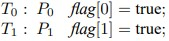

# 1. 프로세스 동기화

## [동기화 도구들](./06_syncTools/README.md)

- 배경

- 임계구역 문제

- Peterson의 해결안

- 동기화를 위한 하드웨어 지원

- Mutex Locks

- 세마포(semaphore)

- 모니터

- 라이브니스

---

## [동기화 예제](./07_syncExamples/README.md)

- 고전적인 동기화 문제들

- 커널 안에서의 동기화

- POSIX 동기화

- Java에서의 동기화

- 대체 방안들

---

## [교착 상태](./08_deadlock/README.md)

- 시스템 모델

- 다중 스테드 응용에서의 교착 상태

- 교착 상태 특성

- 교착 상태 처리 방법

- 교착 상태 예방

- 교착 상태 회피

- 교착 상태 탐지

- 교착 상태로부터 회복

----
## 1.1 배경
- 여러 프로세스가 병행으로 수행되어 발생하는 문제를 해결하는 것을 프로세스 동기화라 한다.
- 예) 변수의 값이 항상 같아야 하는 두 개의 변수 a와 b를 여러 프로세스가 공유한다고 가정하자. 이 때 다음과 같은 두 개의 프로세스가 있다고 하자.
    - P1
    ```
    a = a + 1;
    b = b + 1;
    ```
    - P2
    ```
    b = b * 2;
    a = a * 2;
    ```
    - 각 프로세스가 독립적으로 수행되면 일관성은 유지된다. 그러나 병행으로 수행되면 다음과 같이 일관성이 깨질 수 있다.
    ```
    a = a + 1;
    b = b * 2;
    b = b + 1;
    a = a * 2;
    ```
----
## 1.2 임계 구역 문제
- `임계 구역(critical section)`: 프로세스의 코드의 일부분으로서, 다른 프로세스와 공동으로 사용하는 변수, 테이블, 파일 등을 변경하는 부분이다.
- 임계 구역의 실행은 상호배타적으로 실행되어야 한다. 즉, 한 프로세스가 임계 구역을 실행하고 있으면 다른 프로세스는 임계 구역에 진입할 수 없어야 한다.
- 따라서 각 프로세스는 임계구역에 진입하기 전에 허가를 받아야 한다. 이 허가를 요청하는 코드를 `진입 구역(entry section)`이라 한다. 허가를 받아 임계구역을 실행한 다음에는 다른 프로세스들이 진입할 수 있도록 해주어야 한다. 이것을 하는 코드를 `출구 구역(exit section)`이라 한다.
- 진입 구역, 임계 구역, 출구 구역에 아닌 코드 부분을 `잔류 구역(remainder section)`이라 한다.
- 임계 구역이 포함된 프로세스의 일반 구조
```
do{
    /* entry section */
    /* critical section */
    /* exit section */
    /* remainder section */
} while(1);
```
여기서 do while 구조로 표현한 것은 특별한 이유가 있는 것은 아니다.
- 임계 구역 문제를 해결하는 메커니즘은 다음 세 가지 요건을 충족해야 한다.
- `상호 배제(mutual exclusive)`: 한 프로세스가 임계 구역에서 실행하고 있으면 어떤 프로세스도 임계 구역에 진입할 수 없어야 한다.
- `진행(progress)`: 임계 구역을 실행하고 있는 프로세스가 없을 때, 몇 개의 프로세스가 임계 구역에 진입하고자 하면 이들의 진입 순서는 이들에 의해서만 결정되어야 한다. 또 한 이 선택은 무한정 연기되어서는 안 된다.
- `한계 대기(bounded waiting)`: 한 프로세스가 자신의 임계 구역에 진입하고자 요청을 한 후부터 이 요청이 허용될 때까지 다른 프로세스가 그들의 임계구역에 진입할 수 있는 회수가 제한되어야 한다.
----
## 1.3 소프트웨어 접근 방법
----
### 1.3.1 두개의 프로세스를 위한 해결책
- 두 개의 프로세스중 하나를 P0라 하고 다른 하나는 P1이라고 하자. 또한 설명의 편리성을 위해 하나를 Pi라 하면 다른 하나는 Pj가 된다.   
-    
- 상호 배제는 만족하지만 진행 요구 조건은 충족하지 못한다. 즉, 엄격하게 교대로 진입하므로 다른 프로세스가 진입하고자 하더라도 그 프로세스의 차례가 아니면 무조건 기다려야 한다. 특히 한 프로세스가 예기치 않게 종료되면 종료되는 위치와 상관없이 다른 프로세스는 영원히 진입할 수 없다.   
- 
- 상호 배제는 만족하지만 진행 요구 조건은 충족하지 못한다. 특히 다음과 같이 실행되었다면 P0와 P1은 모두 영원히 기다리게 된다.   

- 프로세스가 임계 구역 내에서 또는 자신의 flag 값을 true로 설정한 다음에 예기치 않게 종료되면 다른 프로세스는 영원히 진입할 수 없다.
-    
둘 중 하나만 진입하고자 하면 다른 프로세스의 flag 값이 false이므로 진입할 수 있다. 두 프로세스가 모두 진입하고자 하면 turn 값이 진입하는 프로세스를 결정한다. 이 알고리즘은 세 가지 요구 조건을 모두 충족한다.
- 
----
### 1.3.2 다중 프로세스를 위한 해결책
----
## 1.4 동기화 하드웨어
- 단일 프로세서 시스템의 경우 공유된 변수를 변경하는 동안에 인터럽트를 발생할 수 없도록 하면 위와 같은 문제를 보다 쉽게 해결할 수 있다.
- 인터럽트 억제 방법을 이용한 임계 구역 문제의 해결책   
```
do{
    /* disable interrupt */
    /* critical section */
    /* enable interrupt */
    /* remainder section */
}while(1)
```   
다중 프로그래밍에 큰 영향을 주므로 효율적인 해결책은 아니다.
----
## 1.5 세마포어
- `세마포어(semaphore)`S는 정수 변수로서 초기화를 제외하고는 두 가지 연산 `wait`와 `signal`을 통해서만 접근할 수 있다. 이 두 연산은 원자적이다.
- `wait` 연산   
```
wait(S){
    while(S <= 0);
    S--;
}
```
- `signal` 연산   
```
signal(S){
    S++;
}
```
----
### 1.5.1 사용법
- 세마포어를 이용한 n 프로세스 임계 구역 문제에 대한 해결책   
```
do{
    wait(mutex);
    /*critical setcion*/
    signal(mutex)
    /*remainder section*/
}
```   
모든 프로세스는 mutex라는 세마포어를 공유하며, mutex는 1로 초기화된다.   
    - `wait` 연산을 제일 먼저 실행하는 프로세스는 mutex 값이 1이므로 이 값을 0으로 바꾸고 임계 구역에 진입할 수 있다. 이 프로세스가 출구 지역에서 mutex 값을 1로 다시 바꾸어주면 다른 프로세스가 진입을 할 수 있다.   
    - 한계 대기는 충족하지 못한다.
- 병행으로 수행되는 두 개의 프로세스 P1, P2는 각각 S1, S2 프로그램이 문장을 가지고 있다고 하자. 또한 S1이 실행된 다음에 S2가 실행되어야 한다. 이런 동기화 문제는 세마포어를 이용하여 쉽게 해결할 수 있다. 두 프로세스는 0으로 초기화된 synch라는 세마포어를 공유한다.   
```
-P1
S1;
signal(synch);
-P2
wait(synch);
S2;
```
----
## 1.5.2 이진 세마포어
- 지금까지 사용한 세마포어는 가질 수 잇는 값의 범위가 정해져 있지 않은 카운팅 세마포어이다.
- 세마포어가 가질 수 있는 값의 범위가 0 또는 1로 제한되어 있으면 이진 세마포어라 한다.
- busy waiting이 없는 이진 wait 연산   
```
void wait(semaphore S){
    if(S.value == 1)
        S.value = 0;
    else{
        add this process to S.L;
        block()
    }
}
```
- busy waiting이 없는 이진 signal 연산
```
void signal(semaphore S){
    if(S.L is empty)
        S.value = 1;
    else {
        remove a process P from S.L;
        wakeup(S.L);
    }
}
```
- 카운팅 세마포어는 두 개의 이진 세마포어 S1과 S2를 이용하여 구현할 수 있다. 이 때 추가로 카운팅 세마포어의 초기값으로 초기화된 정수 변수 C를 사용한다.
- `wait` 연산   
```
void wait(semaphore S){
    wait(S1);
    C--;
    if(C < 0){
        signal(S1);
        wait(S2);
    }
    signal(S1);
}
```
- `signal` 연산
```
void signal(semaphore S){
    wait(S1);
    C++;
    if(C <= 0) signal(S2);
    else signal(S1);
}