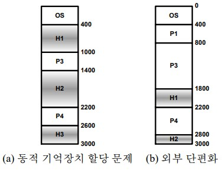

# 저장장치 관리
----
### 1.1.1 주소 바인딩
- 프로그램을 작성할 때, 프로그래머는 기호 주소를 사용한다. 즉, 변수를 선언하고 이 변수 이름을 통해 주소를 접근한다.
- 프로그램은 실행되기 전에 이런 기호 주소를 실제 주소로 바인딩해주어야 한다.
- 주소를 바인딩하는 시기
    - 컴파일 시간: 컴파일러가 프로세스가 어디에 적재될지 알고 있으면 컴파일할 때 주소를 바인딩할 수 있다.
    - 적재 시간: 컴파일할 때 프로세스가 어디에 적재될지 모르면 컴파일러는 재배치 가능코드를 생성한다. 실제 바인딩은 적재할 때까지 지연된다. 재배치 가능 코드란 기준 위치 주소를 사용하는 코드를 말한다.
    - 실행 시간: 실행 도중에 프로세스의 적재 위치가 바뀔 수 있으며 바인딩은 실행될 때 이루어진다. 현재는 대부분 이 방법을 사용한다.
----
### 1.1.2 논리 VS 물리적 주소 공간
- `CPU에 의해 생성되는 주소는 보통 논리적 주소`라 하고, `주기억장치가 접하게 되는 주소(MAR에 적재되는 주소)는 물리적 주소`라 한다.
- 컴파일 시간 바인딩이나 적재 시간 바인딩에서는 놀리적 주소와 물리적 주소가 같다.
- 실행 시간 바인딩의 경우에는 논리적 주소와 물리적 주소가 다르며, 이 경우에 논리적 주소를 가상 주소(virtual address)라 한다.
- 프로그램에 의해 참조될 수 있는 모든 논리적 주소를 논리적 주소 공간(logical address space)이라 한다. 모든 논리적 주소에 대응되는 모든 물리적 주소를 물리적 주소 공간이라 한다.
- 실행 시간 바인딩에서 논리적 주소와 물리적 주소 간에 매핑은 주기억장치-관리 장치(MMU, Memory_Management Unit)라 하는 하드웨어에 의해 이루어진다.
- 간단한 예) 재배치 레지스터(relocation register) 사용
    - 재배치 레지스터는 다른 말로 기저 레지스터(base register)라 하며, 이 레지스터에 있는 값이 6이고 CPU가 생성한 논리적 주소가 이면 주기억장치에게는 a + b 값이 주소 정보로 전달된다.
    - MSDOS는 네 개의 기저 레지스터를 사용하였다.
----
### 1.1.3 동적 적재
- 초창기에는 프로그램이 실행되기 위해서는 전체프로그램이 모두 주기억장치에 적재되어야 했다.
    - 문제점: 프로세스의 크기가 물리적 주기억 장치 크기에 의해 제한된다.
- `동적 적재(dynamic loading)`: 루틴이 호출될 때 주기억장치에 적재하는 방법
    - 모든 루틴은 재배치 가능 코드 형태로 디스크에 유지된다.
    - main 프로그램이 먼저 적재되며, 실행 도중에 다른 루틴을 호출해야 하면 이 루틴이 현재 주기억장치에 있는지 검사하고 없으면 재배치 가능 연결 적재기를 이용하여 루틴을 주기억장치에 적재한다.
    - 장점: 사용하지 않는 루틴(오류 처리 루틴)은 주기억장치에 적재되지 않는다.
----
### 1.1.4 동적 연결과 공유 라이브러리
- 정적 연결(static linking): 프로그래밍 언어에서 제공하는 라이브러리를 프로그램과 결합하여 사용하는 방식
    - 단점: 모든 프로그램은 라이브러리의 복사본을 가지고 있다. 따라서 디스크 공간과 주 기억장치 공간이 모두 낭비된다.
- 동적 연결(dynamic linking): 라이브러리와의 연결이 실행 시간까지 연기되는 방식
- 장점
    - 라이브러리 갱신이 용이하다.
    - 여러 버전의 라이브러리 사용 가능하다.
    - 디스크 공간과 주기억장치 공간을 절약할 수 있다.
- 동적 연결은 다른 주소 공간을 접근해야 하므로 운영체제 지원이 필요하다.
----
### 1.1.5 중첩
- `중첩(overlay)`은 프로세스의 크기가 프로세스에게 할당된 공간보다 클 수 있도록 해준다. 기본 생각은 현재 필요한 명령어들과 데이터만 주기억장치에 유지하는 것이다. 현재는 사용하지 않는 방법이다.
----
## 1.2 스왑핑
- 프로세스는 실행 도중에 일시적으로 주기억장치에서 디스크로 옮겨진 후에 나중에 다시 주기억장치에서 디스크로 옮겨진 후에 나중에 다시 주기억장치에 적재되어 실행을 재개할 수 있다. 이 과정을 스왑핑(swapping)이라 한다.
- 스왑핑을 하기 위해서는 보조기억장치가 필요하며, 보통 빠른 디스크를 활용.
----
## 1.3 연속적 공간 할당
- 주기억장치는 보통 두 영역으로 분할된다. 한 영역은 운영체제가 사용하며, 다른 영역은 사용자 프로세스가 사용한다. 보통 운영체제는 하위 주소에 위치한다.
- 연속적 공간 할당에서 각 사용자 프로세스는 연속된 단일 영역을 할당받는다.
----
### 1.3.1 주기억장치 보호
- 운영체제를 사용자 프로세스로부터 보호해야 하며, 사용자 프로세스를 다른 사용자 프로세스로부터 보호해야한다.
----
### 1.3.2 주기억장치 할당
- `MFT (Multiprogramming with Fixed number of Tasks)방법`
    - 주기억 장치를 고정된 크기의 영역으로 분할하여 각 영역을 하나의 프로세스에게 할당한다.
    - 이 경우 다중 프로그래밍 정도는 분할 영역의 수에 의해 결정된다.
    - 운영체제는 어떤 영역이 사용가능한지를 유지하기 위해 테이블을 사용한다.
    - 이 방법을 MFT라 하며 IBM에서 초창기에 사용한 방식이다. 그러나 현재 이 방식을 사용하지 않는다.
- `MVT (Multiprogramming with Variable number of Tasks) 방법`   
    - 운영체제는 현재 사용되고 있는 공간과 사용되지 않는 공간을 테이블에 유지한다.
    - 처음에는 운영체제가 적재되어 있는 공간을 제외하고는 모두 사용이 가능하며, 사용가능한 영역을 홀(hole)이라 한다.
    - 프로세스가 도착하면 그 프로세스를 수요할 수 있는 크기의 홀을 찾아 할당한다.
    - 프로세스가 실행되기 위해 도착하면 입력 큐(준비완료 큐)에 할당한다.
    - 스케줄링 알고리즘에 따라 프로세스에게 주기억장치를 할당하며, 더 이상 할당할 공간이 없으면 프로세스는 대기하게 된다.
    - 어떤 주어진 시간에 주기억장치를 관찰하면 홀들은 주기억장치 전반에 걸쳐 흩어져 있다.
- 
- 동적 기억장치 할당 문제: 여러 홀이 있을 때 어떤 홀에 프로세스를 할당할 것인지를 결정하는 문제
    - 최초 적합: 충분히 큰 첫 번째로 발견한 홀에 할당
    - 최적 적합: 프로세스를 수용할 수 있는 가장 작은 홀에 할당
    - 최악 적합: 가장 큰 홀에 할당.
- 위 세가지 알고리즘은 외부 단편화(external fragmentation) 발생할 수 있다.
- 외부 단편화: 모든 홀을 합하면 프로세스를 수용 할 수 있으나 연속 공간이 아니라 프로세스를 할당할 수 있는 경우를 말한다.
----
## 1.4 페이징
- 
- 페이징 기법에서는 프로세스에게 연속된 공간을 할당해주지 않아도 된다.
- 현재 가장 널리 사용되는 방법
- 초창기 페이징 기법은 하드웨어에 전적으로 의존하여 구현. 그러나 최근에는 운영체제와 하드웨어를 밀접하게 연관시켜 구현한다.
----
### 1.4.1 기본 개념
- 물리적 기억 장치는 고정된 크기의 `프레임(frame)`으로 나눈다.
- 논리적 주소공간도 프레임과 같은 크기의 페이지(page)로 나눈다.
- 프로세스가 실행될 때 그것의 페이지는 사용 가능한 어떤 프레임에도 할당될 수 있다.
- 하드웨어 지원
    - CPU가 생성하는 주소: 페이지 번호(p)와 페이지 오프셋(d), 두 필드로 구성된다.
    - 페이지 번호는 페이지 테이블을 참조하는 색인(index)로 활용되며, 이를 통해 이페이지가 할당되어 있는 프레임을 알 수 있다.
----
### 1.4.2 하드웨어 지원
----
### 1.4.3 보호
- 페이징 기법을 사용하는 환경에서 주기억장치 보호는 보호 비트를 이용한다.
- 보호 비트는 페이지 테이블에 유지된다.
- 각 페이지마다 한 비트를 이용하여 페이지가 읽기-쓰기 또는 읽기-전용인지를 나타낼 수 있다.
----
### 1.4.4 페이지 테이블의 구조
----
#### 1.4.4.1 계층구조 페이징
- 계층구조 페이징이란 페이지 테이블도 페이징을 하는 페이징 기법이다.
----
#### 1.4.4.2 해시된 페이지 테이블
- 
- `해시 테이블(hash table)`의 각 항은 같은 위치로 해시되는 페이지 번호의 연결 리스트로 구성된다. 연결 리스트의 각 요소는 다음과 같은 세가지 필드로 구성된다.
    - 가상 페이지 번호
    - 페이지 프레임의 값
    - 다음 요소를 가르키는 포인터
- 주소 해석 방법
    - 주소에 있는 가상 페이지 번호를 해시하여 해당하는 해시 테이블의 위치를 계산한다.
    - 그 위치에 있는 연결 리스트를 검색하여 페이지 프레임 값을 얻는다.
- 단계가 깊은 다 단계 페이징 방식보다는 주소를 참조하는데 소요되는 시간이 평균적으로 적다.
----
#### 1.4.4.3 역 페이지 테이블
- 
- 주기억장치의 각 프레임에 대한 항만을 가지고 있다. 이 항에는 이 프레임에 저장되어 있는 가상 주소와 이것을 사용하는 프로세스의 식별자로 구성되어 있다.
- 주소 해석 방법
    - 각 가상 주소는 세 개의 필드(프로세스 식별자, 페이지 번호, 오프셋)로 구성되어 있다.
    - 프로세스 식별자와 페이지 번호를 이용하여 테이블을 검색한다. 일치하는 것을 발견하면 그 항의 위치가 프레임의 위치가 된다.
    - 문제점: 페이지 테이블을 검색하는 비용이 많다. 이것을 극복하기 위해 해시 테이블을 활용할 수 있다.
----
### 1.4.5 공유 페이지
- 페이징 기법의 또 다른 장점은 공통 코드의 공유 가능성이다.
- 재진입 코드는 자체 수정이 가능하지 않아야 한다. 즉, 스스로 수행되는 동안에 변경되지 않아야 한다.
- 코드를 공유하기 위해서는 반드시 재진입이 가능해야 한다.
----
## 1.5 세그먼테이션
----
### 1.5.1 기본 방법
- 세그먼테이션은 사용자 관점을 지원해주는 주기억장치 관리 기법이다.
- 세그먼테이션에서 논리 주소 공간은 세그먼트의 집합으로 구성되며, 각 세그먼트는 이름과 길이를 가진다.
- 사용자는 세그먼트 이름과 오프셋을 이용하여 주소를 지정한다.
- 컴파일러가 사용자 프로그램을 번역할 때 자동적으로 세그먼트를 구성해준다.
----
### 1.5.2 하드웨어
- 세그먼트 주소와 물리적 주소 간에 매핑
    - 세그먼트 테이블을 사용한다.
    - 이 테이블의 각 항은 세그먼트의 기저와 한계로 구성되어 있다. 세그먼트의 기저에는 세그먼트의 물리적 시작 주소가 기록되어 있으며, 한계에는 세그먼트의 길이가 기록되어 있다.
    