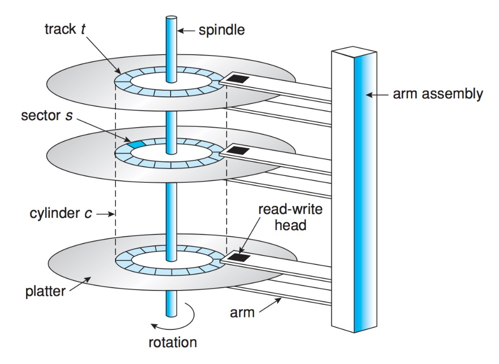
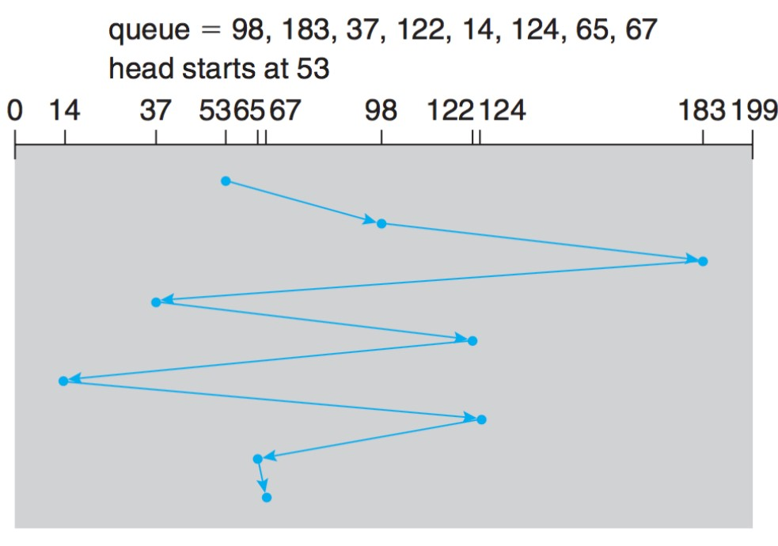
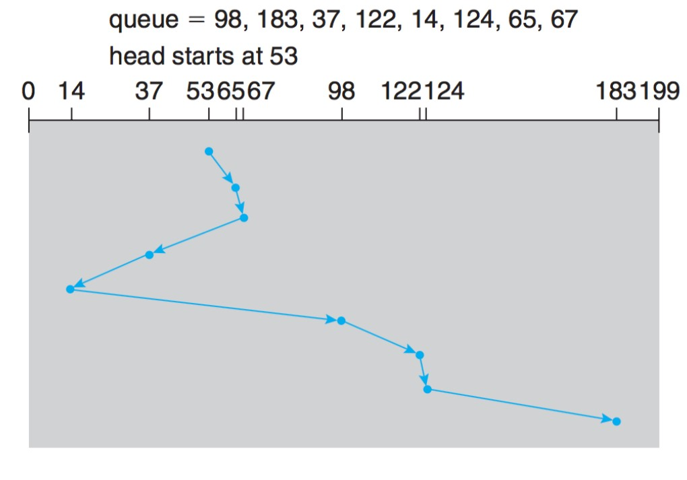
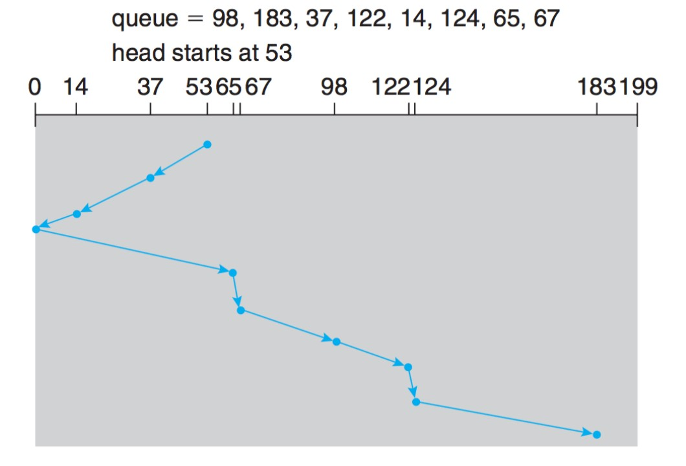
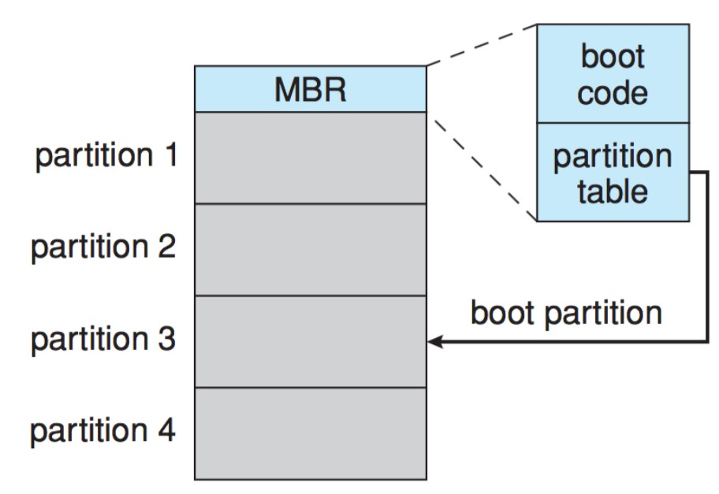
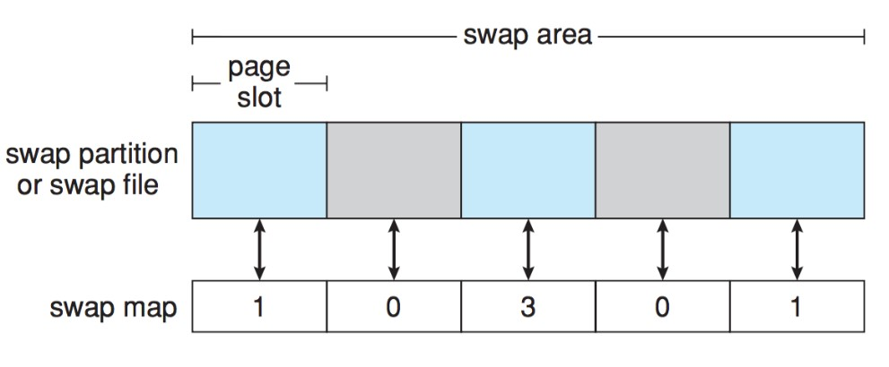
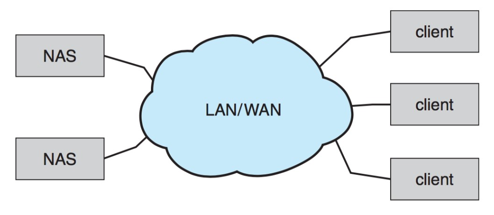
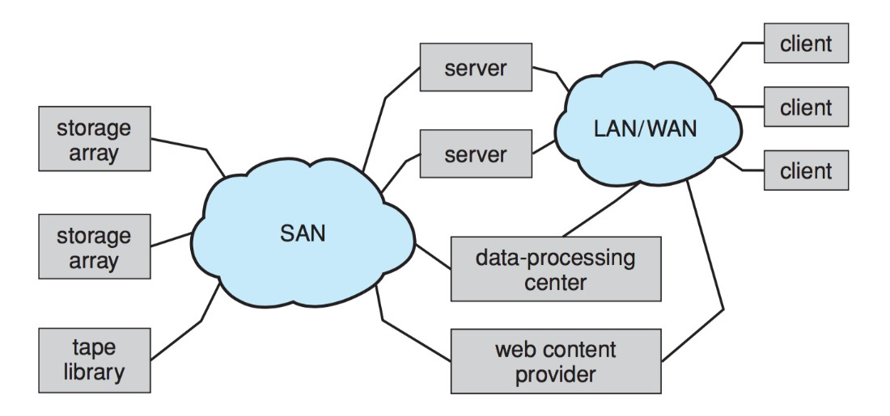
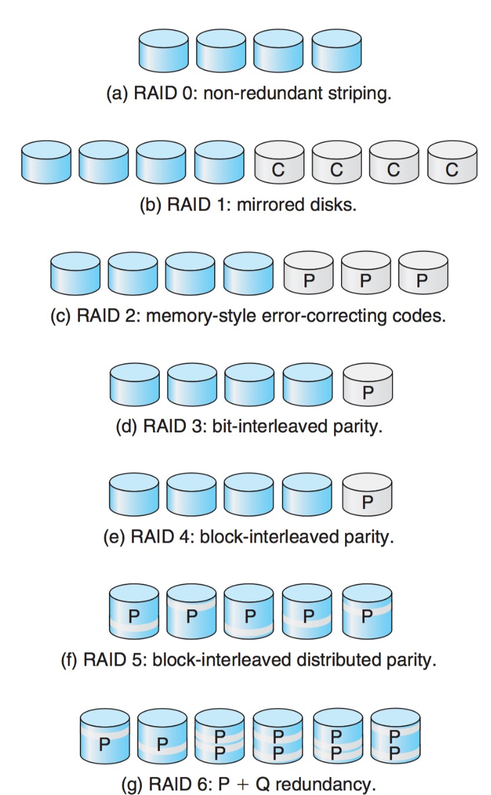

# 대용량 저장장치 구조
----
## 1.1 대용량 저장장치 구조의 개관
----
### 1.1.1 자기 디스크
- 자기 디스크는 현대의 컴퓨터 시스템을 위한 대량의 보조 저장장치로 사용된다.
    - 하드웨어 구조
        - 플래터 : CD처럼 생긴 원형 평판, 양쪽 표면이 자기 물질로 덮여있다.
        - 헤드 : 읽기 헤드/ 쓰기 헤드가 보통 함께 있음
        - 암 : 헤드를 움직일 수 있도록 하는 모듈
    - 데이터를 나누는 단위
        - 트랙 : 하나의 동심원
        - 섹터 : 트랙을 일정한 크기의 섹터로 나누고, 정보를 저장한다.
        - 실린더 : 동일한 암 위치에 있는 트랙의 집합을 말한다.
    - 접근 시간/속도에 관한 용어
        - 전송률 : 드라이브와 컴퓨터 간의 데이터 흐름 비율 (보통 초당 수(십) 메가바이트)
        - 임의 접근 시간(Random Access time)
    - 위치 잡기 시간 (Positioning time) : 탐색 시간 + 회전 지연 시간 ( 수 밀리초)
        - 탐색 시간 : 디스크 암이 움직이는 시간.
        - 회전 지연 시간 : 원하는 섹터가 디스크 헤드로 회전하는 데 걸리는 시간.
    - 하드 디스크나 플로피 디스크가 자기 디스크에 해당한다.
    - 보통 디스크 드라이브는 입출력 버스 라고 하는 회선들의 집합에 의해 컴퓨터에 부착되어 있다.
    - EIDE,ATA,SATA,USB,FC,SCSI 등등…
    - 버스 상에서의 데이터 전송은 제어기(Controller)가 처리한다. 보통 각각의 디스크 드라이브에 내장되어 있다.
    - 하드 디스크가 캐시를 내장할 수도 있다.
- 
----
### 1.1.2 자기 테이프
- 초기의 보조 저장장치 매체로 사용되었다. 상대적으로 영구적, 대용량의 데이터가 보관 가능하지만 접근 시간이 느리다. 따라서 보조 저장장치로는 부적합, 백업용으로 사용함.
- 테이프 형태의 구조는 앞뒤로 왔다갔다 하며 정확하게 이동하는데 많은 시간이 소요됨.
----
### 1.1.3 디스크 구조
- 디스크는 논리적으로 매우 큰 일차원 블록의 배열로 간주되며, 이 블록은 전송의 최소 단위이다. 블록의 크기는 보통 512KB이다.
- 이 블록들은 디스크의 섹터로 사상된다. 그러나 불량 섹터의 존재 가능성과 트랙 당 섹터의 수가 다를 수 있으므로 논리적 순서를 물리적 순서로 사상하는 것이 쉽지 않다.
- 섹터 0은 가장 첫 번째(가장 바깥쪽) 실린더의 첫 번째 트랙의 첫 번째 섹터가 된다. 차차 안쪽 실린더로 진행된다.
    - 고정 선형 속도 : 트랙당 비트의 밀도가 일정하다. 트랙이 디스크의 중심에서 더 멀어질수록 더 많은 섹터를 가질 수 있다. 따라서 현대의 디스크들은 실린더를 몇 개의 구역으로 나눈다. 바깥족으로 갈 수록 트랙당 섹터 수가 증가한다. 헤드가 바깥쪽에서 안쪽으로 이동할 때 데이터의 읽고 쓰는 양을 동일하게 하기 위해 회전 속도를 높인다. CD DVD 등에서 사용한다. 밀도가 같다
    - 고정 각속도 : 디스크의 회전 속도를 일정하게 유지하고 안쪽 트랙에서 바깥쪽 트랙으로 갈 수록 비트의 밀도를 줄여 데이터 전송률을 일정하게 유지한다. 하드디스크에서 사용한다. 밀도가 다르다.
----
## 1.2 디스크 스케줄링
- 운영체제가 어떻게 하면 효율적으로 디스크를 제어할 수 있는가에 대한 논의이다.
- 디스크의 접근 시간에 가장 큰 영향을 주는 것은 탐색 시간이다.
- 디스크 입출력 요청은 다음과 같은 정보를 지정한다.
    - 연산의 유형: 입력 또는 출력
    - 디스크 내의 위치 또는 주소
    - 주기억장치 내의 위치
    - 전송할 바이트의 수
- 디스크 접근 시간
    - 탐색 시간 : 디스크 암이 헤드를 움직이는 시간
    - 회전 지연 : 디스크 헤드가 원하는 섹터에 도달하기까지 걸리는 추가적인 시간.
- 디스크 대역폭 : 단위 시간당 전송되는 총 바이트 수
효율적인 스케줄링은 접근 시간과 대역폭 모두를 증가시킬 수 있다.
시스템이 디스크에 입출력을 요청할 때에는 다음과 같은 인자들을 같이 전달한다
- 입력/출력 여부
- 디스크 주소
- 메모리 주소
    - 전송될 섹터의 수   
    디스크 드라이브의 제어기가 쉬고 있다면 요청이 바로 시작되지만, 바쁜 경우라면 드라이브의 큐 (Queue)에 들어가 기다려야 한다.   
    다중 프로그래밍 시스템에서는 많은 프로세스들이 디스크를 공유한다. 따라서 큐가 길어질 가능성이 크다. 디스크 스케줄링 알고리즘은 큐에 대기하고 있는 입출력 요청 들을 어떤 순서로 처리할 지에 대한 연구이다.
----
### 1.2.1 FCFS 스케줄링(선입 선처리 스케줄링)
- 먼저 요청이 들어오는 것부터 처리한다. 가장 단순한 형태의 알고리즘이다.
- 가장 단순한 방법이지만 헤드 움직임을 최적화 하지 않기 때문에 성능이 나쁠 수 있다.
- 
----
### 1.2.2 SSTF 스케줄링(최소 탐색시간 우선 스케줄링)
- SSTF(Shortest-Seek-Time-First) 알고리즘은 탐색 시간이 가장 작은 것부터 먼저 처리하는 방식이다.
- 헤드가 다른 곳으로 이동하기 전에, 현재 헤드로부터 가장 가까운 곳에 있는 요구를 먼저 처리해 주고 이동하는 알고리즘이다.
- 최소 작업 우선(Shortest-Job-First) 스케줄링과 유사하나, 몇 개의 디스크 요청들이 매우 오래 기다리는 기아 현상(Starvation) 이 발생할 수 있다. 큐의 길이가 길어질수록 기아 현상이 심해질 수 있다.
- 
----
### 1.2.3 SCAN 스케줄링
- 스캔 알고리즘은 디스크 암이 한쪽 끝에서 다른 쪽 끝으로 이동하면서 처리한 다음 방향을 바꾸어 처리하는 방식이다. 
- 이동하는 길에 있는 요청을 모두 처리한다.
- 
----
### 1.2.4 디스크 스케줄링 알고리즘의 선택
- 어떠한 스케줄링 알고리즘을 사용하던 간에 알고리즘의 성능은 요청의 형태와 횟수에 의해 좌우된다. 그리고 디렉터리와 색인 블록의 위치 또한 중요하다. 모든 파일은 열려야 사용이 가능하기 때문에 파일의 위치를 담고 있는 디렉토리에 먼저 접근해야 한다. 이렇다 보니 가장 빈번하게 접근되게 된다. 따라서 디렉터리는 디스크의 가장 안쪽이나 끝 보다는 중간 정도의 실린더에 있는게 더욱 좋다.
----
## 1.3 NVM 스케줄링
- NVM 이란?
    - NVM(비휘발성 메모리) 장치는 기계식이 아니라 전기식이다. 플래시 메모리 기반 NVM은 SSD라고도 한다. 일반적으로 플래시 NAND 다이 반도체 칩으로 구성된다.
    - NVM 장치는 움직이는 부품이 없어 HDD보다 안정성도 높고 데이터 접근 시간이 없으므로 빠르다
    - 단점은 HDD 보다 가격이  비싸고 용량이 작다
- FCFS방식 스케줄링을 사용한다.
----
## 1.4 저장장치 관리
- 운영체제는 이 외에도 디스크 관리와 관련된 몇 가지 책임을 져야 한다.
----
### 1.4.1 디스크 포맷팅
- 새로운 디스크는 아무런 정보도 없이 비어있는 상태이다. 이러한 디스크에 자료를 저장하기 전에 섹터들로 나누어야 하며, 이 과정을 저수준 포맷팅(Low-Level Format) 또는 물리적 포맷팅 이라고 한다.
- 이는 섹터를 구분하기 위해 적절한 자료구조로 채우는 것이며, 보통 헤더 자료 구역(보통 512B의 데이터 영역, 트레일러(ECC 및 섹터 번호) 등의 정보를 가지고 있다.
- 파티션 나누기: 하드 디스크의 경우 각각의 파티션을 별도의 디스크처럼 취급한다
- 물리적 포맷팅: 디스크를 디스크 제어기가 읽고 쓸 수 있도록 섹터 단위로 나누는 작업을 말한다.
- 논리적 포맷팅: 파티션을 만든 후에 초기 파일 시스템을 적재하는 과정을 말한다.
----
### 1.4.2 부트 블록
- 컴퓨터를 시작하기 전에 전원을 켜거나 재부팅할 때 시스템을 시작시키는 프로그램이다.
- 컴퓨터의 전원을 키면 부트스트랩 프로그램은 시스템의 모든 구성요소를 초기화하고, 디스크에서 운영체제 커널을 주기억장치에 적재한 다음 커널을 실행한다.
- 부트스트랩 프로그램은 ROM에 적재되어 있다.
- 장점 : 처음 부팅되었을 때 위치가 고정되어 있어 실행하기가 쉽고 ROM은 읽기 전용 기억장치이므로 바이러스에 감염되지 않는다.
- 단점 : ROM에 적재하면 부트스트랩 프로그램을 변경하기 어렵다.
- 따라서 부트스트랩 프로그램의 일부만 ROM에 적재하고, 나머지는 디스크에 유지한다. ROM에 있는 프로그램의 역할은 이 프로그램을 주기억장치에 적재하여 실행하는 것이다.
   
- MBR Master Boot Record : 주로 하드디스크의 첫 번째 섹터에 저장되는 정보로 부트 코드와 파티션 테이블이 들어있다. 어떤 파티션이 부트되어야 하는가에 대한 표시가 같이 되어있다.
- 
----
### 1.4.3 불량 블록
- MS-DOS의 경우에는 FAT 테이블에 불량 블록을 기록하여 사용하지 않도록 한다. 사용 도중에 불량 블록을 발견하면 특수한 프로그램을 수행하여 이것을 불량 블록을 기록한 다음에 다시 사용해야 한다.
- SCSI와 같은 보다 복잡한 디스크는 여분 섹터를 유지하여 자동으로 교체하여 사용한다. 즉, 불량 섹터를 발견하면 그 사실을 기록하고, 이 섹터와 여분 섹터를 하나 연고나해 놓는다. 그 다음부터 이 섹터를 접근하면 자동으로 연관한 여분 섹터를 사용한다.
- 여분 섹터가 멀리 떨어져 있으면 디스크 스케줄링 알고리즘의 나쁜 영향을 미친다. 따라서 섹터 옮기기 기법을 사용한다. 트랙마다 여분 섹터를 두어 불량 섹터 이후의 모든 섹터를 그것의 다음 섹터로 사상되도록 사용한다.
    - 섹터 옮기기/섹터 남기기 : SCSI 디스크의 경우 손상 블록이 발생하면, 손상 블록 리스트를 유지하고, 이에 저수준 포맷팅을 미리 할 때 보이지 않는 예비 섹터를 둔다. 이를 손상된 블록과 교체시킬 수 있다. 일부 디스크의 경우 포맷팅할 때에 예비 섹터를 각 실린더마다 배치하고 예비 실린더도 배치한다. 그리고 섹터가 손상되면 예비 섹터를 찾아서 대치시킨다.
    - 섹터 밀어내기 : 블록 17에 결함 첫 번째 예비 섹터가 202번인 경우 17~202까지의 섹터들을 한 칸씩 이동시킨다.
    - 연성 에러 (soft error) : 손상된 블록 데이터를 복사하고 예비 블록으로 대체할 수 있는 경우
    - 경성 에러 (hard error) : 데이터를 잃어버리게 되면 사람이 직접 백업본을 들고 와서 에러유무를 체크해야 한다.
----
## 1.5 스왑 공간 관리
- swap: 프로세스 전체를 디스크나 주 메모리로 옮기는 것. 물리 메모리가 아주 작아질 때 활성화된다. 근데 가상 메모리로 활용되는 영역은 디스크 영역으로 메모리에 비해 현저히 느릴 수 밖에 없다. 그렇기에 스왑 공간의 설계와 구현 즉 스왑 공간을 어떻게 쓰고, 디스크상에 어디에 위치시켜야 하는가에 대해 알아본다.
----
### 1.5.1 스왑 공간 사용
- 스왑 공간은 사용하는 OS에 따라 다양하게 운영된다.
- 시스템에 따라서슨 프로세서의 이미지 전체를 스왑 공간에 가지고 있을 수 있다. 
- 페이징 시스템에서는 단순히 주 메모리에서 밀려나는 페이지들을 스왑 공간에 다 들고 있을 수도 있으므로 수 메가에서 수 기가바이트까자의 크기를 가진다.
----
### 1.5.2 스왑 공간 위치
- 스왑 공간은 두 군데에 있을 수 있다.
    - 일반 파일 시스템이 차지하고 있는 공간
    - 만일 하나의 통짜 파일이라면 구현이 매우 간단해 할당과 관리가 편하다. 다만 스왑을 할 때마다 디렉터리 구조와 디스크 할당 자료구조를 거쳐야 하기 때문에 추가로 디스크 액세스가 필요하다.
    별도의 파티션에 따로 관리
    - 따라서 보통 스왑 공간은 별도의 디스크 파티션에 둔다. 일반 파일/디렉터리는 이 공간에 저장되지 않는다. 스왑 관리 루틴은 공간 효율성보다는 속도 효율성을 최적화히기 위한 알고리즘을 쓴다. 파일 시스템에 비해 훨신 자주 접근되기 때문이다. 내부 단편화가 자주 발생하겠지만 훨신 짧은 시간동안만 사용하므로 큰 문제가 되지는 않는다.
    - 리눅스의 경우 별도의 파티션을 두는 방법과, 파일 시스템 공간 모두에 스왑이 가능하다.
----
### 1.5.3 스왑 공간 관리: 예
- UNIX의 경우 원래 전체 프로세스 이미지를 메모리/디스크 내에 연속적인 공간으로 스와핑하는데에서 출발했다. 하드웨어 페이징 기술이 발전함에 따라 페이징과 스와핑을 함께 쓰는 방식으로 발전했다.
- SunOs의 경우 페이지를 교체할 때 스왑 아웃 시키기보다는 그냥 할당 해제하고 필요할 경우 파일 시스템으로부터 다시 읽는다. 굳이 스왑 공간을 한번 더 거치면 비효율적이기 때문이다.
리눅스의 경우 스왑 공간을 익명 메모리(힙,스택 등으로 초기화되지 않은 메모리) 혹은 다수의 프로세스들이 공유하는 메모리 영역에만 사용한다. 스왑 영역은 일반 파일로도, 스왑 파티션으로도 있을 수 있다. 각 스왑 영역은 연속된 페이지 슬롯으로 구성되고 이 페이지 슬롯에 스왑된 페이지들을 적재한다. 그리고 몇 개의 프로세스가 그 스왑 공간을 이용하는지를 체크 해 카운터 개수를 센다. 해당 카운터가 0인 영역은 해당 페이지 슬롯이 사용 가능하다는 의미이다.
- 
----
## 1.6 저장장치 연결
- 디스크를 I/O포트에 붙이거나 디스크를 네트워크에 붙이거나 둘 중 한가지의 형태를 가진다.
----
### 1.6.1 호스트 부착 저장장치
- 로컬 입출력 포트를 이용하여 접근하는 방법. IDE(integrated drive electronics),ATA(AT attachment)라고 하는 입출력 버스 아키텍처를 사용한다. 입출력은 버스마다 최대 2개의 드라이브를 지원한다.
    - SCSI : 보통 50 또는 68개의 핀으로 이루어진 커넥터를 쓰고 1 버스당 16대의 디바이스를 지원한다.
    - FC : 높은 속도를 지원하는 직렬 아키텍처 이다. SAN의 기본이 된다.
----
### 1.6.2 네트워크에 부착된 저장장치(Network-Attached Storage)
- 네트워크를 통해 원격으로 접근되는 전용 저장장치. 클라이언트는 NFS 또는 CIFS 등의 원격 프로시저 호출을 통해 NAS에 접근한다.
- NAS는 디바이스가 가지고 있는 전용 프로토콜 (SCSI, IDE등)이 아닌 TCP/IP 상에서 RPC를 사용하여 호출한다.
- 
----
### 1.6.3 SAN(Storage-Area-Network)
- NAS의 경우 입출력 연산시 TCP/IP 네트웍 프로토콜을 사용한다. 따라서 통신의 지연을 증가시키게 된다. 이는 대규모 클라이언트/서버 구축 시 통신 대역폭을 놓고 서버-클라이언트와 경쟁하게 된다.
- SAN은 서버들과 저장장치 유닛들을 연결하는 사유 네트워크이다. 따라서 네트워크 프로토콜이 아닌 저장장치 프로토콜을 사용한다.
- 여러 호스트와 저장장치가 같은 SAN에 부착될 수 있고, 저장장치는 동적으로 호스트에 할당이 가능해 융통성 있게 사용할 수 있다.
- 
----
## 1.7 RAID 구조
- Redundant Array of Independent (Inexpensive) Disk
- 디스크 만드는 기술이 발전함에 따라 디스크의 가격이 점점 더 저렴해졌고, 여러 개의 디스크를 이용하여 병렬 처리를 하여 더 신뢰성이 높고, 더 빠른 데이터 전송률을 확보하기 위해 사용한다.
----
### 1.7.1 중복을 통한 신뢰성 향상
- 디스크를 한 개만 사용하여 데이터를 저장하는 경우 한번 디스크 오류가 발생하면 엄청난 양의 데이터 손실이 발생할 수 있다. 따라서 중복하여 데이터 저장을 허용하는 방법으로 데이터의 분실을 막는 방법이다.
- 가장 단순하고 비용이 많이 드는 방법으로 디스크의 복사본을 만드는 방법이 있다. 이는 `미러링`이라고 불린다. 미러링을 사용하는 하나의 논리 디스크는 두 개의 물리 디스크로 구성된다. 물론 이렇게 구성한 경우라도 미러링된 디스크에서 두 디스크가 동시에 고장이 날 수도 있기에 완벽한 방법은 아니지만, 단일 디스크를 사용하는 것에 비해 훨씬 안정적이다.
- 두 디스크를 사용하여 동시에 쓰기를 진행하는 겨우 갑자기 한 쪽에만 오류가 생겨 내용이 달라질 수가 있다. 이러한 현상을 방지하기 위해 NVRAM 캐시(비휘발성 메모리 캐시)를 RAID영역에 두고 첫 번째 디스크에 쓰기 작업을 마친 후, 두 번째 디스크에 쓰기 작업을 마친다. 이는 전원이 나가있는 동안의 데이터 손실이 없다.
----
### 1.7.2 병렬성을 통한 성능 향상
- 디스크를 병렬로 접근하게 된다면 한 개의 요청으로 두 개의 디스크에 동시에 쓰기 작업 혹은 읽기 작업이 가능하다.
    - 데이터 스트라이핑 : 여러 디스크를 한 번에 읽기/쓰기 작업을 진행하여 데이터 전송 비율을 향상시킬 수 있다.
    - 비트 레벨 스트라이핑 : 예를 들어 8개의 디스크를 가지고 있는 경우 각 디스크의 i에 비트 i를 쓴다. 크기도 8배가 되고 접근 성능도 8배가 된다. 일반적으로 8의 배수 또는 8의 약수개의 디스크를 사용한다고 일반화할 수 있다.
    - n개의 디스크에서 파일의 i번째 블록은 (i mod n) +1의 디스크로 간다 . 스트라이핑도 비트 레벨이 아닌 바이트 레벨, 섹터 레벨로 가능하다. 블록 레벨의 스트라이핑이 가장 일반적이다
----
### 1.7.3 RAID 레벨
- 적은 비용으로 중복을 허용하는 많은 기법들이 있다.
    - RAID 0 (Raid Level 0) : 블록 레벨 스트라이핑 디스크 구성으로 여러 개의 디스크를 사용하여 입출력 속도를 향상시키는 구성이다.   

    - RAID 1 : 디스크를 미러링하는것을 뜻한다.   

    - RAID 2 : 메모리 스타일 오류 정정 코드 구조로 패리티 비트를 이용하여 단일 비트 손상의 경우 데이터를 복구하는 방법이다. 비트 스트라이핑의 경우 8개의 비트가 스트라이핑 된다면 8개의 디스크에 데이터가 써질 것이고, 나머지 한 개의 디스크에 패리티 정보를 저장한다. 오버헤드 디스크가 한 개 줄어든다.   

    - RAID 3 : bit-interleaved paritiy organization : 메모리와 달리 한 섹터가 정확히 읽혔는지를 디스크 컨트롤러가 탐지할 수 있다는 사실을 이용하여, level2의 기능을 향상시킨 것이다. 하나의 오버헤드 디스크를 가진다. 이 방법 때문에 RAID2는 주로 사용되지 않는다.   

    - RAID 4 : block-interleaved parity organization : 블록 단위의 스트라피잉을 사용하며 N개의 디스크에 대한 패리티 블록을 다른 디스크에 저장한다. 대규모 읽기 쓰기에 대해 높은 성능을 보이지만, 작은 개별적인 영역의 경우, 패리티 비트를 블록 단위로 기록하기 때문에 읽기-변경-쓰기 의 번거로운 단계를 거쳐야 한다.   

    - RAID 5 : block-interleaved distributed parity : RAID 3,4의 경우 다른 디스크에 패리티비트 정보를 저장하는데 이럴 경우 패리티 비트가 저장된 하드가 손실된 경우가 있다. 이를 막기 위해 비트 정보와 함께 패리티 정보도 N+1개로 나누어 분산시켜 저장한다.   

    - RAID 6 : P + Q 중복 기법 : Raid 5와 유사하지만 여러 디스크 오류에 대비하기 위해 추가 중복 정보를 저장한다. 패리티 비트 대신에 Reed-Solomon Codes 같은 에러 교정 코드를 사용한다. 4비트마다 2비트의 중복 데이터를 허용하므로 시스템 내의 2개의 디스크 오류가 생길 수 있다. 
-   
    - RAID 0 + 1 : 높은 성능과 높은 신뢰성 두 가지를 모두 사용할 수 있는 대신에 하드디스크 사용량이 두 배로 는다. 하나의 디스크 집합이 스트라이프 되고, 그 스트라이프가 다른 스트라이프로 미러링된다. 4 + 4   

    - RAID 1 + 0 : 0 + 1의 경우 한 개의 디스크가 고장난다면 그 집합 전체에 접근이 불가능해진다 따라서 다른 RAID 종류로 디스크를 미러링한 후 그 쌍을 스트라이프 하며서 사용하는 방법이 생겼다. 2 + 2 + 2 + 2 하나의 디스크가 고장나더라도 미러드 디스크를 통해 데이터에 접근이 가능하다.   

    - 커널 혹은 시스템 소프트웨어 계층 내에서 볼륨 관리 소프트웨어로 RAID를 구성할 수 있다. 패리티 RAID의 경우 소프트웨어로 구성할 경우 상당히 느려지므로 RAID 0 + 1 또는 1 + 0 이 사용된다.   

    - RAID는 HBA 하드웨어에 구현될 수 있다. 비용은 적게 드나 융통성이 없을 수 있다.   

- 
----
### 1.7.4 RAID 레벨 선택
- 복구 능력의 측면에서보면 복구 능력은 RAID 레벨에 따라 매우 다르다.
----
### 1.7.5 확장
- RAID의 개념은 테이프나 무슨 시스템의 데이터를 브로드캐스트 하는 일을 포함하여 여러 저장장치에 적용된다. 테이프 구조에는 데이터 복구율을 향상시킬 수 있고, 무선 시스템의 브로드캐스팅은, 패리티를 함께 브로드캐스팅 하여 전송 손실이 생기더라도 복구가 가능하다.
----
### 1.7.6 RAID의 문제점들
- RAID는 운영체제나 사용자에게 데이터가 가용하다는 것을 항상 보장하지 않는다. 물리적인 오류는 보호할 수 있으나 다른 하드웨어나 소프트웨어 버그는 보호하지 못한다.