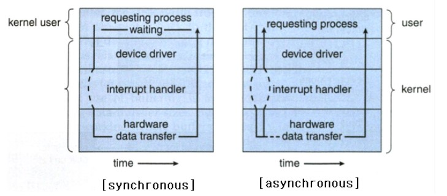
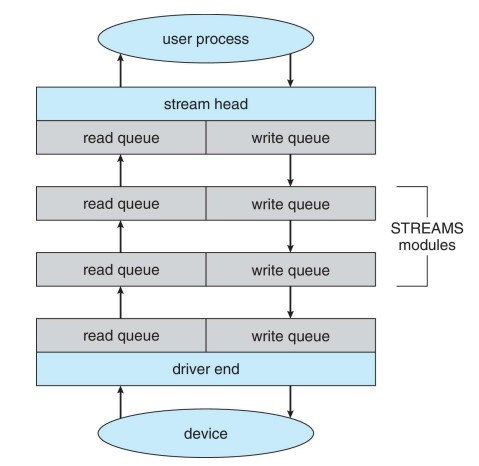

# 입출력 시스템
----
## 12.1 개관
- 컴퓨터의 주요한 두가지 작업은 `연산작업`, `입출력작업`이다.
- 컴퓨터는 설치된 입출력 장치들과 원활하게 소통해야하며 운영체제는 이러한 입출력이 잘 이루어 지도록 할 필요가 있다.
----
## 12.2 입출력 하드웨어
----
### 12.2.1 입출력 하드웨어의 구성
- 입출력 하드웨어는 크게 저장 장치, 전송장치, 사용자 인터페이스 장치 등으로 나누어진다.
- 하드웨어 장치는 케이블을 통하거나 무선으로 신호를 보냄으로써 컴퓨터 시스템과 통신하며, 포트라고 불리는 연결점을 통해 컴퓨터에 접속한다.
- 만약 하나 이상의 장치들이 공동으로 여러 선들을 사용한다면 이것을 `버스`라고 부른다.
- 하드웨어 장치의 또 다른 구성요소는 `제어기`이다.
- `제어기`란 포트나 버스나 입출력 장치를 제어하는 전자회로의 집합체이며 많은 입출력 장치는 제어기를 내장하고 있다.
- 컴퓨터가 장치의 제어기에서 입출력을 하도록 명령하는 방법
    - 모든 제어기는 레지스터를 가지고 있고 컴퓨터의 프로세서는 제어기의 레지스터에 비트 패턴을 쓰거나 읽음으로써 입출력을 실행한다.
    - 다른 방법으로는 장치 제어 레지스터를 프로세서의 주소 공간으로 사상하는 방법이 있고 이것을 `메모리 맵 입출력(Memory Map I/O)`라고 한다.
- 장치의 입출력 포트의 구성
    - 상태 레지스터, 제어 레지스터, 입력 레지스터, 출력 레지스터
    - 제어 레지스터: 장치에게 쓰거나 읽는 동작을 명령하기 위한 명령 코드를 적재하는 곳
    - 상태 레지스터: 해당장치에 오류가 있는지, 작업이 진행중인지, 작업을 끝내고 쉬고 있는지 등 장치의 상태를 체크하는 용도로 사용된다. busy/done 등의 플래그나 오류코드로 표현된다.
----
### 12.2.2 입출력 하드웨어의 동작
- 폴링
    - 장치의 제어기의 레지스터에는 `비지 비트` 라는 것이 존재 하는데, 이것은 현재 장치가 사용가능한 상태인지 아니면 다른 작업을 처리중이라 사용이 불가능 한지를 나타낸다.
    - 제어기가 바쁠 때에는 비지 비트를 1로 설정, 준비 중인 경우에는 0으로 설정하여 컴퓨터가 현재 장치를 사용중인지를 알 수 있게 해준다.
    - 컴퓨터는 계속 장치가 사용중인지 검사하기 위해 비지 비트를 검사하는데, 이것을 계속 돌면서 반복한다고 하여 `폴링` 이라고 부른다.
    - 폴링은 장치가 준비하는 시간이 길어지면 매우 비효율적고, 하드웨어 제어기가 자신의 상태가 바뀔 때 컴퓨터에게 통보를 해주면 비효율을 막을 수 있고 이를 `인터럽트`라고 한다.
- 인터럽트
    - CPU는 인터럽트 요청 라인을 가진다. CPU는 매 명령어를 끝내고 다음 명령어를 수행하기 전 이 라인을 검사한다. 입출력 장치가 준비가 완료되어 인터럽트 요청 라인에 신호를 보내면 CPU는 하나의 명령을 끝낸 시점에 인터럽트를 확인하고 인터럽트 핸들러를 실행한다.
    - 인터럽트 핸들러란 입출력 장치를 서비스함으로써 이 인터럽트를 처리해 주는 것이다.
----
### 12.2.3 직접 메모리 접근
- CPU가 매번 바이트 전송을 제어하는 것은 심한 낭비이다. 이렇게 CPU가 1바이트씩 옮기는 입출력 방식을 `PIO` 라고 부른다.
- CPU의 낭비를 막기위해 PIO를 `DMA 제어기`라 불리는 틀수 프로세서에게 위임한다.
- 컴퓨터(호스트)는 메모리에 DMA 명령 블록을 쓴다. 이 블록에는 전송할 데이터가 있는 곳의 포인터와 전송할 장소에 대한 포인터 그리고 전송될 바이트 수를 기록해 놓는다. 그러면 CPU는 DMA 명령 블록의 주소를 DMA에게 알려주고 자신은 다른 일을 처리한다. 그러면 DMA는 CPU의 도움 없이 자신이 직접 버스를 통해 DMA 명령 블록을 액세스하여 입출력을 실행한다.
- DMA 제어기와 장치 제어기의 연결
    - 이 둘의 핸드셰이킹은 DMA request, 와 DMA acknowledge 라고 불리는 두 개의 선을 통해서 실행된다. 장치 제어기는 전송할 자료가 생기면 DMA request를 통해 장치 제어기에서 데이터 전송을 요청 한다. 그러면 DMA 제어기가 메모리 버스를 얻어 거기에 원하는 주소를 올려 놓고 DMA acknowledge 신호 를 보낸다. 장치 제어기가 DMA acknowledge 신호를 받으면 제어기는 한 워드를 메모리로 전송하고 DMA request를 제거 한다. 그리고 전송이 끝나면 DMA 제어기는 CPU에게 인터럽트를 걸어 전송이 완료되었음을 알린다. 이 과정에서 DMA 제어기가 메모리 버스를 점유 중이면 주 메모리는 주캐시와 보조캐시에 있는 데이터에는 접근할 수 있지만 주 메모리에 있는 데이터는 접근을 할 수 없게 되어 CPU의 속도를 저하시키지만 전체적으로 보았을 때에는 입출력 작업을 DMA로 넘기는 것은 시스템 성능을 향상 시킨다.
----
## 12.3 응용 입출력 인터페이스
- 입/출력 장치들이 일관된 방법으로 다루어 질 수 있도록 운영체제가 인터페이스를 구성하는 기술을 설명 한다. 공통적인 특징을 가진 입/출력 장치들의 표준 함수를 인터페이스(interface)라 한다. 장치 드라이버(device driver)라 불리는 커널 내의 모듈들은 각 입/출력 장치를 위한 구체적인 코딩을 제공하여 바로 위에서 정의한 “인터페이스”의 표준 함수들을 내부적으로 수행한다.
- 
- 장치 드라이버(device driver) 계층의 목적은 여러 입/출력 하드웨어 차이를 숨기고 이들을 간단한 표준 인터페이스들로 보이도록 포장시켜서 이것을 상위의 커널 입/출력 서브시스템에 제공하는 것이다. 이렇게 되면 입/출력 서브시스템은 하드웨어와 독립적이 되어서 운영체제 개발자의 작업을 간단하게 해준다
- 문제점: 운영체제마다 장치 드라이버 인터페이스에 대한 규격이 다르다. 따라서 새로운 장치를 위한 드라이버가 함께 제공되어야 한다.
- 
    - 문자 스트림과 블록(Character stream or block) : 문자 스트림 장치는 바이트를 하나씩 전송하지만 블록 장치는 블록 단위로 전송 한다.

    - 순차 접근과 임의 접근(Sequential or random access) : 순차 장치는 순차적 순서로만 자료를 전송하지만 임의 접근 장치는 임의의 위치에 있는 자료도 입/출력 할 수 있다.

    - 동기식과 비동기식 (Synchronous or asynchronous) : 동기식 장치는 일정한 응답 시간을 갖지만 비동기식 장치는 응답 시간이 예측 불가능 하다.

    - 공유와 전용 (Sharable or dedicated) : 공유 가능한 장치는 몇 개의 프로세스나 쓰레드에 의해 동시에 사용될 수 있으나 전용 장치는 혼자만 사용해야 한다.

    - 읽기/쓰기, 읽기 전용, 쓰기 전용 : 일부 장치들은 읽기와 쓰기를 모두 수행하지만 어떤 것들은 하나만 지원한다.
----
### 12.3.1 블록 장치와 문자 장치
- 블록 장치 인터페이스는 디스크나 이와 유사한 블록 지향(block oriented)장치를 사용하기 위해 필요한 모든 요소들을 제공하고 있다. 운영체제나 데이터베이스는 블록 장치를 마치 선형 배열(linear array)이라고 이해하고 사용하기를 원할 것이다. 이러한 접근 모드를 비가공 입/출력(raw I/O)라 불린다.    

- 만약 응용프로그램이 자체 버퍼링을 수행 한다면 파일 시스템은 불필요하고 중복된 버퍼링을 하게 될 것이다. 또한 응용프로그램이 파일의 블록이나 일부에 대한 자체 잠금 기능을 제공한다면 운영체제의 잠금 기능은 최소한 중복된 기능이고 최악의 경우에는 모순이 발생 할 수도 있다. 이러한 충돌을 피하기 위해 비가공 장치(raw device)의 접근은 장치의 제어권을 집적 응용프로그램에 일임하고 운영체제는 한발 물러나야 한다. 이에 대한 절충안으로 운영체제가 버퍼링과 잠금을 하지 않는 모드로 파일에 대한 입/출력 작업을 하는 것이다. UNIX에서는 이러한 방식을 직접 입/출력(direct I/O)이라고 한다.   

- 메모리 매핑(memory mapped) 파일 접근은 블록 장치 위의 계층으로 구현할 수 있다. 메모리 매핑 파일 접근이란 실제로 장치를 읽거나 쓰는 명령을 사용하는 대신 메모리의 특정 번지를 읽거나 쓰는 명령으로 파일 입/출력을 대신하는 방식이다. 키보드는 문자 스트림(character stream) 인터페이스를 통해 접근되는 장치의 예이다.   
----
### 12.3.2 네트워트 장치
- 네트워크 인터페이스는 소켓(socket)인터페이스 이다. 원격지의 응용 프로그램이 이 소켓으로 접속을 완료하였는지 알아보고 연결이 되었으면 패킷(packet)을 주고 받도록 해 준다.
----
### 12.3.3 클록과 타이머
- 대부분의 컴퓨터들은 하드웨어 클록과 타이머를 가지고 세 가지 기본적인 기능들을 제공한다.
    - 현재 시간을 제공
    - 경과된 시간을 제공
    - T 시각이 되면 X 오퍼레이션을 실행

- 이것은 어느 시간만큼 경과되면 인터럽트를 발생 시키도록 설정 할 수 있으며 이 과정을 한 번 또는 주기적으로 인터럽트를 발생하도록 설정 할 수 있다.   

- 이 메커니즘은 스케줄러가 시간이 종료되면 현재 진행중인 프로세스로부터 CPU를 빼앗기 위해 사용되며 디스크 입/출력 서브시스템이 변경된 캐시 버퍼(dirty cache buffer)를 주기적으로 디스크에 쏟아내는 (flushing)데 사용되고 네트워크 서브시스템이 네트워크 혼잡이나 오류로 인해 어떤 작업을 취소하는데도 사용된다.   

- 운영체제는 가상 클록을 흉내냄으로써 타이머 하드웨어 채널 수보다 더 많은 타이머 관련 요청들을 지원할 수도 있다. 하드웨어 클록의 틱에 의해 생성되는 인터럽트율은 초당 18~60틱 사이다. 간격이 촘촘하지 못한 이유는 타이머 하드웨어 자체에도 이유가 있지만 정밀하기 위한 가상 클록을 유지하는데 오버헤드가 매우 크기 때문이다.   

- 따라서 대부분의 컴퓨터는 클록을 카운터로 구현한다. 카운터 값은 레지스터로부터 읽을 수 있도록 하여 정밀도를 높인다.   
----
### 12.3.4 봉쇄형과 비봉쇄형 입/출력
- 봉쇄형 : 입/출력이 즉시 완료 될 수 없을 경우 응용프로그램은 봉쇄 상태로 들어간다. 즉 실행 큐로부터 대기 큐로 옮겨진다. 이후 수행 될 때 대기 큐에서 실행 큐로 옮겨지며 응용 프로그램은 입/출력 시스템 호출이 되돌려준 값을 받아 사용하게 된다.   

- 비봉쇄형 : 연산과 입/출력간의 중첩을 최대한 도모하기 위해 다중 스레드 방식으로 작성한다. 예를 들면 연산(렌더링)을 하는 동안 입출력 작업(마우스 움직임 등)을 할 수 있다.  비봉쇄형은 프로그램을 멈춰두지 않고 곧장 돌아오며 몇 개의 바이트가 전송되었는지를 알려주는 복귀값을 되돌려 준다.   

- 
----
## 12.4 커널 입출력 서브시스템
- 커널은 입/출력과 관련된 많은 서비스를 제공한다. 입/출력 스케줄링, 버퍼링, 캐싱, 스풀링, 장치 예약 및 에러 처리등의 서비스가 제공되며 이들은 하드웨어와 장치 드라이버 구조를 바탕으로 한다.
----
### 12.4.1 입출력 스케줄링
- 입/출력 요청을 스케줄 한다는 것은 그 요청들을 실행할 순서를 결정하는 것을 의미 한다. 응용프로그램이 입/출력을 요청하는 순서대로 처리하는 것은 비효율 적이다. 운영체제 개발자들은 각 장치마다 대기 큐를 유지함으로써 스케줄링을 구현하고 있다.   

- 응용프로그램이 봉쇄형 입/출력 시스템을 호출 하면 그 입/출력 요청은 해당 장치의 큐에 넣어진다. 입/출력 스케줄러는 시스템의 성능과 각 응용에 대한 평균 응답 시간을 향상하기 위해 큐 안의 순서를 재배치 한다.   

- 커널이 비동기적 입/출력을 제공한다면 커널은 동시에 많은 입/출력 요청을 추적해야 한다. 이를 위해 운영체제는 각 장치 상태 테이블(device status table)에 대기 큐를 연동한다. 이 테이블에는 각 입/출력 장치에 대한 정보가 있다. 각 테이블 항목은 장치의 종류, 주소, 상태, 유휴, 동작중 등을 나타낸다. 장치가 요청을 처리하느라 동작중 상태이면 같은 장치에 대한 요청은 그 장치에 해당하는 테이블 항목에 저장된다.   

- 

- 입/출력 서브시스템의 효율을 높이는 방법으로는 스케줄링외에 버퍼링, 캐싱, 스풀링처럼 디스크의 저장장치 공간을 이용하는 것이다.
----
### 12.4.2 버퍼링
- 버퍼는 입/출력 장치와 응용프로그램 사이에 자료가 전송되는 동안 그 자료를 임시로 저장하는 메모리 영역을 말한다. 버퍼링이 필요한 이유는 다음과 같이 정리할 수 있다.
    - 자료의 생산자와 소비자 사이에 속도가 다른 것에 대처하기 위함이다. 이중버퍼링(double buffering)을 이용하여 자료의 생산자와 소비자간의 속도 차이를 흡수 할 수 있다.

    - 서로 다른 장치들 사이에 사용되는 자료 전송 크기가 다른 것을 극복하기 위한 것이다. 특히 컴퓨터 네트워킹에서 많이 발생하며 송신자의 큰 패킷을 작은 패킷으로 나누어 전송하며 수신자는 나누어진 패킷을 버퍼에서 결합한다.

    - 응용프로그램의 copy semantic를 지원하기 위함이다. 이는 디스크에 쓰기를 할 때 호출할 시점의 버퍼에 있는 내용만 디스크에 쓴다는 것을 보장한다.
----
### 12.4.3 캐싱
- 캐시는 자주 사용될 자료의 복사본을 저장하는 빠른 메모리 영역이다. 캐시된 복사본을 사용하는 것이 원래 자료를 사용하는 것보다 더 효율적이다.

- 캐싱과 버퍼링은 두 가지 서로 다른 기능이지만 메모리의 한 영역이 두 가지 목적 모두를 위해 사용될 수도 있다. 버퍼들은 읽기/쓰기가 빈번하거나 또는 프로세스들 간에 공유되어야 하는 파일들을 위한 캐시로도 사용될 수 있다.

- 커널이 파일 입/출력 요구를 받게 되면 커널은 먼저 그 자료가 버퍼 캐시에 올라와 있는지를 검사한다. 만약 이미 있으면 디스크 입/출력을 생략하거나 연기할 수 있다. 디스크 쓰기의 경우 버퍼에 모아 놓았다가 한번에 쓰기를 실행함으로써 효율을 높일 수도 있다.
----
### 12.4.4 스풀링 및 장치 예약
- `스풀(spool)`은 교차(interleave)해서 동작될 수 없는 프린터 같은 장치를 위해 출력 자료를 보관하는 버퍼이다. 많은 응용프로그램들이 출력 자료를 만들어 내면 각 출력들이 다른 프로그램의 출력과 섞이지 않도록 운영체제는 모든 출력을 가로챔으로써 이 문제를 해결한다. 각 응용프로그램의 출력은 각각 대응되는 디스크 파일에 저장(스풀) 된다.

- 일부 운영체제에서는 스풀링은 시스템 데몬(daemon) 프로세스의 의해 관리 되거나 커널 스레드에 의해 처리 된다.
----
### 12.4.5 에러 처리
- 보호되는(protected) 메모리를 사용하는 운영체제는 많은 종류의 하드웨어 및 응용 프로그램 오류에 대처할 수 있으며 그러한 오류가 일어나도 시스템 전체의 마비로까지 확대되지 않는다.

- 일반적으로 입/출력 시스템 호출은 성공/실패를 나타내는 한 비트 정보를 복귀 한다. UNIX는 복귀 값 외에도 errno라 부르는 변수를 사용한다.이 변수는 100가지 종류의 오류를 구분하여 보여 준다.
----
### 12.4.5 입/출력 보호
- 에러는 보호 문제와 밀접한 관련이 있다. 사용자 프로세스는 고의든 아니든 불법적인 입/출력 명령을 시도함으로써 정상적인 동작을 방해 할 수 있다. 사용자가 불법적인 입/출력을 못하게 하기 위해 모든 입/출력 명령은 특권 명령(privileged instruction)으로 정의한다. 따라서 사용자는 입/출력 명령을 직접 실행할 수 없다. 대신 운영체제가 입/출력을 실행하도록 시스템 호출을 실행 한다.   

- 메모리 매핑 또는 입/출력 포트 메모리의 위치는 메모리 보호 시스템에 의해 사용자로부터 보호되어야 하지만 무조건 모든 사용자의 접근을 거부해서는 안 된다. 예를 들어 그래픽 성능을 높이기 위해선 그래픽 제어기 메모리에 직접 접근을 할 필요가 있기 때문이다. 이러한 경우 커널은 한 번에 한 프로세스에 할당되도록 잠금 기법을 제공해야 한다.
----
### 12.4.6 커널 자료 구조
- 커널은 입/출력 구성 요소에 대한 상태 정보를 유지해야 한다. 커널은 네트워크 연결, 문자 장치 통신 그리고 다른 입/출력 활동을 관리하기 위해 여러 비슷한 구조를 사용한다.
- UNIX는 파일 시스템 인터페이스를 사용하여 다양한 개체에 접근할 수 있게 해준다. 사용자 파일, 비가공 장치, 프로세스의 주소 공간과 같은 다양한 개체들을 파일 시스템처럼 접근할 수 있게 해준다.

- 

- Windows NT에서는 입/출력 서비스를 커널이 직접 해주지 않고 커널 밖의 입/출력 관리자라는 프로그램에게 넘겨준다. 커널에게 입/출력 요청이 오면 그것은 메시지로 바뀌어 커널을 통해 입/출력 관리자에게 전달되고 다시 장치 드라이버에게 전달 된다.

- 
----
## 12.5 입출력 요구를 하드웨어 연산으로 변환
- 프로세스를 위해 디스크로부터 파일을 읽는 것에 대한 고려:
    - 장치 보유 파일 결정
    - 이름을 장치 표현으로 변환
    - 디스크에서 버퍼로 물리적으로 데이터 읽기
    - 요청 프로세스에 데이터 사용 가능
    - 프로세스에 대한 제어 권한 반환
- I/O 요청의 Life Cycle
- 
----
## 12.6 STREAMS
- STREAM - 사용자 레벨 프로세스와 Unix System V 및 그 이후의 장치 간의 전이중 통신 채널 스트림은 다음으로 구성된다.
    - STREAM 헤드 인터페이스
    - 사용자 프로세스
    - 장치와의 드라이버 끝 인터페이스
    - 0개 이상의 스트림 모듈 사이
- 각 모듈에는 읽기 대기열과 쓰기 대기열이 있다.
- 
----
