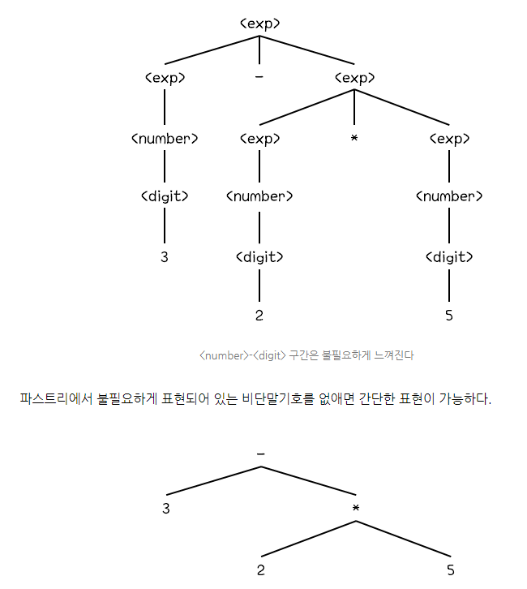

# 프로그래밍 언어의 구문과 구현 기법

## 언어 구문

### 프로그래밍 언어의 어휘 구조

- 모든 프로그래밍 언어는 알파벳에 기본을 두고 있음

    - 두 개의 문자 코드를 사용함

        - EBCDIC(Extended Binary Coded Decimal Interchange Code) - 8비트 조합

        - ASCII(American Standard Code for Information Interchange) - 7비트 조합

        - 각 국가 문자 코드 문제를 위한 `유니코드`도 등장

    - 언어 구성자(`식별자`)

        - 한 개 이상의 어휘 토큰을 가지고 구문적으로 허용된 프로그램의 일부 구조

        - 재정의할 수 없게 `예약어` 기능을 사용

    - 예약어 사용의 장점

        - 프로그램을 읽기 쉽게 해줌

        - 컴파일러가 기호 테이블을 짧은 시간에 탐색하도록 해줌

        - 오류 회복을 할 수 있게 해줌
        
    - 예약어 사용의 단점
    
        - 많은 예약어를 기억하기 어려움

        - 기존의 언어를 확장할 때 증가된 예약어가 이전에 사용했던 식별자와 중복될 수 있음

            - 이러한 목적으로 구분자 역할을 하는 특수 문자나 분리자로 구별되는 토큰들도 있음

### 문맥 자유 문법과 BNF

- 프로그래밍 언어의 구문을 이해시킬 때는 언어 구문을 형식화시켜 서술하는 방법이 효율적

- 언어 구문의 형식 정의 : 그 언어를 가지고 정상적인 프로그램을 작성하는 규율들의 집합

    - 때로는 순서도를 가지고 표현함

- BNF(Backus-Naur Form)

    - 구문 형식을 정의하는 가장 보편적인 기법

    - 이후 확장한 EBNF 사용

    - 한 언어의 구문에 대한 BNF 정의는 생성규칙들의 집합

    예시 : 

    ```
    <identifier> ::= <letter> | <identifier><letter> | <identifier><digit>
    <letter> ::= A | B | C ... | X | Y | Z
    <digit> ::= 0 | 1 | 2 | ... | 8 | 9
    ```
        - 왼쪽 : 정의될 대상
        - 오른쪽 : 그 대상에 대한 정의
        - 비단말 기호 : 각 괄호(<>)로 묶여진 기호
        - 단말 기호 : 묶이지 않은 기호
        - 메타 기호 : 특수 기호들 (::=, |, <>)

    - 문맥 자유 문법(context-free grammar)
    
        - 정의될 대상이 하나의 비단말 기호만으로 구성됨

        - 비단말 기호가 어디에 나타날지라도 그에 해당되는 우측 선택으로 언제나 대치될 수 있음

    - 문맥 의존 문법(context sensitive grammar)

        - 특수한 문맥에 의존하여 대치되는 문법

- 더욱 간결하게 표현할 수 있는 `EBNF`를 많이 사용

- [자세한 내용 참고](https://atoz-develop.tistory.com/entry/%EA%B5%AC%EB%AC%B8%EB%A1%A0-BNF-EBNF-%EA%B5%AC%EB%AC%B8%EB%8F%84%ED%91%9C-%ED%91%9C%ED%98%84%EB%B2%95)

### 구문 도표

- 형태는 순서도와 비슷

- 다시 정의될 대상은 네모칸

- 단말 기호는 원이나 타원

- 이들 사이는 지시선으로 연결

    |도형|의미|
    |---|---|
    |사각형|비단말 기호|
    |원|단말 기호|
    |화살표|기호 연결|
    


### 파스 트리와 추상 구문 트리

- 파스 트리

    - BNF에 의하여 작성될 수 있는지 확인하기 위해 BNF를 이용하여 생성

        - 대상을 근(root)으로 하고 단말 노드들을 왼쪽에서 오른쪽으로 나열한 것이 검증하고자 하는 표현과 같게 되는 트리

            

- 추상 구문 트리

    - 파스 트리에서 불필요하게 표현되어 있는 비단말 기호들을 없앤 트리

        

### 모호성, 결합성 및 우선 순위

- 동일 스트링에 대해서 서로 다른 파스 (또는 구문)트리가 발생하면 이러한 문법을 `모호`하다고 함

    - 어떤 구조가 의미 있는지 결정할 수 있도록 `모호성 제거 규칙`을 기술해야 함

        - ex) 덧셈, 곱셈, 뺄셈, 나눗셈 등에서의 순위 규칙
    
        - 동일한 순위에서 좌-결합, 우-결합으로 나뉠 수 있어 대부분의 언어에서는 동일 연산 순위를 가질 때 한 방향으로만 결합되도록 지원함

### 구문과 프로그램 신뢰성

- 주석

    - 프로그램의 문서화에 많은 도움을 줌

- 놀람 최소의 법칙을 위반한 예시들

    ```
    A = B = C;
    ```

    - PL/I의 다중 배정에서 '='을 배정 연산자와 등가 연산자 두 가지 뜻을 갖고 있어서 잘못된 결과를 초래함

    ```
    if cond then S1 else S2
    ```

    - else의 의미 부여에 대한 점이 모호함

        - 이러한 else 문제를 `현수 else(dangling else)`라고 함

            - C나 java에서는 중괄호로 모호함을 제거함

---

## 프로그래밍 언어 구현 기법

### 번역 기법

- 주어진 고급 프로그래밍 언어로 작성된 프로그램을 실제 주어진 컴퓨터의 기계어로 번역하여 동등한 의미의 기계어 프로그램을 만들어 실행시키는 방법

- 번역기

    - 원시 언어로 작성된 프로그램을 입력받아 목적 언어로 된 기능이 동등한 프로그램을 출력해 주는 언어 처리기

    - 컴파일러(compiler)

        - 원시 언어가 고급 언어이고 목적 언어가 저급 언어인 번역기

            - 저급 언어는 준기계어 형태 또는 어셈블리 언어가 속함

    - 어셈블러(assembler)

        - 원시 언어가 어셈블리 언어이고 목적 언어가 저급 언어인 번역기

    - 링커(linker)

        - 재배치 형태의 기계어로 된 여허 개의 프로그램을 묶어 로드 모듈이라는 어느 정도 실행 가능한 기계어로 변역해주는 번역기

    - 로더(loader)

        - 로드 모듈로 된 기계어 프로그램을 실제 실행 가능한 기계어로 번역해서 주기억 장치에 적재

    - 프리프로세서(preprocessor)

        - 원시 언어와 목적 언어가 모두 고급 언어인 번역기

            - 다른 고급 언어로 번역해서 이미 구현된 방법으로 실행시킬 때 사용


### 인터프리터 기법

- 고급 언어를 기계어로 취급하는 컴퓨터를 가상하여 주어진 컴퓨터에서 시뮬레이션하여 실핸시키는 방법

    - 고급 언어를 기계어로 하는 컴퓨터를 하드웨어로 구성하는 대신에 이 고급 언어 기계를 다른 기계에서 실행되는 소프트웨어로 시뮬레이션하여 구성하는 방법

   

### 인터프리터 기법과 번역 기법

- 인터프리터와 번역기

    - 고급 언어로 된 프로그램을 입력 자료로 읽어 들이고

    - 번역기

        - 단지 그 입력 프로그램과 동일한 목적언어로 된 프로그램을 출력만 함

    - 인터프리터

        - 직접 그 입력 프로그램을 실행 시키는 것

- 번역기 : 입력 프로그램의 매 문장을 입력된 순서대로 정확하게 한 번씩 처리

- 인터프리터 : 그 입력 프로그램의 논리적 순서에 따라 문장들을 처리하기 때문에 순환 부분 등은 계속 반복 처리해야 함

- 컴파일러 언어

    - 고급 언어를 번역하여 목적 모듈을 출력시켜서 그 목적 모듈을 링크, 로드하여 실행시키는 방법

    - 한번 번역한 코드를 다시 실행할 때 다시 번역할 필요가 없음

- 인터프리터 언어

    - 고급 언어를 적당한 중간 코드까지만 번역해서 곧바로 실행시키는 방법을 택하는 언어

- 하이브리드 구현 기법

    - 번역 기법과 시뮬레이션 기법을 함께 사용하여 컴퓨터에 구현

        - 프로그램을 좀 더 실행시키기 쉬운 형태로 번역한 후, 그 번역된 형태의 프로그램을 디코드해서 시뮬레이션으로 실행

- 실행시간의 효율성을 중시 -> `번역 기법`

- 사용자의 유연성을 중시 -> `시뮬레이션 기법`

- 최근에는 중간언어로 번역된 프로그램을 소프트웨어 인터프리터로 실행시키는 방법인 `하이브리드 구현 기법` 택하기도 함

    - Java