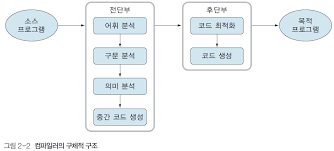

# 컴파일러 개요

- 컴파일러

    - 고급 언어로 쓰여진 프로그램을 어떤 특정한 컴퓨터에서 직접 실행 가능한 형태의 프로그램으로 번역해 주는 컴퓨터 프로그램

## 컴파일러 일반적 구성

- 전단부

    - 소스 언어에 관계되는 부분

    - 소스 프로그램을 분석하고 중간 코드를 생성하는 부분

    - 언어마다 하나씩 필요

- 후단부

    - 소스 언어보다는 목적 기계에 의존적

    - 전단부에서 생성한 중간 코드를 특정 기계를 위한 목적 코드로 번역하는 부분

    - 목적 기계당 하나씩 필요



- 어휘 분석

    - 어휘 분석기에 의해 이루어짐

    - 소스 프로그램을 읽어들여 일련의 토큰을 생성하는 일

        - 토큰 : 문법적으로 의미를 갖는 최소의 단위

            ##### 프로그램은 토큰의 열로서 구성되어 있음

            - 특수 형태 : 언어를 정의할 때 언어 설계자가 결정하는 지정어, 연산자 기호, 구분자 등

            - 일반 형태 : 프로그래머가 프로그래밍할 때 사용한 명칭과 상수들

                ```
                a = b + 10;
                ```
                 =, + : 특수 형태의 토큰 / a, b, 10 : 일반 형태의 토큰

- 구문 분석
    - 구문 분석기(파서(parser))

        - 토큰들을 받아 소스 프로그램에 대한 에러 체크, 올바른 문장에 대한 구문 구조를 만듬

            - 에러가 있으면 에러 메시지 출력,
            - 올바르면 프로그램에 대란 구문 구조를 트리 형태로 만들어 출력
    
- 중간 코드 생성

    - 추상 구문 트리를 입력으로 받아 의미 검사를 하고 그에 해당하는 중간 코드 생성

    - 의미 분석 단계에서 가장 중요한 일 중 하나는 `형 검사(type checking)`

        - 형 검사 : 각 연산자가 사용 언어의 정의에 맞는 피연산자를 가지는가를 검사

            - ex) 실수와 정수를 바꿔주는 형 변환 작업 처리

- 코드 최적화

    - 같은 의미를 유지하며 코드를 보다 효율적으로 만듬

    - 기억 공간이나 실행 시간을 절약

    - 지역 최적화 : 기본 블록 내에서 행해지며 부분적인 관점에서 일련의 비효율적인 코드들을 구분해 내고 좀더 효율적인 코드로 개선
        - 효과
        1. 컴파일 시간 상수 연산
        2. 중복된 load, store 명령문 제거
        3. 식의 대수학적 간소화
        4. 연산 강도 경감
        5. 불필요한 일련의 코드 블록 삭제

    - 전역 최적화 : 흐름 분석 기술을 이용하여 기본 블록들의 축약, 루프 내에서 값이 변하지 않는 코드를 루프 밖으로 이동, 도달될 수 없는 코드 제거

    - Precode optimization

        - 중간 코드를 이용하여 최적화 수행하며 목적 코드 생성 전에 행해짐

    - Postcode optimization

        - 목적코드 생성 후에 목적 코드를 최적화하는 방법으로 기계 의존적인 방법

- 목적 코드 생성

    - 중간 코드를 입력으로 받아 그와 의미적으로 동등한 목적 기계에 대한 코드를 생성

        - 행하는 일
        1. 목적 코드 선택 및 생성
        2. 레지스터의 운영
        3. 기억 장소 할당
        4. 기계 의존적인 코드 최적화    

## 컴파일러 자동화도구

- 어휘 분석기 생성기

    - 토큰에 대한 기술을 입력받아 기술된 형태의 토큰을 찾아내는 어휘 분석기를 만듬

- 파서 생성기

    - 언어의 문법 표현으로부터 파서를 제어하는 테이블을 생성

        - 파서는 이 테이블을 이용하여 주어진 문장에 대한 문법적인 검사를 하며 다음 단계에서 필요한 의미 정보를 만듬

- 코드 생성의 자동화

    - 코드 생성은 중간언어를 목적 기계 언어로 바꾸는 컴파일러 과정

        - 기계 정형화를 통해 자동적으로 구성하려 함

    - 목적 기계의 명령어들을 나타낸 테이블을 사용하여 기계 독립적인 코드 생성 알고리즘을 고안하는 방법

- 컴파일러-컴파일러 시스템

    - 실질적인 컴파일러 자동 제작 시스템이 되기 위해서는 전과정을 자동화해야 함

## 어휘 분석

- 어휘분석이란
    
    - 소스 프로그램을 하나의 긴 문자열로 보고 차례대로 문자를 검조하여 문법적으로 의미있는 최소의 단위로 분할해 내는 것

    - 이러한 문법적인 단위는 `토큰`

- 어휘번석기를 개발하는 방법은 소스 언어의 토큰 패턴을 기술하는 `상태 전이도`를 설계하고 이 다이어그램을 구현하는 프로그램을 작성

- 어휘 분석기에서 사용되는 상태도는 `유한 오토마타`라 불리는 수학적 기계

    - 유한 오토마타는 정규 언어라 불리는 언어의 한 유형을 인식할 수 있음

        - 정규 언어의 생성장치로 정규 문법과 정규 표현식이 사용됨

    
- 토큰의 종류

    - 특수 형태의 토큰

        - 언어 설계자가 결정하는 `예약어`들

        - 연산자 기호는 연산의 의미를 나타내는 기호, 구분자는 문법 항목을 구별해 주는 기능을 하는 특수 문자

    - 일반 형태의 토큰

        - 프로그래머가 프로그램을 작성할 때 사용하는 식별자와 상수들

            - 식별자는 이름으로 사용되며 상수는 자료형에 따라 특정한 값을 가짐
    
- 토큰 번호

    - 각 토큰들이 효율적인 처리를 위해 가지는 고유의 내부 번호

- 토큰 값

    - 일반 형태의 토큰에서 프로그래머가 사용한 값

    - 스트링 값이나 수치 값

        - 명칭인 경우 명칭이 스트링 값이며 상수인 경우는 수치 값

- 어휘 분석기가 구문 분석기에 넘겨주는 토큰의 정보는 일반적으로 `토큰 번호`와 `토큰 값`의 순서쌍으로 구성됨

- 심벌 테이블

    - 프로그래머가 사용한 명칭에 대한 토큰의 토큰 값과 그 속성을 나타내는 정보를 보관하는 테이블

    - 어휘 분석 과정, 구문 분석 과정, 의미 분석 과정에서 운영됨


### 토큰 인식

- 상태 전이도 : 유한 오토마타를 그림으로 표현하는 흐름도

    - 어떤 모양의 토큰을 인식할 수 있는지를 쉽게 파악할 수 있는 그림

    - 각 노드는 상태를 표시

    - 문자를 레이블로 갖는 지시선은 한 상태로부터 소스 프로그램 속의 그 문자를 읽고 다음 상태로의 이동을 나타냄

    - 이중 원으로 표시된 노드는 한 토큰의 인식을 의미하는 종결 상태를 나타냄

1. 명칭의 인식

2. 정수 상수의 인식

## 구문 분석

- 주어진 입력이 올바른 프로그램인가를 검사, 다음 단계에서 필요한 정보를 구성하는 과정

### 구문 분석 방법

- 유도 트리 / 파스 트리

    - 구문 분석기의 출력으로 생성되는 트리

    - context-free 문법을 위한 구문 분석 방법은 Top-down 방식과 Bottom-up 방식이 존재

    - Top-down 방식

        - 루트 노트로부터 시작하여 단말 노드로 만들어 나감

        - 좌측 유도의 순서 생성 규칙

        - 유도 방법 : 입력 스트링에 대하여 자동으로 좌측 유도 과정을 찾는 시도

    - Bottom-up 방식

        - 단말 노드로부터 루트 노드를 향하녀 위로 만들어 나감

        - 우측 유도의 순서 생성 규칙

        - 특정한 생성 규칙의 rhs(right hand side)를 찾아 lhs로 바꾸는 것을 `reduce`한다고 
        함

            - 주어진 스트링으로부터 차례로 reduce를 반복하여 시작 심벌로 갈 수 있으면 올바른 문장으로 간주

- [참고](https://blog.naver.com/PostView.nhn?blogId=bestowing&logNo=221769416451)

### 구문 분석기의 출력

- 구문 분석기

    - 입력으로 스트링을 받아 만일 그 스트링이 정의된 문법의 문장이라면 구문 붖ㄴ석 정보를 생성,

    - 정의된 문법의 문장이 아니라면 에러 메시지 출력

- 구문 분석기의 출력은 다음 단계인 중간 코드 생성의 입력이 됨

- 유도 과정에서 적용된 일련의 생성규칙 번호를 `파스`라고 함

    - 좌파스(좌측 유도 과정에서 적용된 일련의 생성규칙 번호)

        - Top-down 방법일 때 생성
        
    - 우파스(우측 유도 과정에서 적용된 일련의 생성규칙 번호)

        - Bottom-up 방법일 때 생성

- 파스 트리는 주어진 스트링에 대해 형태는 같지만 구문 분석 방법에 따라 구성되는 순서가 다름

    - Top-down

        - 루트 노드로부터 생성규칙이 적용되어 직접 유도될 때마다 트리가 구성됨

    - Bottom-up

        - 주어진 문장으로부터 생성규칙이 reduce될 때 서브트리가 만들어짐

### Top-down 방법

- 시작 심벌로부터 생성규칙을 적용하여 좌측 유도를 수행하는 방법

- 좌측 유도 과정에서 생성규칙이 잘못 적용되었으면 스트링을 다시 검조하기 위해 입력으로 보내는 `재검조 과정(Backtracking)`을 함

- LL 조건

    - 정의된 문법이 어떤 조건을 만족하면 주어진 스트링을 결정적으로 구문 분석할 수 있는 것

    - 이 조건을 만족아는 문법을 LL 문법

### Bottom-up 방법

- 주어진 스트링으로부터 시작 심벌로 축약되는 과정

    - 축약될 수 있으면 올바른 문장으로 간주

- top-down 방식이 시작 심벌로부터 확장(expand)이라면 bottom-up 방식은 시작 심벌로 축약(reduce)하는 과정임

- 핸들(handle)

    - 문장 형태의 일부분이 정의된 생성규칙의 오른쪽 부분(rhs)과 같을 경우의 부분

    - 이 생성규칙의 왼쪽 부분(lhs)으로 대치하는 것을 의미

    정의
    ```
    S => aAw => aBw의 유도 과정이 있을 때, B를 문장 형태 aBw의 핸들(handle)이라 한다.
    즉, 한 문장 형태에서 reduce되는 부분을 말한다.
    ```

- Shift-reduce 구문 분석

    - 스택과 입력 버퍼를 사용하여 구현

        - 스택은 보통 파싱 스택이라 부르며 문장 형태에서 핸들을 찾을 때까지 필요한 문법 심벌들을 유지하고 입력 버퍼는 주어진 스트링을 보유함

    - 파서의 행동은 shift, reduce, accept, error 네 가지

        - 스택의 top과 현재의 입력 심벌에 따라 파싱 테이블을 참조하여 결정함

        - Shift

            - 현재의 입력 심벌을 스택으로 이동하는 것

        - Reduce

            - 스택 top 부분에 있는 핸들을 그에 따른 생성규칙으로 축약하는 행동

        - Accept

            - 주어진 스트링이 문법의 올바른 문장임을 알리는 행동

        - Error

            - 현재 보고 있는 입력 심벌이 그 상태에서 나타날 수 없기 때문에 틀린 문장이라는 것을 보고하는 행동

        이와 같은 Shift와 reduce의 행동이 연속으로 이루어짐

    

- LR 구문 분석

    - 입력 스트링을 왼쪽에서 오른쪽으로 읽어가며 출력으로 우파스(Right Parse)를 생성

    - 파싱 스택에는 상태 번호와 문법 심벌들을 교대로 보유

    - 파싱 테이블만 다른 형태

- Shift-reduce, LR 구문 분석 [참고](https://untitledtblog.tistory.com/95)