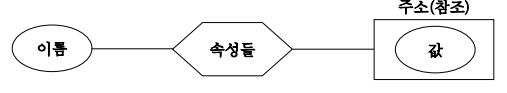
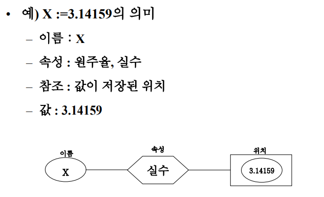
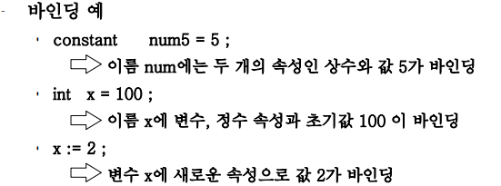

# 변수, 바인딩, 식 및 제어문

## 변수

- 이름(식별자), 속성의 집합, 참조(주소), 값의 4요소로 구성

    

    

---

## 바인딩

### 바인딩 개념

- 이름에 어떠한 속성을 연결하는 과정, 

- 프로그램의 기본 단위에 이 단위가 택할 수 있는 어러 속성 중에서 일부를 선정하여 결정하는 행위

    

- 바인딩 시간

    - 바인딩이 발생되는 시간

### 바인딩 시간의 종류

- 정적 바인딩

    - 번역 시간에 이루어지는 바인딩

- 동적 바인딩

    - 실행 시간에 이루어지는 바인딩

### 바인딩 시간의 중요성

---

## 선언

---

## 배정문

1. l-values와 r-values

2. 단순 배정문

3. 다중 목적지 배정문

4. 조건 목적지 배정문

5. 복합 배정 연산자

6. 단항 배정 연산자

7. 식으로서의 배정문

8. 혼합형 배정문

---

## 상수 및 변수 초기화

---

## 표현식

1. 식의 개요

2. 논리 조건

---

## 조건문

---

## 반복문

1. 사용자 지정 반복

2. 논리 제어 반복문

3. 제어 변수 반복문

---

## GoTo문

1. 레이블과 GoTo문

2. GoTo문의 장단점

