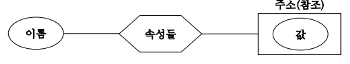
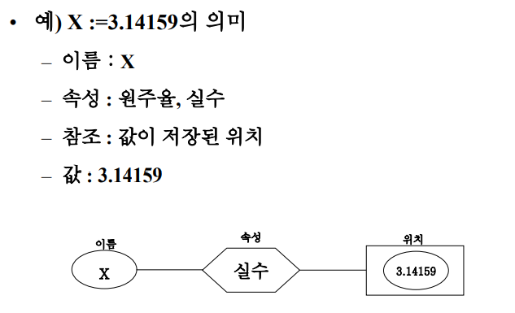
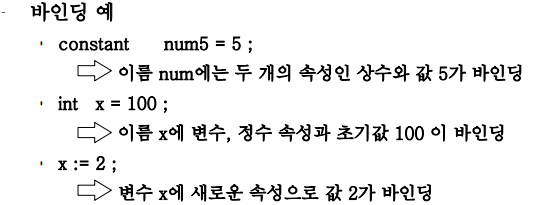

# 변수, 바인딩, 식 및 제어문

## 변수

- 이름(식별자), 속성의 집합, 참조(주소), 값의 4요소로 구성

    

    

---

## 바인딩

### 바인딩 개념

- 이름에 어떠한 속성을 연결하는 과정, 

- 프로그램의 기본 단위에 이 단위가 택할 수 있는 어러 속성 중에서 일부를 선정하여 결정하는 행위

    

- 바인딩 시간

    - 바인딩이 발생되는 시간

### 바인딩 시간의 종류

- 정적, 동적

    - 정적 바인딩

        - 번역 시간에 이루어지는 바인딩

    - 동적 바인딩

        - 실행 시간에 이루어지는 바인딩

- 실행 시간

    - 프로그램 실행 시간에 발생되는 바인딩

        - 대부분이 해당됨

        - = 동적 바인딩

        |모듈의 시작 시간 | 실행 시간의 사용 시점|
        |---|---|
        |모듈 프로그램 실행 시작 시간에 발생 | 프로그램 실행시 사용 시점에서 수시로 발생 |

- 번역 시간

    - 언어를 번역하는 시점에서 발생하는 바인딩

        - 정적 바인딩

        - 컴파일 시간, 링크 시간, 로드 시간으로 구성

        - 변수의 형, 자료 구조의 형과 크기, 레코드 항목들의 형을 확정

- 언어의 구현 시간

    - 언어 정의 시 일부 특성을 한정하지 않고 언어를 컴퓨터에서 구현할 때 특성의 일부를 확정하는 바인딩

        - 정수의 자릿수, 실수의 유효숫자 개수, 수의 기계 내에서의 표기법

- 언어 정의 시간

    - 언어를 정의할 때 확정되는 바인딩

        - 언어 구문 정의, 혼합형 연산에서 두 피연산자의 형 결정에 관한 사항

### 바인딩 시간의 중요성

- 언어들 간의 중요하고 미묘한 차이점은 바인딩 시간의 차이에서 발생함

- 모든 언어들이 많은 수치 연산이 포함되어 있는 문제를 푸는데 적합한 것은 아님

- 빠른 바인딩 => `효율성` 증가 / 늦은 바인딩 => `유연성` 증가

---

## 선언

- 실행 시 사용될 자료의 속성을 언어의 번역기에게 알려주는 프로그램 문장

- 디폴트 선언

    - 간접적인 선언 방법으로 명시적 선언이 없으면 묵시적 선언으로 간주됨

- 목적

    1. 주기억 장치 사용과 접근 방법의 효율성

        - 변수, 배열, 레코드 등의 효율적인 접근 가능

    2. 주기억 장치 경영의 효율설

        - 생성과 소멸 시점을 알고 있으므로 스택 기반 기억 장소 할당 등을 수행 가능

    3. 정적 형 검사 가능

        - 형 고정 연산 : 하드웨어 제공

        - 혼합형 연산 : 프로그래밍 언어 제공

- 정적 형 검사

    - 모든 변수의 형 선언 요구

        |장점|단점|
        |--|--|
        |실행 시간 효율이 높음|자료 생성, 소멸, 내용 변경에 많은 제약이 존재함|

    - ex) Java, C, Fortran 등의 컴파일러 언어

- 동적 형 검사

    - 선언문 사용 안함

        |장점|단점|
        |--|--|
        |프로그래밍 단순화, 유연성 높음|프로그램 실행 시간 지연, 자료 표현상 효율 저하, 복잡한 기억 장소 경영기법 요구|

    - ex) Lisp, APL, Snobol4 등의 인터프리터 언어

---

## 배정문

- 변수의 내용을 변경하는 원시 연산

- ex) =, :=, <-, <=, ...

### l-values와 r-values

- 배정 연산자의 왼쪽, 오른쪽 의미

- l-value

    - 값이 저장되는 위치(주소, 참조)

- r-value

    - 저장되는 값

### 단순 배정문

```
<목적지 변수> <배정 연산자> <식>    
```

- 대부분의 언어에서는 배정 연산자로 동등기호(=) 사용

- 관계 연산자로 = 사용될 경우 혼돈 초래하기도 함

    - C, Java 등에서 ==로 사용

### 다중 목적지 배정문

- 값을 하나 이상의 목적지 변수에 배정을 허용

    - ex) sum, total = 0  
    or, sum = total = 0

### 조건 목적지 배정문

- C++, Java에서 배정문에 조건 목적지를 허용함

    - ex) flag ? count1 : count2 = 0

### 복합 배정 연산자

- 배정문에 필요한 형태를 축약하여 표현하는 방법

    - ex) a = a + b `=>` a += b

### 단항 배정 연산자

- C, C++, Java는 증가, 감소 연산을 배정과 결합한 단항 배정 연산자를 허용함

    - ++, --

    - 전위 연산자, 후위 연산자

### 식으로서의 배정문

- C, C++, Java는 배정문이 식 또는 피연산자를 사용 가능

    - ex) while ((ch = getchar()) != EOF) { ... }

### 혼합형 배정문

- 배정문의 양편 자료형이 서로 다를 때

- 몇 언어에서는 묵시적 형 변환 규칙을 혼합형 배정에 사용함

    - 우변 식이 평가된 이후 발생함

---

## 상수 및 변수 초기화

- 상수

    - 프로그램이 실행되는 동안 `값이 변하지 않는 식별자`

    - 리터럴과 구별됨

    - 상수 허용시 고려사항

        1. 단순 변수 또는 구조 변수

        2. 산수 값 표현 : 수식 가능 여부

        3. 상수 값 배정 시간

        4. predefined contant 제곡 여부

- 상수의 초기화

    - 언어별로 const, #define 등을 이용해 초기화

---

## 표현식

### 식의 개요

- 계산을 기술한 문장

- 일반적으로 피연산자(상수, 변수, 함수 등)와 연산자로 구성됨

- 참조 투명성

    - 식 평가는 환경 변화 없이 값만을 생성

- 연산자 순위

    - 언어에 따라 차이가 있음 - `묵시적 순서`

    - 괄호는 언어가 제공하는 연산 순위를 변화함 - `명시적 순서`

    - 동 순위 연산자에서는 일반적으로 left-to-right

### 논리 조건

- operand1 op operand2 - 적용 순서

    - 1, 2를 계산한 후 op 적용

    - 한 개의 오퍼랜드 값만들 알고도 그 식의 값을 알 수도 있음

- 단락 회로(short circuit) 평가 기법

    - 일부 피연산자만으로 bool 수식을 평가하는 기법

    - ex) 앞의 값이 거짓이고 and이면 무조건 거짓, 참이고 or이면 무조건 참

---

## 조건문

- 조건에 따라 실행되는 부분이 달라질 떄 사용

- if문은 중첩되어 사용할 수 있음

    - 현수(dangling) else 문제가 발생할 우려

- case문

    - 상호 배제적인 택일의 집합에서 한 개만을 선택하ㅗ록 하는 구조

    - defualt, break 사용하기도 함

---

## 반복문

- 한 개 이상의 문장을 0번 이상 여러번 실행하는 문장

### 사용자 지정 반복

- 가장 간결한 형태

- loop-repeat 문

    - 탈출 방법 : goto -> exit

    - C 등에서는 break로 탈출, continue도 제공

### 논리 제어 반복문

- while문

    - 그 결과가 참이면 수행하고 다시 조건 검사 실행을 반복

- repeat-until문

    - 마지막 부분에서 반복조건 검사

    - 무조건 한번 이상 실행

- do-while문

    - 무조건 한번 이상 실행

### 제어 변수 반복문

- for문

    - 반복변수를 사용하여 고정된 횟수의 반복을 표시할때 사용

    - 고려사항

        1. 반복 변수가 택할 수 있는 값들의 자료형

        2. 초기값, 최종값, 증분값에 수식의 허용여부와 수실 결과의 자료형

        3. 반복시 최종값과 증분값은 얼마나 자주 평가되는지

        4. 반복 변수와 최종값은 언제 비교되는지

        5. 반복문 내에서 배정문으로 반복 변수가 변경될 수 있는지

        6. 반복문 종료 후 반복 변수가 갖는 값

        7. 반복문 내외로 제어 이동이 허용되는지

        8. 반복 변수의 영역

---

## GoTo문

- 레이블 제어 모든 문장을 지칠

- 기계어 특성 그대로 표현

- 사용이 편리함

### 레이블과 GoTo문

- 레이블

    - 프로그램 내의 위치를 나타내는 식별자

        - 어떤 문장을 참조하는데 자주 사용됨

- 레이블 사용에 따라 분류됨

    1. 레이블을 태그로만 사용

        - 기계어 코드에서 분기할 위치를 가리켜 주기 위하여 사용됨

            - 번역하는 동안 적당한 기계어 주소에 해당됨

    2. 레이블을 제한된 자료 항목으로 간주

        - 레이블 변수, 레이블 배열, 레이블 매개변수, 비지역 레이블 참조 등

    3. 일반 자료 항목으로 간수

### GoTo문의 장단점

- 장점

    - GOTO문 제어구조를 하드웨어가 제공

    - GOTO문 제어구조의 완벽한 범용성

- 단점

    - 프로그램 질 저하 유도

    - 판독성 저하

    - 프로그램 유지보수의 난해성

- GoTo문의 잔존여부는 논란의 대상임

    - 대부분 제거되고 있음
