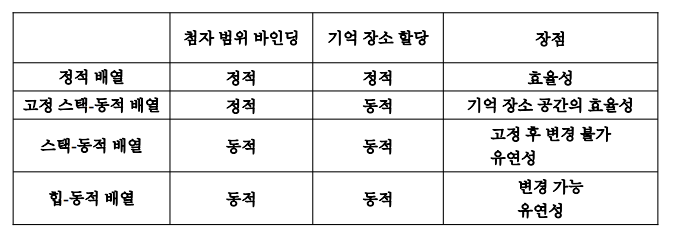

# 자료형

- 객체들의 집합, 연산들의 집합

## 자료형과 형 선언

---

## 단순형

- 수치형

    - 기본 자료형(실수, 정수)

    - 스칼라형, 정수 또는 실수의 근사값을 표현

    - 기계 의존적 -> 빠른 연산속도, 호환성 문제

    - 다형성

        - 동일 속성의 연산자가 피연산자 형에 따라 다른것으로 간주됨

        - 혼합형 연산 해결 방법

            1. 제1방법

                - 피연산자와 연산 결과에 대한 자료형을 표로 제공

            2. 제2방법

                - 연산 결과의 자료형을 미리 결정하여 해당 연산을 수행

                - 피연산자가 연산 결과의 자료형과 다르면 결과형으로 변환하여 연산

- 논리형

    - 값의 영역이 참, 거짓 두가지로 구성

        - and, or, not, imp, equiv

- 문자형

    - 정수형 변수에 저장됨

---

## 열거형

- 사용되는 자료집합을 리스트 형태로 정의

- 동등 및 순서관계, 배정연산 허용함

- 프로그래밍 언어의 능력을 크게 증가시켜 주는 효율적인 기법

- 문제점

    - 다중 정의
        
        - 동일한 상수를 두 열거형의 리터럴 값으로 사용 - 형 대조시 문제 발생

- 부분 영역형

    - 이미 정의된 자료형에서 일부 구간을 정의해 사용

    - 원래형의 연산을 부분 영역형에서 사용 가능

---

## 배열

- 여러 자료를 묶어 하나의 단위로 처리하는 자료형

    - 배열 - homogeneous datas

    - 레코드 - heterogenous datas

- 이름, 차원, 원소형, 첨자(인덱스) 집합의 형과 범위로 구성됨

    ```
    배열 이름[첨자 리스트] -> 원소
    ```

- 첨자(인덱스)

    - 일반적으로 연속적인 정수형 집합

        

- 배열 명세표

    - 배열의 정보 저장 테이블

        - 배열 이름, 원소형, 길이, 시작주소, 차원수, 각 차원 상/하한값

- 배열 저장 순서

    - 행 우선(대부분의 언어), 열 우선

- 배열 부분 선택

    - 슬라이스(slice) - 배열의 연속된 일부분 선택

- 배열 고려사항

    1. 배열 이름과 배열 원소에 대한 구문

    2. 원소값에 대하여 어떤 자료형이 있는가

    3. 첨자로 어떤 자료형을 사용할 수 있는가

    4. 배열 크기의 바인딩 시간

    5. 배열 이름에 대한 주소 결정이 얼마나 복잡하게 되어 있는가

    6. 어떤 형태의 슬라이싱을 제공하는가

    7. 배열을 초기화시키기 위한 어떤 종류의 문장이 허용되는가

    8. 배열에 대한 내장된 연산은 어떤 종류가 허용되는가

---

## 연상 배열(Associative array)

- 키(key)라 불리는 값들에 의해서 접근되는 순서를 갖지 않는 데이터 원소들의 집합체

    - 사용자-정의 키들이 배열에 함께 저장되어야 함

        - 실제로 한 개의 `키`와 한 개의 `값`으로 구성된 쌍으로 저장됨

- 해시

    - 원소들의 탐색이 요구될 때 배열보다 훨씬 효율적
---

## 레코드

- 이질형 요소들의 모임인 자료형

- 점(.)을 사용하여 필드 참조 방식을 주로 사용

- 가변부

    - 판별자를 이용한 필드들의 택일 변환 기술

---

## 포인터 자료형

- 어떤 객체에 대한 참조

- 포인터 변수

    - 객체를 참조하기 위한 주소를 값으로 취하는 식별자

- 실행시간까지 크기를 알고 없는 자료의 동적 기억장소 할당, 다중관계에 사용하기 위함

- 포인터 사용의 문제점

    - 다수의 포인터가 동일 객체 지시

        - 이명 발생

    - 포인트 되지 않는 객체 존재

    - 현수 참조

### 참조형

- C++에서 참조형이라 불리는 포인터형 제공

    - 주로 함수 정의에 서 형식 매개변수를 위해 사용됨

    - 묵시적으로 항상 역참조되는 상수 포인터

---

## 자료형 변환

- 묵시적 형 변환

    - 수식 평가나 배정시 발생

    - 강제로 요구되어 시스템에 의해 자동 변환됨

- 명시적 형 변환

    - 프로그래머가 명령문으로 요구 - 캐스트(cast)

- 축소변환

    - 축소되는 크기로 변환 - 절단, 반올림 발생 가능

- 확대변환

    - 확대되는 크기로 변환

        - 문자 -> 정수 / 정수 -> 실수 등..

- 스칼라형 : 형 변환이 그나마 용이함

- 구조형, 사용자 정의형 : 형 변환이 거의 불가능함

---

## 자료형 동치

- 종류

    - 이름 동치

        - 함께 선언되거나 동일 식별자 이름으로 선언되면 동일형 간주

    - 구조 동치

        - 구성요소가 모든 측면에서 같으면 동일형 간주

    - *선언 동치

        - 이름 동치과 구조 동치의 중간을 택함

        - 자료형 이름을 재선언하여 사용할 경우 동일형 간주

- 자료형 적법성

    - 객체의 형이 특정 문맥에서 정당한지를 결정하는 의미 규칙들 의미