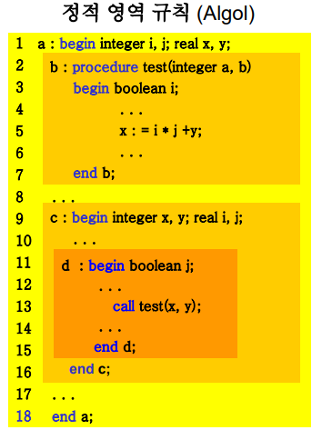
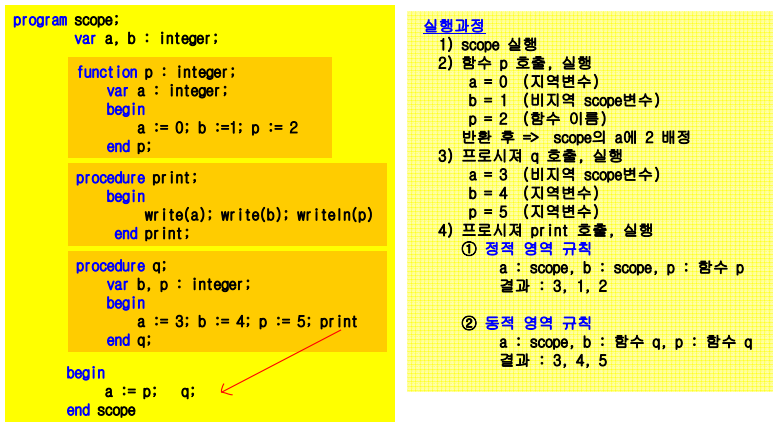

# 영역과 수명

- 영역

    - 식별자의 효력을 나타낼 수 있는 영역

    - 식별자의 사용이 허락되는 프로그램의 범위

        - 식별자 : 변수, 상수, 레이블, 자료형, 부프로그램 등의 이름

- 수명

    - 식별자(변수) 값을 보유할 기억장소가 배정되어 있는 실행시간

    - 식별자의 기억장소 할당부터 해제까지의 기간

## 블록과 영역

- Algol 60에서의 영역

    - 복합문 개념을 이용하여 도입

    - 일련의 문장 그룹을 begin-end로 묶어 단일 문장으로 취급

        - 이러한 복합문을 `블록(block)`이라 함

    - 블록 내에서 선언된 항목들은 `지역 식별자`

- C, C++, Java 등

    - 두 개의 중괄호로 묶어 복합문 표시

- 지역 식별자는 실행 시간에 기억장소를 배당받으며 블록이 실행하는 동안에만 의미있는 값을 지님

- 내포(nested)될 수 있음

---

## 정적 영역과 동적 영역

- 정적 영역 규칙

    - 일반적인 컴파일러 언어에서 식별자의 사용 영역을 블록의 정적 내포관계로 결정

    - 지역 변수

        - 현재 블록에서 선언된 변수, 형식매개변수

    - 전역 변수(비지역 변수)

        - 모든 블록에서 사용 가능한 변수

    

    - 영역 구멍

        - 정적 영역 규칙을 따른 변칙 현상

        - 위 예시에서 a의 변수x 선언이 지역 선언 때문에 보이지 않을 때

            - c 이외에서는 a에서 정의한 실수형으로 쓰임

- 동적 영역 규칙

    - 식별자의 영역이 실행시간에 확정됨

    - 식별자의 사용 영역이 프로그램 실행 순서에 의해 결정됨

    - 인터프리터 언어에서 주로 사용

- 정적, 동적 영역규칙 적용 예시

    

---

## 언어에서의 영역

- JOVIAL

    - 정적 영역 규칙(블록 중심)

    - 분리 컴파일 허용

- PL/I

    - BEGIN .. END 도입(블록 개념)

    - 묵시적 선언 가능
    
        - 문제점 발생

- ALGOL 68

    - begin ... end 블록 개념 일반화

    - 영역 블록

        - 모든 문맥시작 기호와 문맥 마침 기호 사이

- Pascal

    - begin .. end 도입

        - 복합문 개념으로 영역 블록이 아님

    - 프로시저 내포 가능

        - 정적 영역 규칙

- C, C++, Java

    - 블록 개념의 언어

        - 중괄호 {, }를 사용하여 영역 정의

    - C에서는 모든 함수 전체를 영역으로 하는 외부 영역 존재

    - C++, Java에서는 변수 정의가 어디에서나 나타날 수 있음

- 블록 구조를 통한 영역 개념의 장점

    1. 지역성 높여줌

    2. 운영체제에서 작은 기억장소 요구

    3. 표준 패키지를 사용자 프로그램에 결합시켜 하나의 프로그램을 만들기 쉬움

    4. 프로그램의 구성을 단계적으로 세분화하는데 도움

---

## 변수의 수명

- 변수 수명

    - 변수가 기억장소를 할당받은 기간

    - 대부분 스택에 사용

- 동적 수명

    - 힙 기법 사용

    - ex) C언어에서의 `malloc() ~ free()`
