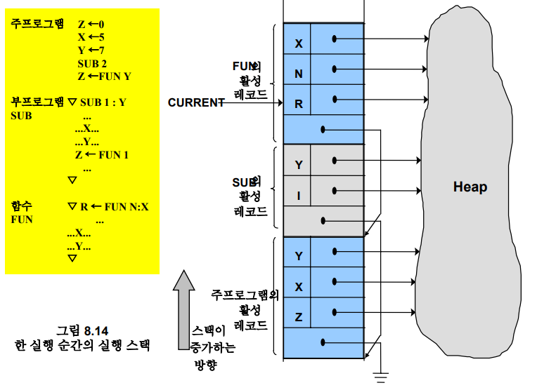

# 기억장소 배당

## 정적 및 동적 기억장소 배당

- 정적 기억장소 할당

    - 번역 시간 할당

    - 기억장소 크기, 위치가 정적으로 고정

    - 배열 접근 코드가 효율적임 (크기가 고정이므로)

- 동적 기억장소 할당

    - 실행 시간 할당

    - 대부분 인터프리터 언어로 많은 실행 시간 요구

- 활성 레코드

    - 지역변수 등 프로그램 실행 시 요구되는 정보들이 저장됨

    - 크기와 내용이 가변적

        

---

## 정적 기억장소 배당

- 대표적 언어인 Fortran 77

    - 하나의 주 프로그램과 여러개의 부 프로그램으로 구성

    - 기억장소 총 용량은 번역 시간에 계산됨
    
    - 정적 변수 사용

- 정적 변수

    - 번역 시간에 크기가 고정되며 번역시간에 배당

    - 프로그램 실행 시간 전체를 수명으로 함

- 정적 기억장소 배당 기법의 장단점

    - 장점

        - 구현이 용이하고 간결함

        - 효율적인 프로그램 실행

    - 단점

        - 유연석이 적음

            - 배열 크기 불변, 되부름 불가

## 스택 기반 기억장소 배당

- 동적 기억장소 할당 기법

    - 스택할당, 힙할당

- ALGOL 유사언어

    - 블록 개념을 도입

    - 변수들이 필요로 하는 전체 기억장소 용량이 정적으로 고정

    - 실행 시 단위 프로그램이 활성화되는 시점에서야 변수들이 필요로 하는 기억장소 용량을 알게됨

    - 새로운 자료 생성문을 실행할 때마다 새롭게 기억장소를 더 요구

### 활성 레코드의 크기가 정적으로 확정하는 경우

- 단위 프로그램이 활성화되는 시점에서 지역 변수들이 생성됨

- 지역 변수들이 필요로 하는 기억장소 용량이 번역시간에 확정

    - 번역시간에 활성 레코드의 크기와 지역 변수에 대한 오프셋이 바인딩

- 준정적 변수

    - 활성 레코드의 크기와 변수에 대한 오프셋이 번역시간에 확정

        - 활성 레코드의 크기는 정적 바인딩

    - 변수에 대한 실제 주소는 실행 시간에 바인딩

        - 기억장소 배당은 동적 바인딩  

### 단위 프로그램이 활성화되는 시점에서 활성 레코드의 크기가 확정되는 경우

- 단위 프로그램의 활성화 시점에서 지역변수 생성

    - 지역변수가 요구하는 기억장소의 크기도 확정됨

- 준동적 변수

    - 기억장소의 크기가 단위 프로그램 활성화 시점에서 바인딩

### 활성 레코드가 동적으로 변하는 경우

- 프로그램 실행 중에 자료가 생성되고 회수되어 활성 레코드의 크기가 변하는 경우

- 동적 변수

    - 실행시 변수 크기가 수시로 변할 수 있는 변수

    - 프로그램 실행 중에 생성, 해제가 가능

    - `힙(heap)` 기억장소에 할당

### 비지역 변수의 참조 방법

- 다른 활성 레코드의 변수를 참조

- Fortran

    - 지역변수 - 현재 단위프로그램 활성 레코드로 간주

    - 전역변수 - 시스템 제공 활성 레코드

- ALGOL 유사언어

    - 지역변수 - 현재 단위프로그램 활성레코드

    - 비지역변수 - 정적 내포관계

        - 정적 체인, 디스플레이 사용 기법 존재

- 정적 체인 사용 기법

    - 단위 프로그램의 정적 내포관계

    - 정적 체인을 따라 탐색

        - 실행시간 낭비가 일어남

    - 간격(distance) 사용

        - 정적 내포 구조의 단계 수 만큼 정적 링크 추적

- 디스플레이 사용 기법

    - 정적 체인 관계를 가변 배열 형태로 표현

    - (d, o) 개념 사용

        - d: 간격, o: 오프셋

    - 모든 비지역 변수 참조시간 동일하다는 장점

[정적 체인, 디스플레이 참고](https://destiny738.tistory.com/216)

---

## 힙 기억장소 배당

- 동적 기억 장소 할당할 때 힙 기법 이용

- APL에서의 예(인터프리터 언어)

    - 주 프로그램의 변수는 전역변수로 함

    - 활성 레코드를 실행 시간 스택에 배당하고 동적 링크로 연결

        - 활성 레코드의 각 항목은 변수 이름과 값을 저장할 힙 기억장소에 대한 포인터로 구성

        