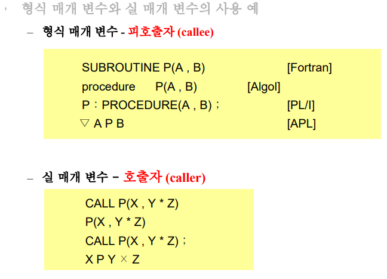
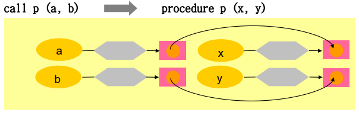

# 부프로그램

- 일련의 행위나 계산을 추상화하는 기법으로 제공

- 실행과 분리해서 선언할 수 있는 블록

- `함수`

    - 하나의 결과 값만을 반환하는 프로시저로서 식에서 변수처럼 하나의 원소로 사용할 수 있음

- `서브루틴`

    - 결과값을 하나 이상의 매개변수에 배정하거나 자신의 환경을 변환하거나 이 두가지 일을 수행함으로써 주어진 목적을 완성하는 프로시저

---

## 매개변수 평가와 전달 기법

### 형식 매개변수와 실 매개변수

- 형식 매개변수

    - 부프로그램이 실행될 때 실 매개변수를 대신하여 사용되는 이름

    - 일반적으로 지역변수 역할

- 실 매개변수

    - 대신하여 사용된 원래의 식 또는 이름

    

### 참조 호출

- 실 매개변수 주소를 대응되는 형식 매개변수에 보내는 방법

### 값 호출과 결과 호출

- 값 호출

    - 형식 매개변수의 지역 변수화

    - 실 매개변수 값을 대응 지역 변수로 복사

    - 실 매개변수의 값이 불변한다는 특징

    

- 결과 호출

    - 피호출자가 반환 직전에 형식 매개변수의 값을 대응되는 실 매개변수에 복사 후 반환

- 값-결과 호출

    - 값 호출과 결과 호출 함께 사용

        - callee 실행 시작시에는 값 호출

        - callee 실행 끝에는 결과 호출

### 이름 호출

- 형식 매개변수의 이름이 사용될 때마다 그에 대응되는 실 매개변수 자체가 사용된 것으로 간주함

- 단점

    - 구현과 프로그램 판독성이 난해함

---

## 형식 매개변수 명세

- 실 매개변수와 형식 매개변수의 정적 형 검사시 `형식 매개변수 명세표`를 요구함

    - 자료형, 전달 기법, 초기값, 대응관계 등

---

## 부수효과와 이명

- 프로그램을 난해하게 만드는 유해한 특징

    - 부수효과, 이명

### 부수효과

- 단위 프로그램들 간의 의사소통을 하기 위한 방법으로 제공되는 주요 특징

    - 참조 전달기법, 이름 전달기법

        - 많은 비지역 변수들의 사용이 프로그램을 읽고 이해하는데 어려움을 줌

    - 프로그램 판독성 저하

    - 심각한 오류 발생

    - 함수의 투명성 상실

### 이명

- 동일한 기억 장소를 함께 사용하고 있는 다른 이름

- 한 변수 값이 변화하면 동일장소 사용하는 다른 변수의 값이 변화하게 됨

---

## 연산자 중복정의(overloading)

- 한 개체가 두 가지 이상의 개념을 가짐

- 동일 이름이나 연산자를 중복 사용하여 하나의 프로그램으로 합침

---

## 포괄 기능

---

## 코루틴

- 어떤 실행 후에 다시 호출되었을 때 이전 실행이 반환된 위치에서 실행을 재개하는 부프로그램
